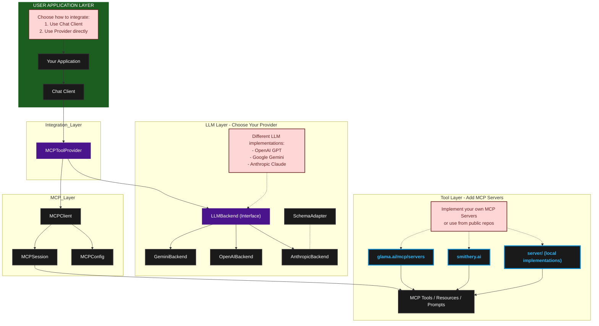

[](https://www.python.org/downloads/)
[](https://github.com/beanone/agentical/blob/main/LICENSE)
[](https://github.com/beanone/agentical/actions/workflows/tests.yml)
[](https://codecov.io/gh/beanone/agentical)
[](https://github.com/astral-sh/ruff)
[](https://badge.fury.io/py/beanone-agentical)

# Agentical: MCP-Compliant LLM Integration Framework

A robust Python framework for integrating Large Language Models (LLMs) with tools using the Model Context Protocol (MCP). This implementation provides a clean, type-safe, and maintainable way to connect LLMs with external tools and data sources.

## Table of Contents
- [Features](#features)
- [Quick Start](#quick-start)
  - [Installation](#installation)
  - [Basic Usage](#basic-usage)
- [Multiple MCP Server Usage](#multiple-mcp-server-usage)
- [API Documentation](#api-documentation)
- [Architecture](#architecture)
- [Environment Variables](#environment-variables)
- [Logging System](#logging-system)
- [Troubleshooting](#troubleshooting)
- [Development](#development)
- [Contributing](#contributing)
- [License](#license)
- [Acknowledgments](#acknowledgments)

## Features

- 🔌 MCP Protocol Integration
- 🚀 Async/Await First Design
- 🛠️ Modular LLM Backend Support (OpenAI, Gemini)
- 🎯 Type-Safe Tool Integration
- 🔍 Comprehensive Error Handling
- 🧹 Automatic Resource Management with AsyncExitStack
- 🔒 Robust Configuration Validation
- 🎮 Interactive Server Selection
- 📦 Clean Separation of Concerns

## Quick Start

### Installation

```bash
# Create and activate virtual environment
python -m venv .venv
source .venv/bin/activate  # Linux/Mac
# or
.venv\Scripts\activate  # Windows

# Install from PyPI
pip install beanone-agentical
```

### Running the Example

1. Download everything under the server folder to your local server folder
2. Create a `.env` file with your API keys:
   ```bash
   # .env file
   OPENAI_API_KEY=your_openai_key  # If using OpenAI backend
   # or
   GEMINI_API_KEY=your_gemini_key  # If using Gemini backend
   ```

3. Create `config.json` from the `config_template.json`:
   ```bash
   cp config_template.json config.json
   # Then edit config.json with your settings
   ```

4. Download one of the demo files (e.g., `demo_openai.py`)

5. Run the demo:
   ```bash
   # Run with OpenAI backend
   python demo_openai.py

   # Or with custom configuration
   python demo_openai.py -c custom_config.json
   ```

6. When prompted, you can:
   - Select a specific MCP server to use its tools
   - Choose "Connect to all servers" to let the LLM use tools from any available server

7. Example queries using multiple tools:

Here are some example queries that demonstrate the power of combining multiple servers:

   **Weather Comparison Across Cities**:
   ```
   Use the calculator-server to find the temperature difference between Seattle and Beijing in celsius
   ```
   This query uses the weather server to:
   - Get current weather in Seattle
   - Get current weather in Beijing
   - Calculate and display the temperature difference

   Note: Calculator-server is specified because LLMs typically do the math themselves but we want to demo the multi-tool use example.

   **Research and Local Storage**:
   ```
   Search for Python async best practices and save them to a local markdown file
   ```
   This query combines:
   - Brave Search server for research
   - File system server for saving results

## API Documentation

Comprehensive API documentation is available in the [docs/api](docs/api/) directory:

- [API Overview](docs/api/README.md): Complete overview of the API structure and components
- [Core Components](docs/api/core.md): Detailed documentation of core interfaces and classes
- [Configuration](docs/api/configuration.md): Configuration options and providers
- [Tool Integration](docs/api/tool_integration.md): Guide for integrating and implementing tools
- [Error Handling](docs/api/error_handling.md): Error handling strategies and best practices
- [Examples](docs/api/examples.md): Practical examples and usage patterns

The API includes three sample LLM backend implementations (OpenAI, Anthropic, and Gemini) that demonstrate how to integrate with different LLM providers. While these implementations have complete code coverage and serve as reference implementations, they are provided as examples only. Users should thoroughly evaluate and test these implementations before using them in production environments.

## Architecture

The framework follows a clean, layered architecture:

```
┌─────────────────┐    agentical/
│    API Layer    │    ├── api/                   # Core abstractions & interfaces
│                 │    │   └── llm_backend.py     # LLM abstraction layer
├─────────────────┤    │
│ MCP Integration │    ├── mcp/                   # MCP protocol integration
│                 │    │   └── provider.py        # Tool provider implementation
├─────────────────┤    │
│     Client      │    ├── chat_client.py         # Generic LLM client implementation
│ Implementation  │    │
│                 │    ├── llm/                   # LLM implementations
│                 │    │   ├── anthropic/         # Anthropic implementation
│                 │    │   ├── gemini/            # Gemini implementation
│                 │    │   └── openai/            # OpenAI implementation
└─────────────────┘
```

For detailed information about specific components:

- [Provider Architecture](docs/provider_architecture.md): Detailed overview of the provider implementation
- [System Lifecycles](docs/system-lifecycles.md): Comprehensive documentation of system state transitions and lifecycles

Here is  a more detailed view of the system architecture and component relationships:




### Key Components

- **MCPToolProvider**: MCP interactions ([Provider Architecture](docs/provider_architecture.md) and [System Lifecycles](docs/system-lifecycles.md) for more detail)
  - Load MCP servers from configuration (Discovery based can be implemented later)
  - Handles server connection and lifecycle management
  - Manages resource lifecycle with AsyncExitStack
  - Provides clean error handling and validation
  - Implements comprehensive component lifecycles and state management

- **LLMBackend**: Abstract interface for LLM implementations
  - Type-safe tool integration
  - Async query processing
  - Pluggable provider support

- **chat_client**: A Facade that encapsulates the integration of LLM with MCPToolProvider
  - Async tool execution
  - Resource cleanup guarantees
  - Error handling


### MCP Integration

* Quickly implement your own
    1. Implement a MCP server: see examples under [server](server/)
    2. Add the server configuration to your `config.json`
    3. See [config_template.json](config_template.json) for how to configure
* Follow links [GlamaLink](https://glama.ai/mcp/servers) or [SmitheryLink](https://smithery.ai)
    1. Add the server configuration to your `config.json`
    2. Set any required environment variables (such as related API key in .env)

Each server in the configuration must implement the Model Context Protocol. The configuration specifies:
- `command`: The command to launch the MCP server
- `args`: Arguments passed to the server command
- `env`: Optional environment variables for the server
- `working_dir`: Optional working directory for the server

## Environment Variables

Set in a `.env` file:

```bash
# API Keys (Required for respective backends)
OPENAI_API_KEY=your_openai_key     # Required for OpenAI backend

# Model Selection (Optional - will use defaults if not set)
OPENAI_MODEL=gpt-4-turbo-preview     # Default model for OpenAI

# Server Configuration (Set based on your MCP servers)
OPENWEATHERMAP_API_KEY=your_weather_key  # Required for weather server
WORKSPACE_DIR=/path/to/workspace         # Optional for file operations
```

Each LLM backend has its own environment variables for API keys and model selection:

1. **OpenAI Backend**
   - `OPENAI_API_KEY`: Required for authentication
   - `OPENAI_MODEL`: Optional, defaults to "gpt-4-turbo-preview"

2. **Anthropic Backend**
   - `ANTHROPIC_API_KEY`: Required for authentication
   - `ANTHROPIC_MODEL`: Optional, defaults to "claude-3-opus-20240229"

3. **Gemini Backend**
   - `GEMINI_API_KEY`: Required for authentication
   - `GEMINI_MODEL`: Optional, defaults to "gemini-2.0-flash-001"

3. **server-specific variables**
   - such as OPENWEATHERMAP_API_KEY if you use a weather server.

## Logging System

The framework includes a comprehensive logging system with:
- Structured logging with timestamps and log levels
- Optional rotating log files
- Log message sanitization
- Configurable log levels

For detailed configuration, see [Logging Configuration](docs/api/error_handling.md#logging-strategy).

## Troubleshooting

Common issues and solutions:

1. **API Key Configuration**
   - Ensure environment variables are set correctly in `.env`
   - Check `.env` file format and permissions
   - Verify API keys are valid and have sufficient permissions

2. **Server Connection**
   - Verify server configurations in `config.json`
   - Check network connectivity to MCP servers
   - Ensure required ports are available
   - Check server logs for connection errors

3. **Tool Execution**
   - Verify tool permissions and access rights
   - Check resource availability (memory, disk space)
   - Review tool-specific error messages
   - Check server health status

4. **Configuration Issues**
   - Validate `config.json` against `config_template.json`
   - Check for missing or invalid configuration values
   - Verify environment variables are properly set
   - Ensure working directories exist and are accessible

For more detailed troubleshooting, see the [Error Handling](docs/api/error_handling.md) documentation.

## Development

### Prerequisites

- Python 3.12+ (Lower versions may work but are not officially tested)

### Setup Development Environment

```bash
# Clone repository
git clone <repository-url>
cd agentical

# Create and activate virtual environment
python -m venv .venv
source .venv/bin/activate

# Install package in development mode
pip install -e .

# Install development dependencies
pip install -r requirements-dev.txt
```

### Implementing New LLM Backends

1. Inherit from `LLMBackend` abstract base class
2. Implement required methods:
   - `process_query`: Handle query processing and tool execution
   - `convert_tools`: Convert MCP tools to LLM-specific format
3. Add proper error handling and resource management
4. Follow existing patterns in OpenAI/Gemini implementations

## Contributing

1. Fork the repository
2. Create a feature branch
3. Implement changes with tests
4. Ensure all tests pass
5. Create a Pull Request

## License

[MIT License](LICENSE)

## Acknowledgments

- Built on the [Model Context Protocol](https://modelcontextprotocol.io/)
- Uses the official [MCP Python SDK](https://github.com/modelcontextprotocol/python-sdk)