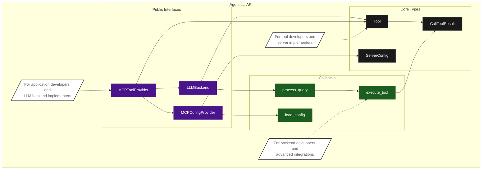

# Agentical API Documentation

This document provides comprehensive documentation for the Agentical API, a robust framework for integrating Large Language Models (LLMs) with tools using the Model Context Protocol (MCP).

## Table of Contents

1. [Core Components](./core.md)
   - LLMBackend Interface
   - MCPToolProvider
   - ChatClient

2. [Configuration](./configuration.md)
   - Server Configuration
   - Environment Variables
   - Configuration Providers

3. [Tool Integration](./tool_integration.md)
   - Tool Registry
   - Tool Execution
   - Tool Conversion

4. [Error Handling](./error_handling.md)
   - Connection Errors
   - Query Processing Errors
   - Resource Management

5. [Examples](./examples.md)
   - Basic Usage
   - Custom LLM Backend
   - Interactive Chat Session

## Overview

Agentical provides a clean, type-safe, and maintainable way to connect LLMs with external tools and data sources. The framework is built around these key principles:

1. **Type Safety**: All interfaces are fully typed with proper type hints
2. **Async First**: Built for asynchronous operation from the ground up
3. **Resource Safety**: Guaranteed cleanup of resources through AsyncExitStack
4. **Modularity**: Clean separation of concerns with pluggable components
5. **Error Handling**: Comprehensive error handling and recovery

## API Structure



### Key API Components

1. **Public Interfaces** (For application developers and LLM backend implementers)
   - `MCPToolProvider`: Main entry point for using the framework
   - `LLMBackend<T>`: Interface for implementing LLM backends
   - `MCPConfigProvider`: Interface for configuration providers

2. **API Types** (For tool developers and server implementers)
   - `Tool`: Represents an MCP tool definition
   - `ServerConfig`: Server configuration structure
   - `CallToolResult`: Tool execution result type

3. **API Callbacks** (For backend developers and advanced integrations)
   - `execute_tool()`: Tool execution callback
   - `process_query()`: Query processing interface
   - `load_config()`: Configuration loading interface

### Sample LLM Backend Implementations

The framework includes three sample LLM backend implementations that demonstrate how to integrate with different LLM providers:

- `OpenAIBackend`: Integration with OpenAI's GPT models
- `AnthropicBackend`: Integration with Anthropic's Claude models
- `GeminiBackend`: Integration with Google's Gemini models

> **⚠️ Important Note**: While these implementations have complete code coverage and serve as reference implementations, they are provided as examples only. Users should thoroughly evaluate and test these implementations before using them in production environments. You are encouraged to create your own implementations of the `LLMBackend` interface tailored to your specific needs and security requirements.

### Configuration Providers

The framework offers flexible configuration management through these providers:

- `FileBasedMCPConfigProvider`: Loads server configurations from JSON files
- `DictBasedMCPConfigProvider`: Uses in-memory configuration dictionary

You can implement custom configuration providers by implementing the `MCPConfigProvider` interface.

### Interactive Usage

The framework includes a `ChatClient` that provides interactive command-line usage:

- **Server Selection**: Interactive selection of single or multiple MCP servers
- **Query Interface**: Command-line interface for sending queries
- **Resource Management**: Automatic connection and resource cleanup
- **Error Handling**: Comprehensive error handling and logging
- **Session Management**: Maintains conversation context and tool state

Example usage:
```python
from agentical.mcp import MCPToolProvider
from agentical.llm.openai import OpenAIBackend
from agentical.mcp.config import FileBasedMCPConfigProvider

async def main():
    # Initialize with your chosen LLM backend
    provider = MCPToolProvider(
        OpenAIBackend(),
        config_provider=FileBasedMCPConfigProvider("config.json")
    )

    try:
        await provider.initialize()
        await provider.mcp_connect_all()
        response = await provider.process_query("What tools are available?")
        print(response)
    finally:
        await provider.cleanup_all()
```

## Quick Links

- [Getting Started](../README.md#quick-start)
- [Architecture Overview](../provider_architecture.md)
- [Tool Development Guide](./tool_development.md)