# System Lifecycles Detailed

This document details the various lifecycles present in the Agentical system, their interactions, and management.

## Table of Contents
- [1. System Overview](#1-system-overview)
  - [1.1 Lifecycle Relationships](#11-lifecycle-relationships)
  - [1.2 System Interaction Flow](#12-system-interaction-flow)
    - [1.2.1 Provider Initialization](#121-provider-initialization)
    - [1.2.2 Connection Flow](#122-connection-flow)
    - [1.2.3 Health Monitoring](#123-health-monitoring)
- [2. Provider Lifecycle](#2-provider-lifecycle)
  - [2.1 Initialization Phase](#21-initialization-phase)
  - [2.2 Connection Phase](#22-connection-phase)
  - [2.3 Operation Phase](#23-operation-phase)
  - [2.4 Cleanup Phase](#24-cleanup-phase)
- [3. Connection Lifecycle](#3-connection-lifecycle)
  - [3.1 Connection Establishment](#31-connection-establishment)
  - [3.2 Connection Maintenance](#32-connection-maintenance)
  - [3.3 Connection Cleanup](#33-connection-cleanup)
- [4. Tool Lifecycle](#4-tool-lifecycle)
  - [4.1 Tool Registration](#41-tool-registration)
  - [4.2 Tool Management](#42-tool-management)
  - [4.3 Tool Execution](#43-tool-execution)
  - [4.4 Tool Registry](#44-tool-registry)
- [5. Health Monitoring Lifecycle](#5-health-monitoring-lifecycle)
  - [5.1 Monitor Initialization](#51-monitor-initialization)
  - [5.2 Health Checks](#52-health-checks)
  - [5.3 Recovery Process](#53-recovery-process)
  - [5.4 Monitor Cleanup](#54-monitor-cleanup)
- [6. Session Lifecycle](#6-session-lifecycle)
  - [6.1 Session Creation](#61-session-creation)
  - [6.2 Session Management](#62-session-management)
  - [6.3 Session Cleanup](#63-session-cleanup)
- [7. Error Handling and Recovery](#7-error-handling-and-recovery)
  - [7.1 Connection Errors](#71-connection-errors)
  - [7.2 Tool Execution Errors](#72-tool-execution-errors)
  - [7.3 Health Monitoring Errors](#73-health-monitoring-errors)
- [8. Resource Management](#8-resource-management)
  - [8.1 Resource Allocation](#81-resource-allocation)
  - [8.2 Resource Cleanup](#82-resource-cleanup)
- [9. Logging and Monitoring](#9-logging-and-monitoring)
  - [9.1 Logging Lifecycle](#91-logging-lifecycle)
  - [9.2 Performance Monitoring](#92-performance-monitoring)

## 1. System Overview

### 1.1 Lifecycle Relationships

The system consists of several interconnected lifecycles that work together to provide robust and reliable operation. These relationships can be understood through four key perspectives:

#### 1.1.1 Core Component Dependencies

The fundamental relationships between core system components:

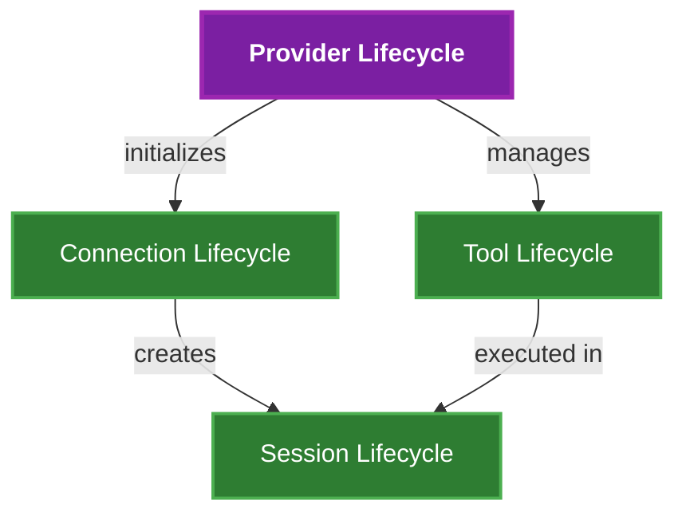

Key relationships:
- Provider Lifecycle is the central coordinator
- Connection Lifecycle manages server connections
- Tool Lifecycle handles tool registration and execution
- Session Lifecycle controls active sessions

#### 1.1.2 Health and Resource Management

The health monitoring and resource management relationships:

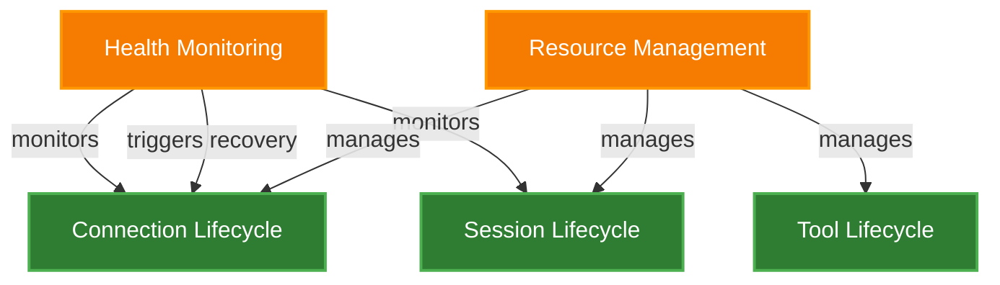

Key aspects:
- Health Monitoring ensures system reliability
- Resource Management controls system resources
- Both systems support core service components

#### 1.1.3 Error Handling Flow

The error handling relationships across the system:

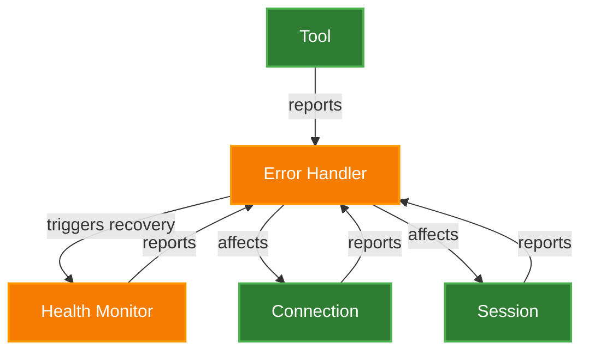

Key flows:
- All components report errors to Error Handler
- Error Handler coordinates with Health Monitor
- Recovery actions affect service components

#### 1.1.4 Monitoring and Logging

The observability layer of the system:

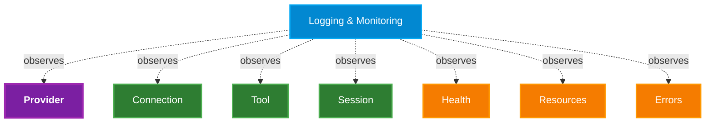

Key aspects:
- Non-intrusive observation of all components
- Comprehensive system monitoring
- No direct operational impact

### 1.2 System Interaction Flow

#### 1.2.1 Provider Initialization
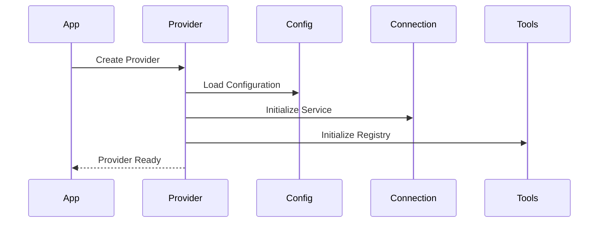

#### 1.2.2 Connection Flow
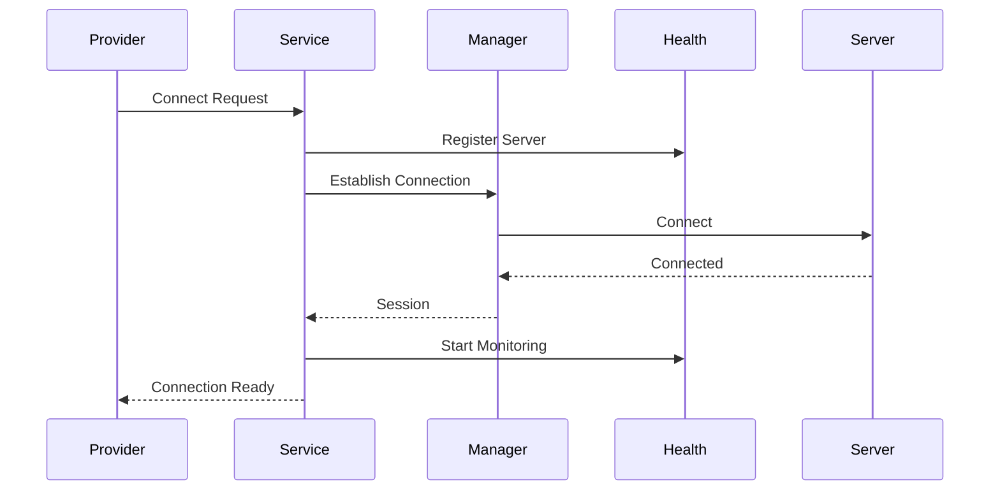

#### 1.2.3 Health Monitoring
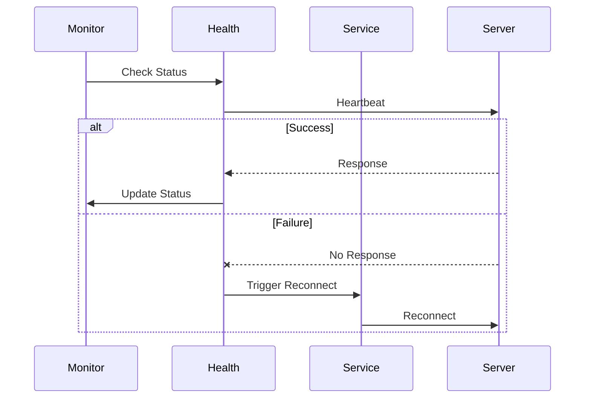

## 2. Provider Lifecycle

```mermaid
stateDiagram-v2
    direction LR

    %%{init: {'theme': 'dark', 'themeVariables': { 'fontFamily': 'arial', 'fontSize': '16px', 'primaryColor': '#2e7d32', 'primaryTextColor': '#fff', 'primaryBorderColor': '#4caf50', 'lineColor': '#666', 'secondaryColor': '#7b1fa2', 'tertiaryColor': '#2d2d2d'}}}%%

    [*] --> Initializing: Create Provider
    Initializing --> Configuring: Load Config
    Configuring --> Ready: Initialize Components
    Ready --> Connecting: Connect Request
    Connecting --> Operating: Connection Success
    Operating --> Cleanup: Cleanup Request
    Cleanup --> [*]: Resources Released

    state Initializing {
        direction LR
        [*] --> LoadEnv: Load Environment
        LoadEnv --> ValidateConfig: Validate Config
        ValidateConfig --> InitComponents: Create Components
        InitComponents --> [*]: Stack Ready
    }

    state Operating {
        direction LR
        [*] --> ProcessQuery: User Query
        ProcessQuery --> ExecuteTool: Tool Selected
        ExecuteTool --> ProcessQuery: Result Returned
    }

    state Cleanup {
        direction LR
        [*] --> StopMonitoring: Stop Health Checks
        StopMonitoring --> CleanRegistry: Clear Tools
        CleanRegistry --> DisconnectServers: Close Connections
        DisconnectServers --> [*]: Stack Closed
    }

    note right of Initializing
        Loads configuration and
        initializes components
    end note

    note right of Operating
        Processes user queries and
        executes tools
    end note

    note right of Cleanup
        Ensures proper resource
        cleanup and shutdown
    end note
```

### 1.1 Initialization Phase
- Load environment variables and configurations
- Initialize LLM backend
- Create AsyncExitStack for resource management
- Initialize connection service
- Initialize tool registry
- Load server configurations through config provider
- Validate configuration source and LLM backend

### 1.2 Connection Phase
- Connect to individual or all servers
- Register available tools from each server
- Start health monitoring
- Initialize conversation context
- Handle connection failures with cleanup

### 1.3 Operation Phase
- Process user queries through LLM
- Execute tools based on LLM decisions
- Maintain tool registry
- Monitor server health
- Handle reconnections as needed
- Track operation durations and performance

### 1.4 Cleanup Phase
- Stop health monitoring
- Clean up tool registry
- Disconnect from servers
- Clean up all resources
- Close AsyncExitStack
- Handle cleanup errors gracefully

## 3. Connection Lifecycle

```mermaid
stateDiagram-v2
    direction LR
    [*] --> Establishing: Connect Request
    Establishing --> Connected: Success
    Establishing --> RetryBackoff: Failure
    RetryBackoff --> Establishing: Retry
    Connected --> Monitoring: Start Health Check
    Monitoring --> Connected: Heartbeat OK
    Monitoring --> Reconnecting: Heartbeat Miss
    Reconnecting --> Connected: Success
    Reconnecting --> Failed: Max Retries
    Failed --> Cleanup: Initiate Cleanup
    Cleanup --> [*]: Resources Released

    state Establishing {
        direction LR
        [*] --> ValidateConfig: Check Config
        ValidateConfig --> CreateSession: Config OK
        CreateSession --> RegisterTools: Session Created
        RegisterTools --> [*]: Tools Registered
    }

    state Monitoring {
        direction LR
        [*] --> CheckHealth: Timer
        CheckHealth --> UpdateStatus: Process Result
        UpdateStatus --> [*]: Status Updated
    }
```

### 2.1 Connection Establishment
- Validate server configuration
- Attempt connection with retry logic (exponential backoff)
- Initialize client session
- Register with health monitor
- Start health monitoring if needed
- Handle connection failures

### 2.2 Connection Maintenance
- Regular heartbeat checks (every 30 seconds)
- Health status tracking
- Automatic reconnection on failures (after 2 missed heartbeats)
- Resource cleanup on disconnection
- Connection state management

### 2.3 Connection Cleanup
- Remove server tools from registry
- Clean up connection resources
- Stop health monitoring
- Handle cleanup errors gracefully
- Close communication channels

## 4. Tool Lifecycle

```mermaid
stateDiagram-v2
    direction LR
    [*] --> Discovery: Server Connected
    Discovery --> Registration: Tools Found
    Registration --> Available: Tools Registered
    Available --> Execution: Tool Request
    Execution --> Available: Success
    Execution --> ErrorHandling: Failure
    ErrorHandling --> Available: Recovered
    Available --> Cleanup: Server Disconnect
    Cleanup --> [*]: Tools Removed

    state Registration {
        direction LR
        [*] --> ValidateTools: Check Schema
        ValidateTools --> IndexTools: Schema Valid
        IndexTools --> UpdateRegistry: Add to Registry
        UpdateRegistry --> [*]: Registry Updated
    }

    state Execution {
        direction LR
        [*] --> FindServer: Locate Tool
        FindServer --> ValidateParams: Server Found
        ValidateParams --> CallTool: Params Valid
        CallTool --> [*]: Result Ready
    }
```

### 3.1 Tool Registration
- Discover tools from connected servers
- Register tools in server-specific collections
- Maintain combined tool list
- Map tools to source servers
- Handle tool updates and replacements

### 3.2 Tool Management
- Track tool availability by server
- Handle server disconnections
- Maintain tool registry state
- Support tool lookup by name
- Clean up tools on server removal

### 3.3 Tool Execution
- Find tool's hosting server
- Validate tool existence
- Execute through appropriate session
- Handle execution errors
- Track execution performance
- Return results to LLM

### 3.4 Tool Registry
```python
class ToolRegistry:
    """Manages the registration and lookup of MCP tools.

    Attributes:
        tools_by_server (Dict[str, List[MCPTool]]): Tools indexed by server
        all_tools (List[MCPTool]): Combined list of all available tools
    """

    def register_server_tools(self, server_name: str, tools: list[MCPTool]) -> None:
        """Register tools for a specific server."""
        pass

    def remove_server_tools(self, server_name: str) -> int:
        """Remove all tools for a specific server."""
        pass

    def find_tool_server(self, tool_name: str) -> str | None:
        """Find which server hosts a specific tool."""
        pass

    def get_server_tools(self, server_name: str) -> list[MCPTool]:
        """Get all tools registered for a specific server."""
        pass
```

## 5. Health Monitoring Lifecycle

```mermaid
stateDiagram-v2
    direction LR
    [*] --> Active: Monitor Started
    Active --> Checking: Heartbeat Timer
    Checking --> Active: Success
    Checking --> Warning: Miss 1
    Warning --> Active: Recovery
    Warning --> Critical: Miss 2
    Critical --> Reconnecting: Auto-Recovery
    Reconnecting --> Active: Success
    Reconnecting --> Failed: Max Attempts
    Failed --> [*]: Stop Monitoring

    state Checking {
        direction LR
        [*] --> VerifyConnection: Check Connection
        VerifyConnection --> UpdateMetrics: Process Status
        UpdateMetrics --> LogStatus: Record State
        LogStatus --> [*]: Check Complete
    }

    state Reconnecting {
        direction LR
        [*] --> CleanupOld: Remove Old
        CleanupOld --> AttemptNew: Try Connect
        AttemptNew --> ValidateNew: Connected
        ValidateNew --> [*]: Validated
    }
```

### 4.1 Monitor Initialization
- Register servers for monitoring
- Set initial health status
- Configure monitoring parameters
  - Heartbeat interval (30 seconds)
  - Max missed heartbeats (2)
- Start monitoring task

### 4.2 Health Checks
- Regular heartbeat verification
- Track consecutive failures
- Update server health status
- Trigger reconnection if needed
- Log health status changes

### 4.3 Recovery Process
- Clean up failed connection
- Attempt reconnection with backoff
- Re-register tools on success
- Update health status
- Handle permanent failures

### 4.4 Monitor Cleanup
- Stop monitoring task
- Clean up health records
- Handle task cancellation
- Release resources
- Log cleanup completion

## 6. Session Lifecycle

```mermaid
stateDiagram-v2
    direction LR
    [*] --> Creating: Init Request
    Creating --> Active: Creation Success
    Active --> Processing: Tool Request
    Processing --> Active: Request Complete
    Active --> Closing: Close Request
    Closing --> [*]: Session Closed

    state Creating {
        direction LR
        [*] --> InitChannel: Create Channel
        InitChannel --> ConfigureSession: Channel Ready
        ConfigureSession --> RegisterHandlers: Session Config
        RegisterHandlers --> [*]: Handlers Ready
    }

    state Processing {
        direction LR
        [*] --> ValidateRequest: Check Request
        ValidateRequest --> ExecuteLogic: Request Valid
        ExecuteLogic --> PrepareResponse: Logic Complete
        PrepareResponse --> [*]: Response Ready
    }

    state Closing {
        direction LR
        [*] --> StopProcessing: Block New
        StopProcessing --> CleanupResources: Finish Active
        CleanupResources --> FinalizeState: Resources Free
        FinalizeState --> [*]: Cleanup Done
    }
```

### 5.1 Session Creation
- Initialize client session
- Establish communication channel
- Configure session parameters
- Register with connection manager
- Initialize session state

### 5.2 Session Management
- Handle session state
- Process tool requests
- Maintain connection
- Track session health
- Handle session errors

### 5.3 Session Cleanup
- Close communication channels
- Clean up session resources
- Remove from connection manager
- Handle cleanup errors
- Log cleanup status

## 7. Error Handling and Recovery

```mermaid
stateDiagram-v2
    direction LR
    [*] --> Monitoring: System Active
    Monitoring --> ErrorDetected: Error Occurs
    ErrorDetected --> Analysis: Detect Error
    Analysis --> Recoverable: Can Recover
    Analysis --> Unrecoverable: Cannot Recover
    Recoverable --> RetryLogic: Attempt Fix
    RetryLogic --> Monitoring: Success
    RetryLogic --> Unrecoverable: Max Retries
    Unrecoverable --> Cleanup: Initiate Cleanup
    Cleanup --> [*]: Error Handled

    state Analysis {
        direction LR
        [*] --> ClassifyError: Identify Type
        ClassifyError --> AssessImpact: Determine Scope
        AssessImpact --> DetermineStrategy: Plan Action
        DetermineStrategy --> [*]: Strategy Ready
    }

    state RetryLogic {
        direction LR
        [*] --> BackoffCalc: Calculate Delay
        BackoffCalc --> AttemptRetry: Wait Complete
        AttemptRetry --> ValidateResult: Retry Done
        ValidateResult --> [*]: Validation Done
    }
```

### 6.1 Connection Errors
- Implement exponential backoff
- Track connection attempts
- Handle permanent failures
- Clean up failed connections
- Log error details

### 6.2 Tool Execution Errors
- Validate tool inputs
- Handle execution failures
- Provide error context
- Clean up resources
- Log execution errors

### 6.3 Health Monitoring Errors
- Handle monitoring failures
- Recover from task errors
- Maintain monitoring state
- Log error information
- Trigger recovery actions

## 8. Resource Management

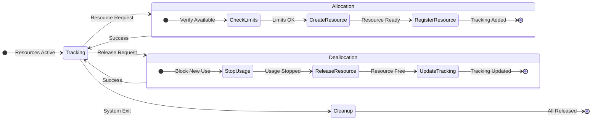

### 7.1 Resource Allocation
- Manage AsyncExitStack
- Track active connections
- Monitor resource usage
- Handle resource limits
- Log resource states

### 7.2 Resource Cleanup
- Implement proper cleanup order
- Handle cleanup failures
- Release resources gracefully
- Verify cleanup completion
- Log cleanup status

## 9. Logging and Monitoring

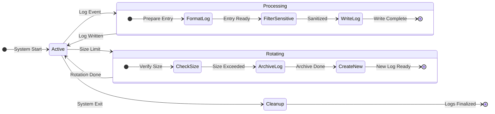

### 8.1 Logging Lifecycle
- Initialize logging system
- Configure log levels
- Handle log rotation
- Manage log output
- Sanitize sensitive data

### 8.2 Performance Monitoring
- Track operation durations
- Monitor resource usage
- Log performance metrics
- Handle monitoring errors
- Report statistics