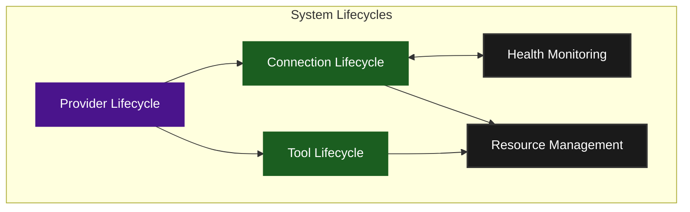
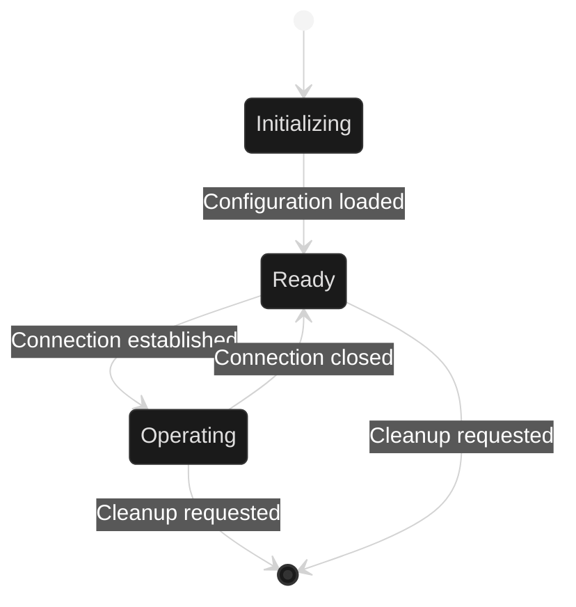
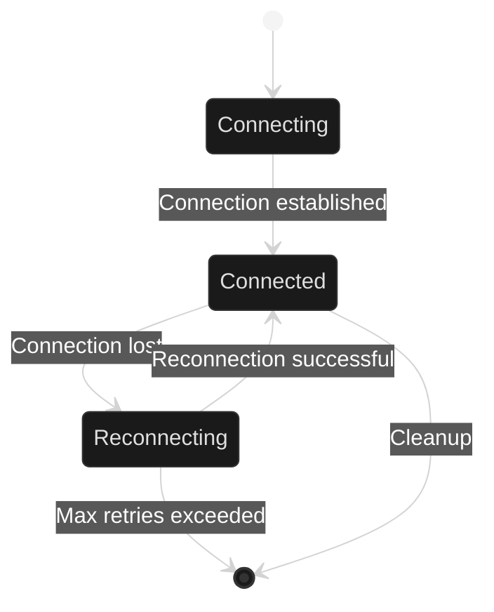
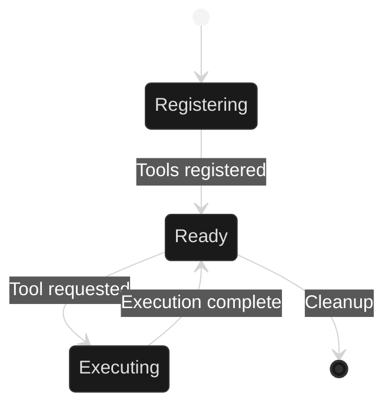
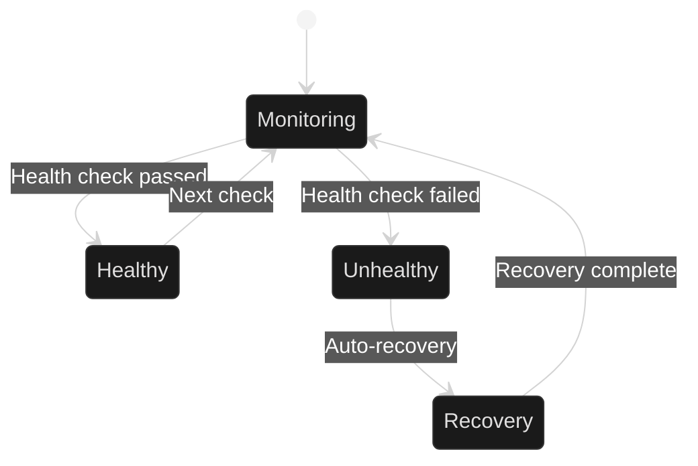

# System Lifecycles

This document outlines the core lifecycles in the Agentical system and their key interactions.
For a more detailed view of each lifecycle, including implementation details and advanced state transitions, see [System Lifecycles (Detailed)](system-lifecycles-detailed.md).

## Table of Contents
- [1. System Overview](#1-system-overview)
- [2. Provider Lifecycle](#2-provider-lifecycle)
- [3. Connection Lifecycle](#3-connection-lifecycle)
- [4. Tool Lifecycle](#4-tool-lifecycle)
- [5. Health Monitoring](#5-health-monitoring)

## 1. System Overview

The system consists of five core lifecycles that work together:

## 2. Provider Lifecycle

The Provider lifecycle manages the overall system:

Key States:
- **Initializing**: Loading configuration and setting up services
- **Ready**: System is configured and ready for connections
- **Operating**: Actively processing requests
- **Cleanup**: Graceful shutdown and resource release

## 3. Connection Lifecycle

Manages server connections:

Key States:
- **Connecting**: Establishing initial connection
- **Connected**: Active server connection
- **Reconnecting**: Handling connection issues
- **Cleanup**: Connection teardown

## 4. Tool Lifecycle

Handles tool registration and execution:

Key States:
- **Registering**: Adding tools to registry
- **Ready**: Tools available for use
- **Executing**: Processing tool request
- **Cleanup**: Tool cleanup and deregistration

## 5. Health Monitoring

Monitors system health:

Key States:
- **Monitoring**: Regular health checks
- **Healthy**: System operating normally
- **Unhealthy**: Issues detected
- **Recovery**: Automatic recovery process