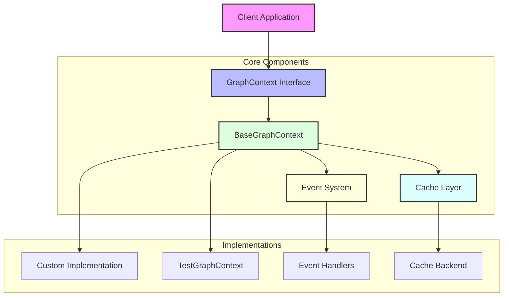
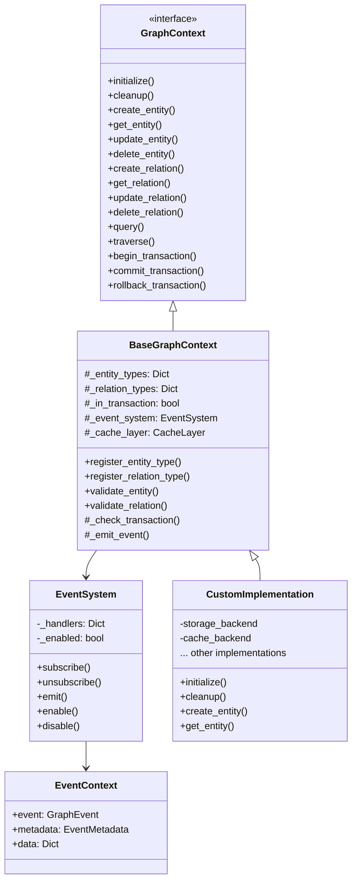
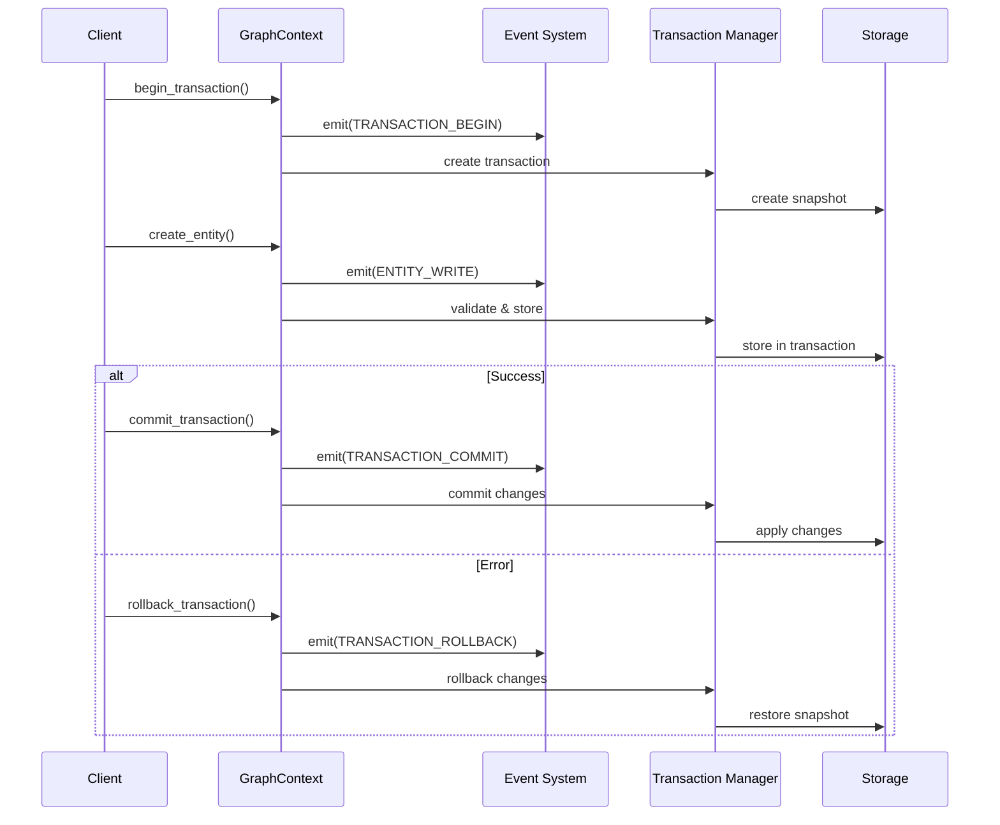
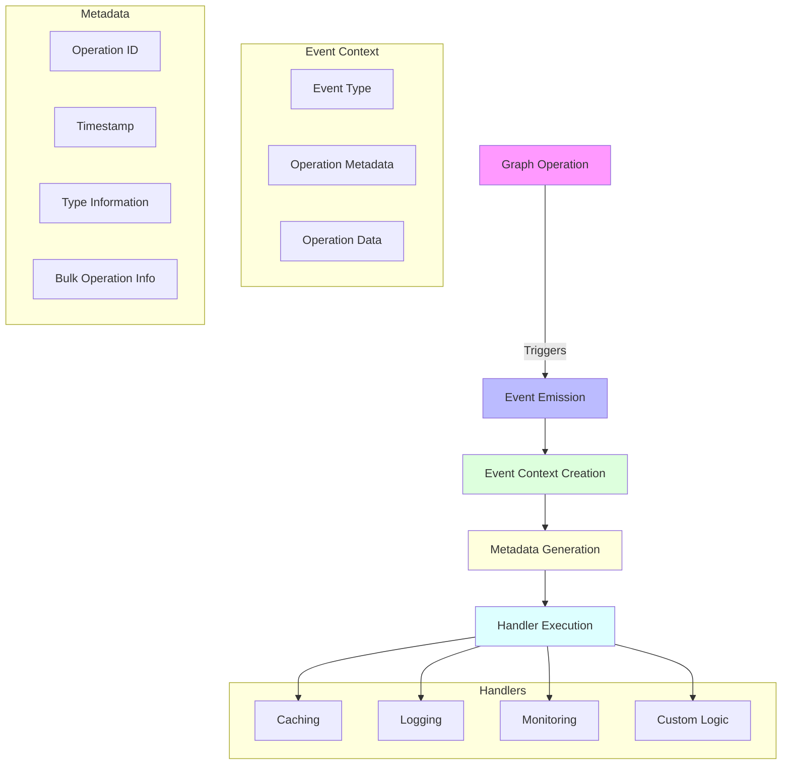
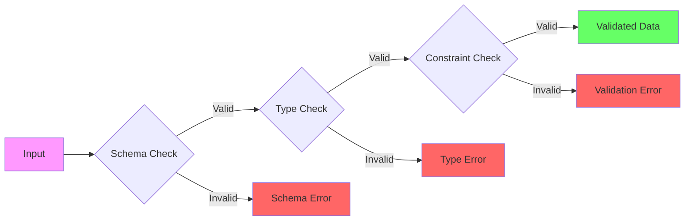

<p align="center">
  
</p>

A flexible and type-safe graph database abstraction layer for Python, providing a robust foundation for building graph-based applications with strong validation and transaction support.

[](https://pypi.org/project/graph-context)
[](https://github.com/beanone/graph-context/blob/main/LICENSE)
[](https://github.com/beanone/graph-context/actions?query=workflow%3Atests)
[](https://codecov.io/gh/beanone/graph-context)
[](https://github.com/astral-sh/ruff)
[](https://pypi.org/project/graph-context)

## Table of Contents

- [Features](#features)
- [Installation](#installation)
- [Quick Start](#quick-start)
- [Core Concepts](#core-concepts)
  - [Event System](#event-system)
  - [Entities](#entities)
  - [Relations](#relations)
  - [Transactions](#transactions)
  - [Validation](#validation)
- [Architecture](#architecture)
  - [Component Overview](#component-overview)
  - [Class Structure](#class-structure)
  - [Transaction Flow](#transaction-flow)
  - [Event System Architecture](#event-system-architecture)
  - [Validation Pipeline](#validation-pipeline)
- [API Reference](#api-reference)
  - [Entity Operations](#entity-operations)
  - [Relation Operations](#relation-operations)
  - [Query and Traversal](#query-and-traversal)
- [Development](#development)
  - [Setup](#setup)
  - [Running Tests](#running-tests)
  - [Code Style](#code-style)
- [Contributing](#contributing)
  - [Guidelines](#guidelines)
- [License](#license)
- [Acknowledgments](#acknowledgments)
- [Documentation](#documentation)
- [Sample Usage with FastAPI](#sample-usage-with-fastapi)

- 🔍 **Type-Safe**: Full type hints and runtime type checking
- 🔒 **Schema Validation**: Strict schema validation for entities and relations
- 💼 **Transaction Support**: ACID-compliant transactions with commit/rollback
- 🎯 **Property Validation**: Rich property validation with constraints
- 🌐 **Graph Operations**: Comprehensive graph traversal and query capabilities
- 🔌 **Extensible**: Easy to implement custom storage backends
- 🧪 **Well-Tested**: High test coverage and comprehensive test suite
- 📡 **Event System**: Sophisticated pub/sub system with metadata tracking and bulk operation support
- 💾 **Caching Support**: Flexible caching system with various backend options
- 🛡️ **Error Handling**: Comprehensive error handling with detailed error types
- 📊 **Bulk Operations**: Efficient bulk entity and relation operations
- 🔄 **Metadata Tracking**: Detailed operation metadata for debugging and monitoring

## Installation

```bash
pip install graph-context
```

## Quick Start

```python
from graph_context import BaseGraphContext
from graph_context.types import EntityType, PropertyDefinition, RelationType

# Define your schema
class MyGraphContext(BaseGraphContext):
    async def initialize(self) -> None:
        # Register entity types
        self.register_entity_type(EntityType(
            name="Person",
            properties={
                "name": PropertyDefinition(type="string", required=True),
                "age": PropertyDefinition(type="integer", required=False)
            }
        ))

        # Register relation types
        self.register_relation_type(RelationType(
            name="KNOWS",
            from_types=["Person"],
            to_types=["Person"]
        ))

    async def cleanup(self) -> None:
        pass

# Use the graph context
async def main():
    context = MyGraphContext()
    await context.initialize()

    # Start a transaction
    await context.begin_transaction()

    try:
        # Create entities
        alice_id = await context.create_entity(
            entity_type="Person",
            properties={"name": "Alice", "age": 30}
        )

        bob_id = await context.create_entity(
            entity_type="Person",
            properties={"name": "Bob", "age": 25}
        )

        # Create relation
        await context.create_relation(
            relation_type="KNOWS",
            from_entity=alice_id,
            to_entity=bob_id
        )

        # Commit the transaction
        await context.commit_transaction()
    except:
        # Rollback on error
        await context.rollback_transaction()
        raise

if __name__ == "__main__":
    import asyncio
    asyncio.run(main())
```

## Core Concepts

### Event System

The graph-context library includes a sophisticated event system that allows you to:
- Subscribe to graph operations (entity/relation CRUD, queries, traversals)
- Track detailed operation metadata
- Handle bulk operations efficiently
- Implement cross-cutting concerns like caching and logging

Example usage:

```python
from graph_context import GraphEvent

async def log_entity_changes(event_context):
    metadata = event_context.metadata
    print(f"Entity changed: {metadata.entity_type} at {metadata.timestamp}")
    print(f"Operation ID: {metadata.operation_id}")

# Subscribe to entity write events
await context.event_system.subscribe(GraphEvent.ENTITY_WRITE, log_entity_changes)
```

### Entities

Entities are nodes in the graph with:
- Type definitions (e.g., "Person", "Document")
- Properties with validation rules
- Unique IDs

### Relations

Relations are edges connecting entities with:
- Type definitions (e.g., "KNOWS", "AUTHORED")
- Direction (from_entity → to_entity)
- Optional properties
- Type constraints

### Transactions

All operations can be wrapped in transactions:
- Begin/commit/rollback support
- Isolation of changes
- Atomic operations
- Consistent state
- Event emission for transaction lifecycle
- Automatic metadata tracking

Example with error handling:

```python
try:
    await context.begin_transaction()

    # Create entities with validation
    try:
        alice_id = await context.create_entity(
            entity_type="Person",
            properties={"name": "Alice", "age": 30}
        )
    except ValidationError as e:
        print(f"Validation failed: {e.detail}")
        await context.rollback_transaction()
        return

    # Create relation with type checking
    try:
        await context.create_relation(
            relation_type="KNOWS",
            from_entity=alice_id,
            to_entity=bob_id
        )
    except (EntityNotFoundError, SchemaError) as e:
        print(f"Relation creation failed: {e}")
        await context.rollback_transaction()
        return

    await context.commit_transaction()
except TransactionError as e:
    print(f"Transaction error: {e}")
    await context.rollback_transaction()

### Validation

Comprehensive validation system:
- Schema validation
- Property type checking
- Required/optional fields
- Default values
- Custom constraints (patterns, ranges, etc.)

## Architecture

### Component Overview



### Class Structure



### Transaction Flow



### Event System Architecture



### Validation Pipeline



## API Reference

### Entity Operations

```python
# Create an entity
entity_id = await context.create_entity(
    entity_type="Person",
    properties={"name": "Alice"}
)

# Get an entity
entity = await context.get_entity(entity_id)

# Update an entity
await context.update_entity(
    entity_id,
    properties={"age": 31}
)

# Delete an entity
await context.delete_entity(entity_id)
```

### Relation Operations

```python
# Create a relation
relation_id = await context.create_relation(
    relation_type="KNOWS",
    from_entity=alice_id,
    to_entity=bob_id
)

# Get a relation
relation = await context.get_relation(relation_id)

# Update a relation
await context.update_relation(
    relation_id,
    properties={"strength": "close"}
)

# Delete a relation
await context.delete_relation(relation_id)
```

### Query and Traversal

```python
# Query relations
results = await context.query({
    "start": alice_id,
    "relation": "KNOWS",
    "direction": "outbound"
})

# Traverse the graph
results = await context.traverse(
    start_entity=alice_id,
    traversal_spec={
        "max_depth": 2,
        "relation_types": ["KNOWS"],
        "direction": "any"
    }
)
```

## Development

### Setup

```bash
# Clone the repository
git clone https://github.com/yourusername/graph-context.git
cd graph-context

# Create and activate virtual environment
python -m venv .venv
source .venv/bin/activate  # On Windows: .venv\Scripts\activate

# Install dependencies
pip install -e ".[dev]"
```

### Running Tests

```bash
# Run all tests
pytest

# Run tests with coverage
pytest --cov=src/graph_context

# Run specific test file
pytest tests/graph_context/test_context_base.py
```

### Code Style

This project uses [ruff](https://github.com/astral-sh/ruff) for code formatting and linting:

```bash
# Format code
ruff format .

# Run linter
ruff check .
```

## Contributing

Contributions are welcome! Please feel free to submit a Pull Request. For major changes, please open an issue first to discuss what you would like to change.

Please make sure to update tests as appropriate.

### Guidelines

1. Fork the repository
2. Create your feature branch (`git checkout -b feature/amazing-feature`)
3. Commit your changes (`git commit -m 'Add some amazing feature'`)
4. Push to the branch (`git push origin feature/amazing-feature`)
5. Open a Pull Request

## License

This project is licensed under the MIT License - see the [LICENSE](LICENSE) file for details.

## Acknowledgments

- Thanks to all contributors who have helped shape this project
- Inspired by graph database concepts and best practices

## Documentation

- [Graph Context Architecture](docs/graph-context.md)
- [Event System](docs/event-system.md) - Flexible pub/sub system for implementing cross-cutting concerns
- [Caching Implementation Plan](docs/caching-implementation-plan.md)

## Sample Usage with FastAPI

Here's a complete example of how to use graph-context with FastAPI to create a REST API for managing a social network graph:

```python
from fastapi import FastAPI, HTTPException, Depends
from pydantic import BaseModel, EmailStr, Field
from typing import List, Optional
from datetime import datetime, UTC
import re
from graph_context import BaseGraphContext
from graph_context.types import EntityType, PropertyDefinition, RelationType, PropertyType
from graph_context.exceptions import (
    GraphContextError,
    ValidationError,
    SchemaError,
    TransactionError,
    EntityNotFoundError
)

# Define your schema
class SocialGraphContext(BaseGraphContext):
    def __init__(self):
        super().__init__()
        # Register entity types with proper property definitions and constraints
        self.register_entity_type(EntityType(
            name="Person",
            properties={
                "name": PropertyDefinition(
                    type=PropertyType.STRING,
                    required=True,
                    constraints={
                        "min_length": 2,
                        "max_length": 100
                    }
                ),
                "email": PropertyDefinition(
                    type=PropertyType.STRING,
                    required=True,
                    constraints={
                        "pattern": r"^[a-zA-Z0-9._%+-]+@[a-zA-Z0-9.-]+\.[a-zA-Z]{2,}$"
                    }
                ),
                "age": PropertyDefinition(
                    type=PropertyType.INTEGER,
                    required=False,
                    constraints={
                        "minimum": 0,
                        "maximum": 150
                    }
                ),
                "interests": PropertyDefinition(
                    type=PropertyType.LIST,
                    required=False,
                    constraints={
                        "item_type": PropertyType.STRING,
                        "min_items": 0,
                        "max_items": 10
                    }
                )
            }
        ))

        # Register relation types with proper type constraints
        self.register_relation_type(RelationType(
            name="FRIENDS_WITH",
            from_types=["Person"],
            to_types=["Person"],
            properties={
                "since": PropertyDefinition(
                    type=PropertyType.DATETIME,
                    required=True
                ),
                "strength": PropertyDefinition(
                    type=PropertyType.STRING,
                    required=False,
                    constraints={
                        "pattern": r"^(close|casual|acquaintance)$"
                    }
                )
            }
        ))

# Pydantic models for API with proper validation
class PersonCreate(BaseModel):
    name: str = Field(..., min_length=2, max_length=100)
    email: EmailStr
    age: Optional[int] = Field(None, ge=0, le=150)
    interests: Optional[List[str]] = Field(None, max_items=10)

class PersonResponse(BaseModel):
    id: str
    name: str
    email: str
    age: Optional[int] = None
    interests: Optional[List[str]] = None

class FriendRequest(BaseModel):
    friend_id: str
    strength: Optional[str] = Field(None, pattern=r"^(close|casual|acquaintance)$")

# FastAPI app setup
app = FastAPI(title="Social Network API")
context = SocialGraphContext()

# Dependency to get graph context
async def get_context():
    return context

@app.on_event("shutdown")
async def shutdown():
    await context.cleanup()

# CRUD endpoints
@app.post("/people", response_model=PersonResponse)
async def create_person(
    person: PersonCreate,
    ctx: BaseGraphContext = Depends(get_context)
):
    try:
        await ctx.begin_transaction()

        # Create person entity with validated properties
        person_id = await ctx.create_entity(
            entity_type="Person",
            properties=person.model_dump(exclude_none=True)
        )

        # Get created person
        person_entity = await ctx.get_entity(person_id)

        await ctx.commit_transaction()
        return PersonResponse(id=person_id, **person_entity.properties)
    except ValidationError as e:
        await ctx.rollback_transaction()
        raise HTTPException(
            status_code=400,
            detail={
                "message": str(e),
                "field": e.details.get("field"),
                "constraint": e.details.get("constraint")
            }
        )
    except SchemaError as e:
        await ctx.rollback_transaction()
        raise HTTPException(
            status_code=400,
            detail={
                "message": str(e),
                "schema_type": e.details.get("schema_type")
            }
        )
    except TransactionError as e:
        await ctx.rollback_transaction()
        raise HTTPException(status_code=500, detail=str(e))
    except GraphContextError as e:
        await ctx.rollback_transaction()
        raise HTTPException(status_code=500, detail=str(e))

@app.get("/people/{person_id}", response_model=PersonResponse)
async def get_person(
    person_id: str,
    ctx: BaseGraphContext = Depends(get_context)
):
    try:
        person = await ctx.get_entity(person_id)
        if not person:
            raise HTTPException(status_code=404, detail="Person not found")
        return PersonResponse(id=person_id, **person.properties)
    except EntityNotFoundError:
        raise HTTPException(status_code=404, detail="Person not found")
    except GraphContextError as e:
        raise HTTPException(status_code=500, detail=str(e))

@app.put("/people/{person_id}", response_model=PersonResponse)
async def update_person(
    person_id: str,
    person: PersonCreate,
    ctx: BaseGraphContext = Depends(get_context)
):
    try:
        await ctx.begin_transaction()

        # Update person entity with validated properties
        success = await ctx.update_entity(
            entity_id=person_id,
            properties=person.model_dump(exclude_none=True)
        )

        if not success:
            raise HTTPException(status_code=404, detail="Person not found")

        # Get updated person
        person_entity = await ctx.get_entity(person_id)

        await ctx.commit_transaction()
        return PersonResponse(id=person_id, **person_entity.properties)
    except ValidationError as e:
        await ctx.rollback_transaction()
        raise HTTPException(
            status_code=400,
            detail={
                "message": str(e),
                "field": e.details.get("field"),
                "constraint": e.details.get("constraint")
            }
        )
    except SchemaError as e:
        await ctx.rollback_transaction()
        raise HTTPException(
            status_code=400,
            detail={
                "message": str(e),
                "schema_type": e.details.get("schema_type")
            }
        )
    except TransactionError as e:
        await ctx.rollback_transaction()
        raise HTTPException(status_code=500, detail=str(e))
    except GraphContextError as e:
        await ctx.rollback_transaction()
        raise HTTPException(status_code=500, detail=str(e))

@app.delete("/people/{person_id}")
async def delete_person(
    person_id: str,
    ctx: BaseGraphContext = Depends(get_context)
):
    try:
        await ctx.begin_transaction()
        success = await ctx.delete_entity(person_id)
        if not success:
            raise HTTPException(status_code=404, detail="Person not found")
        await ctx.commit_transaction()
        return {"message": "Person deleted successfully"}
    except TransactionError as e:
        await ctx.rollback_transaction()
        raise HTTPException(status_code=500, detail=str(e))
    except GraphContextError as e:
        await ctx.rollback_transaction()
        raise HTTPException(status_code=500, detail=str(e))

# Friend relationship endpoints
@app.post("/people/{person_id}/friends")
async def add_friend(
    person_id: str,
    friend: FriendRequest,
    ctx: BaseGraphContext = Depends(get_context)
):
    try:
        await ctx.begin_transaction()

        # Create friend relationship with validated properties
        await ctx.create_relation(
            relation_type="FRIENDS_WITH",
            from_entity=person_id,
            to_entity=friend.friend_id,
            properties={
                "since": datetime.now(UTC),
                "strength": friend.strength
            } if friend.strength else {"since": datetime.now(UTC)}
        )

        await ctx.commit_transaction()
        return {"message": "Friend added successfully"}
    except EntityNotFoundError:
        await ctx.rollback_transaction()
        raise HTTPException(status_code=404, detail="Person or friend not found")
    except ValidationError as e:
        await ctx.rollback_transaction()
        raise HTTPException(
            status_code=400,
            detail={
                "message": str(e),
                "field": e.details.get("field"),
                "constraint": e.details.get("constraint")
            }
        )
    except SchemaError as e:
        await ctx.rollback_transaction()
        raise HTTPException(
            status_code=400,
            detail={
                "message": str(e),
                "schema_type": e.details.get("schema_type")
            }
        )
    except TransactionError as e:
        await ctx.rollback_transaction()
        raise HTTPException(status_code=500, detail=str(e))
    except GraphContextError as e:
        await ctx.rollback_transaction()
        raise HTTPException(status_code=500, detail=str(e))

@app.get("/people/{person_id}/friends", response_model=List[PersonResponse])
async def get_friends(
    person_id: str,
    ctx: BaseGraphContext = Depends(get_context)
):
    try:
        # Query for friends with proper query specification
        friends = await ctx.query({
            "entity_type": "Person",
            "conditions": [
                {
                    "relation_type": "FRIENDS_WITH",
                    "from_entity": person_id,
                    "direction": "outbound"
                }
            ]
        })

        return [
            PersonResponse(id=friend.id, **friend.properties)
            for friend in friends
        ]
    except EntityNotFoundError:
        raise HTTPException(status_code=404, detail="Person not found")
    except GraphContextError as e:
        raise HTTPException(status_code=500, detail=str(e))

# Run with: uvicorn main:app --reload

## Custom GraphStore Implementation

The `BaseGraphContext` uses `InMemoryGraphStore` by default, but you can implement and use your own `GraphStore` implementation. There are two ways to use a custom store:

### 1. Registration-based (Programmatic Use)

Use this pattern when you want to programmatically register and use a custom store:

```python
from graph_context.interfaces.store import GraphStore
from graph_context.types.type_base import Entity, Relation
from typing import Any, Optional, List

class CustomGraphStore(GraphStore):
    """Custom graph store implementation."""

    def __init__(self, config: dict[str, Any]) -> None:
        """Initialize the store with configuration."""
        self.config = config
        # Your initialization code here

    # ... implement all required methods ...

# Register the store type
from graph_context.store import GraphStoreFactory
GraphStoreFactory.register_store_type("custom", CustomGraphStore)

# Create context (will use registered store)
context = BaseGraphContext()

# Use the context
await context.create_entity("Person", {"name": "Alice"})
```

### 2. Configuration-based (Deployment)

Use this pattern when you want to configure the store through environment variables or configuration files:

```python
# 1. Create your store implementation
class CustomGraphStore(GraphStore):
    """Custom graph store implementation."""

    def __init__(self, config: dict[str, Any]) -> None:
        """Initialize the store with configuration."""
        self.config = config
        # Your initialization code here

    # ... implement all required methods ...

# 2. Configure the store using one of these methods:

# a. Environment variable:
export GRAPH_STORE_CONFIG='{"type": "my_package.stores.custom_store.CustomGraphStore", "config": {"your_config": "value"}}'

# b. Configuration file (graph_store_config.json):
{
    "type": "my_package.stores.custom_store.CustomGraphStore",
    "config": {
        "your_config": "value"
    }
}

# 3. Create context (will use configured store)
context = BaseGraphContext()

# 4. Use the context
await context.create_entity("Person", {"name": "Alice"})
```

### Store Loading Process

When you create a new `BaseGraphContext` instance, the following process occurs:

1. `BaseGraphContext.__init__()` calls `GraphStoreFactory.create()`
2. `GraphStoreFactory.create()` loads the configuration:
   - First checks for `GRAPH_STORE_CONFIG` environment variable
   - Then checks for `graph_store_config.json` file
   - Falls back to memory store if no configuration is found
3. The factory determines how to load the store:
   - If the type is registered, uses the registered class
   - If not registered, attempts to load the class dynamically from the configured type
4. It instantiates the store with the provided configuration
5. The store instance is used by the context

### Example: Complete Setup with Both Patterns

```python
# 1. Create your store implementation
class CustomGraphStore(GraphStore):
    def __init__(self, config: dict[str, Any]) -> None:
        self.config = config
        # Your initialization code here

    # ... implement all required methods ...

# 2. Choose one of these approaches:

# A. Registration-based (for programmatic use)
GraphStoreFactory.register_store_type("custom", CustomGraphStore)
context = BaseGraphContext()

# OR

# B. Configuration-based (for deployment)
# Set configuration via environment variable
import os
os.environ["GRAPH_STORE_CONFIG"] = json.dumps({
    "type": "my_package.stores.custom_store.CustomGraphStore",
    "config": {
        "connection_string": "your_connection_string",
        "options": {
            "pool_size": 10,
            "timeout": 30
        }
    }
})
context = BaseGraphContext()

# 3. Use the context
await context.create_entity("Person", {"name": "Alice"})
```

The `GraphStore` interface requires implementing these key methods:
- `create_entity`: Create a new entity
- `get_entity`: Retrieve an entity by ID
- `update_entity`: Update an existing entity
- `delete_entity`: Delete an entity
- `create_relation`: Create a new relation
- `get_relation`: Retrieve a relation by ID
- `update_relation`: Update an existing relation
- `delete_relation`: Delete a relation
- `query`: Execute a query against the graph
- `traverse`: Traverse the graph from a starting entity
- `begin_transaction`: Start a new transaction
- `commit_transaction`: Commit the current transaction
- `rollback_transaction`: Roll back the current transaction

Your custom store implementation should handle:
- Data persistence
- Transaction management
- Query execution
- Graph traversal
- Error handling
- Connection management
- Resource cleanup

## Dynamic Entity Discovery Example

This example demonstrates how to discover and register entity types dynamically from unstructured text:

```python
from typing import Dict, List, Set
import re
from dataclasses import dataclass
from graph_context import BaseGraphContext
from graph_context.types import (
    EntityType,
    PropertyDefinition,
    QuerySpec,
    QueryCondition,
    QueryOperator
)

@dataclass
class DiscoveredEntity:
    text: str
    type: str
    properties: Dict[str, str]
    start_pos: int
    end_pos: int

class DocumentGraphBuilder:
    def __init__(self):
        self.context = BaseGraphContext()
        self.registered_types: Set[str] = set()

    async def discover_entity_types(self, text: str) -> List[DiscoveredEntity]:
        """Discover entities and their types from text using NLP or pattern matching."""
        # This is a simplified example. In reality, you'd use NLP libraries
        # like spaCy, NLTK, or custom ML models for entity recognition

        # Example patterns (simplified for demonstration)
        patterns = {
            "Person": r"\b[A-Z][a-z]+ [A-Z][a-z]+\b",  # Simple name pattern
            "Organization": r"\b[A-Z][a-z]+ (Inc\.|LLC|Corp\.|Ltd\.)\b",
            "Location": r"\b[A-Z][a-z]+(?: [A-Z][a-z]+)* (?:Street|Avenue|Road|City|State)\b",
            "Date": r"\b\d{1,2}/\d{1,2}/\d{2,4}\b"
        }

        entities = []
        for entity_type, pattern in patterns.items():
            for match in re.finditer(pattern, text):
                # Extract properties based on entity type
                properties = self._extract_properties(match.group(), entity_type)

                entities.append(DiscoveredEntity(
                    text=match.group(),
                    type=entity_type,
                    properties=properties,
                    start_pos=match.start(),
                    end_pos=match.end()
                ))

        return entities

    def _extract_properties(self, text: str, entity_type: str) -> Dict[str, str]:
        """Extract properties based on entity type and text."""
        properties = {"text": text}

        if entity_type == "Person":
            # Split name into components
            parts = text.split()
            if len(parts) >= 2:
                properties["first_name"] = parts[0]
                properties["last_name"] = parts[-1]

        elif entity_type == "Organization":
            # Extract company type
            if "Inc." in text:
                properties["company_type"] = "Incorporated"
            elif "LLC" in text:
                properties["company_type"] = "Limited Liability Company"

        elif entity_type == "Date":
            # Parse date components
            month, day, year = text.split("/")
            properties["month"] = month
            properties["day"] = day
            properties["year"] = year

        return properties

    async def register_entity_type(self, entity_type: str, properties: Dict[str, str]):
        """Register an entity type if not already registered."""
        if entity_type in self.registered_types:
            return

        # Convert discovered properties to PropertyDefinition
        property_defs = {
            "text": PropertyDefinition(type="string", required=True)
        }

        # Add type-specific properties
        for prop_name, prop_value in properties.items():
            if prop_name != "text":
                # Infer property type from value
                prop_type = "string"
                if prop_value.isdigit():
                    prop_type = "integer"
                elif prop_value.replace(".", "").isdigit():
                    prop_type = "float"

                property_defs[prop_name] = PropertyDefinition(
                    type=prop_type,
                    required=False
                )

        # Register the entity type
        await self.context.register_entity_type(
            EntityType(
                name=entity_type,
                properties=property_defs
            )
        )
        self.registered_types.add(entity_type)

    async def discover_relations(self, text: str, entities: List[DiscoveredEntity]) -> List[tuple]:
        """Discover relations between entities."""
        relations = []

        # Example relation patterns (simplified)
        relation_patterns = {
            "WORKS_AT": r"works at",
            "LIVES_IN": r"lives in",
            "BORN_ON": r"born on"
        }

        for pattern, relation_type in relation_patterns.items():
            for match in re.finditer(pattern, text):
                # Find entities before and after the relation
                before_entities = [e for e in entities if e.end_pos <= match.start()]
                after_entities = [e for e in entities if e.start_pos >= match.end()]

                if before_entities and after_entities:
                    # In our implementation, relations are always from source to target
                    # So we need to determine the correct direction based on the relation type
                    if relation_type in ["WORKS_AT", "LIVES_IN", "BORN_ON"]:
                        source = before_entities[-1]  # Person
                        target = after_entities[0]    # Organization/Location/Date
                    else:
                        source = after_entities[0]
                        target = before_entities[-1]

                    relations.append((
                        source,
                        relation_type,
                        target,
                        {"text": match.group()}
                    ))

        return relations

    async def build_graph_from_text(self, text: str):
        """Build a graph from text by discovering entities and relations."""
        # Discover entities
        entities = await self.discover_entity_types(text)

        # Register entity types and create entities
        entity_map = {}  # Map discovered entities to their IDs
        async with self.context.begin_transaction():
            for entity in entities:
                # Register entity type if needed
                await self.register_entity_type(entity.type, entity.properties)

                # Create entity
                entity_id = await self.context.create_entity(
                    entity.type,
                    entity.properties
                )
                entity_map[entity] = entity_id

            # Discover and create relations
            relations = await self.discover_relations(text, entities)
            for source, relation_type, target, properties in relations:
                await self.context.create_relation(
                    relation_type,
                    entity_map[source],
                    entity_map[target],
                    properties
                )

# Example usage
async def process_document():
    builder = DocumentGraphBuilder()

    # Example document
    text = """
    John Smith works at Acme Inc. He lives in New York City.
    He was born on 01/15/1980. His colleague Jane Doe also works at Acme Inc.
    """

    await builder.build_graph_from_text(text)

    # Query the graph
    async with builder.context.begin_transaction():
        # Create a query spec to find people who work at Acme Inc.
        query_spec = QuerySpec(
            entity_type="Person",
            conditions=[
                QueryCondition(
                    field="text",
                    operator=QueryOperator.CONTAINS,
                    value="Acme Inc."
                )
            ]
        )

        # Execute the query
        entities = await builder.context.query(query_spec)

        for entity in entities:
            print(f"Found person: {entity.properties['text']}")

# Run the example
import asyncio
asyncio.run(process_document())
```

This example shows how to:
1. Discover entities and their types from text
2. Dynamically register entity types as they're discovered
3. Extract and infer properties from text
4. Discover relations between entities
5. Build a graph from unstructured text
6. Query the resulting graph

The example uses pattern matching for simplicity, but in a real application, you would use NLP libraries like spaCy or custom ML models for more accurate entity recognition.
