# Schema-Aware Event-Based Caching Design

## Overview

The caching system for the Graph Context component is designed to be schema-aware and event-driven, providing efficient caching while maintaining data consistency with schema changes. The implementation uses a decorator pattern to add caching capabilities to any graph context implementation, with a focus on transaction support, type awareness, and efficient invalidation strategies.

## Architecture Diagrams

### Component Architecture

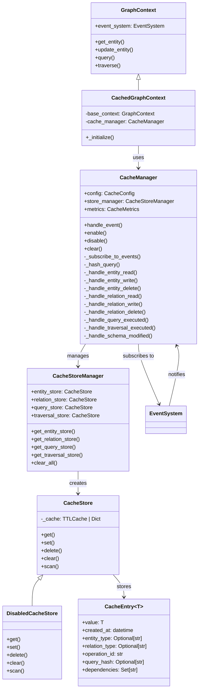

### Component Lifecycle Interactions

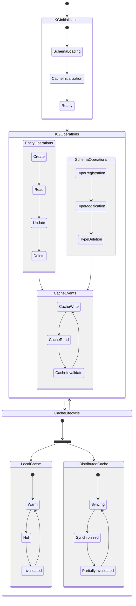

### Component Interaction Details

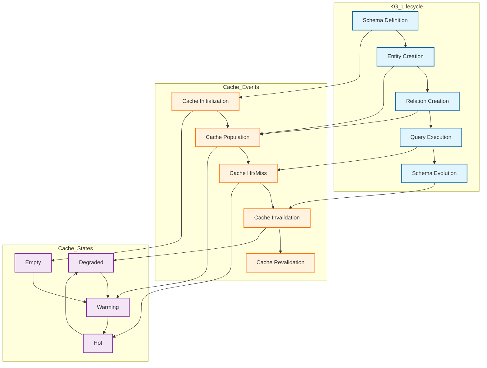

### Event Propagation Matrix

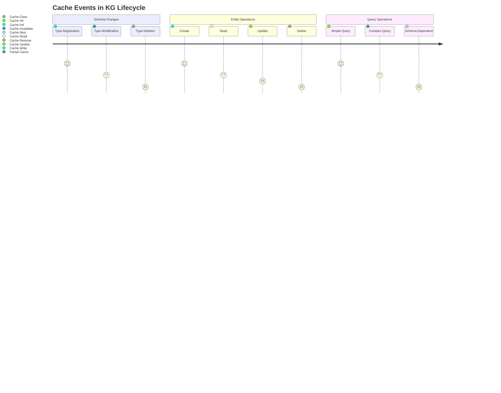

### Event Flow

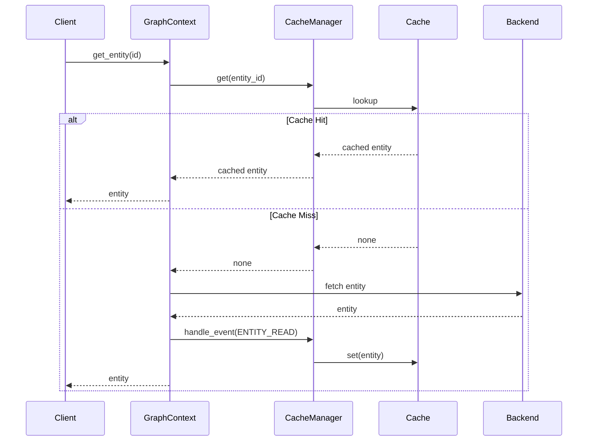

### Cache Invalidation Flow

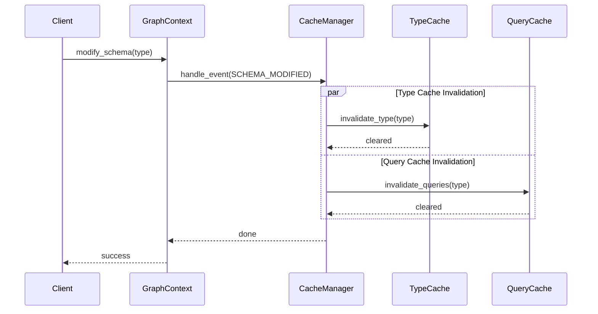

### Dependency Tracking

Note: The following diagram uses example entity types (Person, Address) and cache keys for illustration purposes only. The actual types and cache keys depend on your specific graph schema and use cases. The `CacheStore` implementation uses several internal dictionaries to track dependencies:

- `_type_dependencies`: Maps type names (e.g., "Person") to a set of cache keys that depend on this type.
- `_query_dependencies`: Maps query hashes to a set of cache keys representing the results of that query.
- `_reverse_dependencies`: Maps a cache key to a set of other cache keys that depend on it (e.g., a query result key might depend on several entity keys).
- `_entity_relations`: Maps an entity ID to a set of relation cache keys involving that entity.
- `_relation_entities`: Maps a relation cache key to a set of entity IDs involved in that relation.

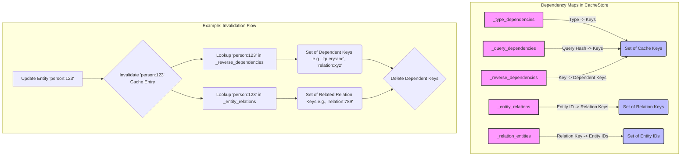

### Cache Key Structure

Cache keys are structured strings to identify the operation and parameters:

- **Entities:** `entity:<entity_id>` (e.g., `entity:person-123`)
- **Relations:** `relation:<relation_id>` (e.g., `relation:knows-456`)
- **Queries:** `query:<query_hash>` (e.g., `query:a1b2c3d4...`)
- **Traversals:** `traversal:<traversal_hash>` (e.g., `traversal:e5f6g7h8...`)

Query and traversal hashes are generated using `hashlib.sha256` on the JSON representation of the respective specification.

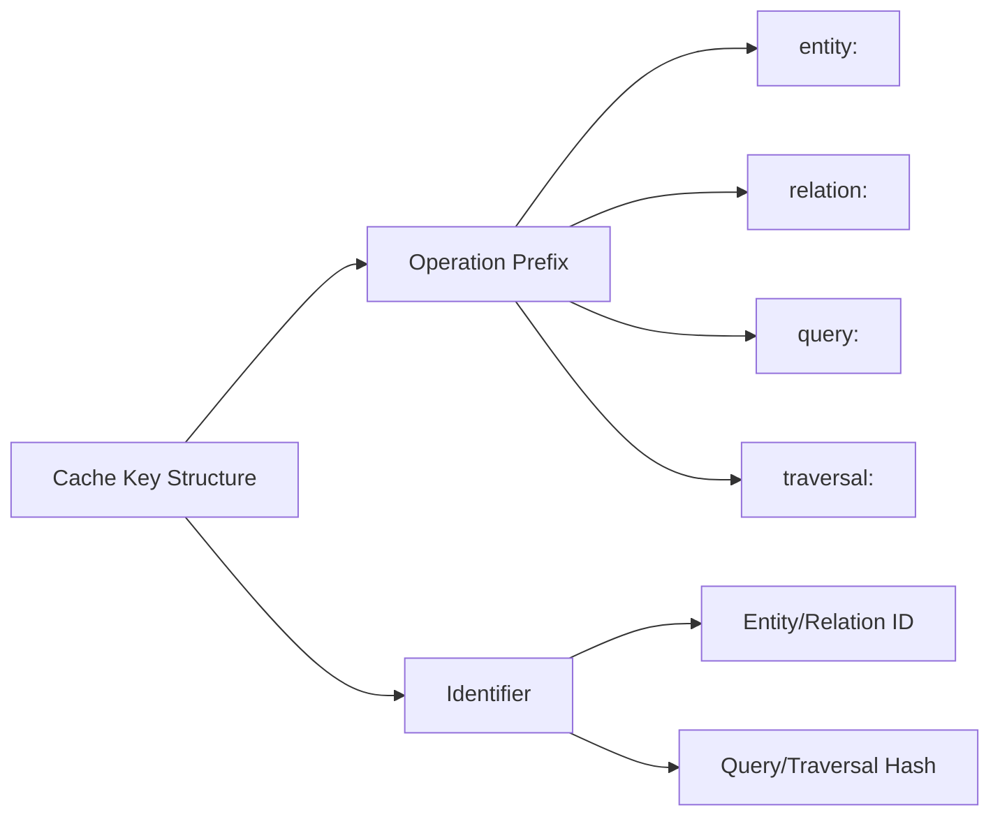

## Implementation Details

### Core Components

1. **CachedGraphContext**
   - Implements decorator pattern to wrap any graph context
   - Provides caching for all graph operations
   - Maintains transaction awareness
   - Delegates to underlying context when needed

2. **CacheManager**
   - Central component for cache operations
   - Handles all graph events
   - Manages transaction state
   - Collects cache metrics
   - Coordinates between components

3. **CacheStore**
   - Provides TTL-based caching
   - Tracks type dependencies
   - Manages query result caching
   - Handles entity-relation dependencies
   - Supports efficient bulk operations

4. **CacheEntry**
   - Generic container for cached values
   - Stores metadata (creation time, types)
   - Tracks dependencies
   - Supports query result caching

### Cache Entry Model

The `CacheEntry` class serves as the core data structure for storing cached values with associated metadata:

```python
class CacheEntry[T]:
    value: T                      # The cached value (any JSON-serializable value)
    created_at: datetime          # Entry creation timestamp (UTC)
    entity_type: Optional[str]    # Type name for entity entries
    relation_type: Optional[str]  # Type name for relation entries
    operation_id: str             # Unique identifier for creating operation (UUID)
    query_hash: Optional[str]     # Hash of query that produced this result
    dependencies: Set[str]        # Entity/relation IDs this entry depends on
```

### Cache Store Implementation

The caching system provides two main cache store implementations:

1. **CacheStore**: The primary implementation supporting TTL-based caching
2. **DisabledCacheStore**: A no-op implementation for when caching is disabled

#### Features
- **TTL Support**: Configurable time-to-live for cache entries using `cachetools.TTLCache`
- **Size Limits**: Configurable maximum cache size (default: 10,000 entries)
- **Default TTL**: 5 minutes default TTL for entries
- **Async Interface**: All operations are async-compatible
- **Key Operations**:
  - `get(key)`: Retrieve entry by key
  - `set(key, entry)`: Store new entry
  - `delete(key)`: Remove entry
  - `clear()`: Remove all entries
  - `scan()`: Async iterator over all entries

### Key Features

1. **Transaction Support**
   - Separate transaction cache
   - Proper handling of transaction boundaries
   - Rollback support
   - Consistency during concurrent operations

2. **Type Awareness**
   - Schema-based invalidation
   - Type dependency tracking
   - Efficient type-based cache clearing
   - Support for schema evolution

3. **Query Caching**
   - Result caching with dependency tracking
   - Query hash-based lookup
   - Automatic invalidation on dependencies
   - Support for complex queries

4. **Event System Integration**
   - Subscription to all graph events
   - Event-driven cache updates
   - Automatic invalidation
   - Metrics collection

5. **Performance Optimizations**
   - TTL-based expiration
   - Bulk operation support
   - Efficient dependency tracking
   - Memory-efficient storage

### Cache Invalidation Strategies

1. **Type-Based Invalidation**
   - Triggered by schema changes
   - Clears all entries of affected type
   - Handles cascading dependencies
   - Maintains consistency

2. **Query-Based Invalidation**
   - Triggered by data changes
   - Clears affected query results
   - Tracks query dependencies
   - Supports partial invalidation

3. **Dependency-Based Invalidation**
   - Tracks entity-relation dependencies
   - Handles cascading updates
   - Maintains referential integrity
   - Supports complex graphs

4. **Transaction-Aware Invalidation**
   - Respects transaction boundaries
   - Supports rollback scenarios
   - Maintains ACID properties
   - Handles concurrent access

### Configuration

The caching system is highly configurable through the `CacheConfig` class:

1. **Cache Settings**
   - TTL duration
   - Maximum cache size
   - Metrics collection
   - Debug logging

2. **Store Configuration**
   - Store implementation selection
   - Store-specific settings
   - Connection parameters
   - Persistence options

3. **Event System Integration**
   - Event subscription configuration
   - Handler registration
   - Event filtering
   - Custom event support

### Metrics and Monitoring

1. **Cache Performance**
   - Hit/miss ratios
   - Operation latencies
   - Cache size tracking
   - Memory usage

2. **Health Monitoring**
   - Store connectivity
   - Cache consistency
   - Error tracking
   - Performance alerts

### Best Practices

1. **Cache Usage**
   - Configure appropriate TTLs
   - Monitor cache size
   - Use transactions appropriately
   - Handle errors gracefully

2. **Performance Optimization**
   - Enable metrics collection
   - Monitor hit ratios
   - Tune cache settings
   - Optimize queries

3. **Maintenance**
   - Regular monitoring
   - Performance tuning
   - Error handling
   - Capacity planning

## Caching Strategies

## Usage Examples

### Basic Entity Caching

```python
# Create and cache entity
person = await graph_context.create_entity(
    "Person",
    {"name": "John Doe", "age": 30}
)

# Cached read
person = await graph_context.get_entity(person.id)

# Modify schema and invalidate cache
person_type = graph_context._entity_types["Person"]
person_type.properties["email"] = PropertyDefinition(
    type=PropertyType.STRING,
    required=True
)

await graph_context.cache_manager.handle_event(
    GraphEvent.SCHEMA_ENTITY_TYPE_MODIFIED,
    EventContext(
        operation="modify_entity_type",
        result=person_type,
        metadata={"type_name": "Person"}
    )
)
```

### Query Caching

```python
# Execute and cache query
results = await graph_context.query({
    "entity_type": "Person",
    "conditions": [
        {"field": "age", "operator": "gt", "value": 25}
    ]
})

# Modify person type and invalidate query cache
await graph_context.cache_manager.handle_event(
    GraphEvent.SCHEMA_ENTITY_TYPE_MODIFIED,
    EventContext(
        operation="modify_entity_type",
        metadata={"type_name": "Person"}
    )
)
```

## Deployment Scenarios

The caching system can be deployed in various configurations depending on scale, performance requirements, and infrastructure constraints. Below are some common deployment patterns:

### Single-Node Deployment

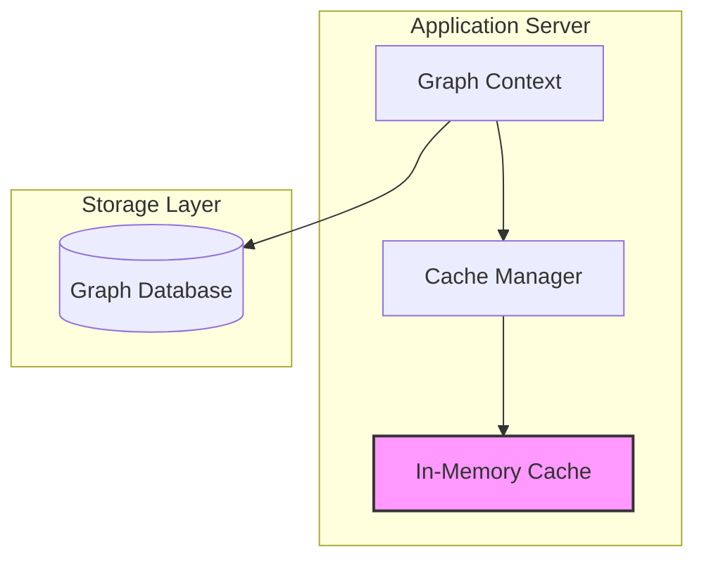

### Distributed Cache Deployment

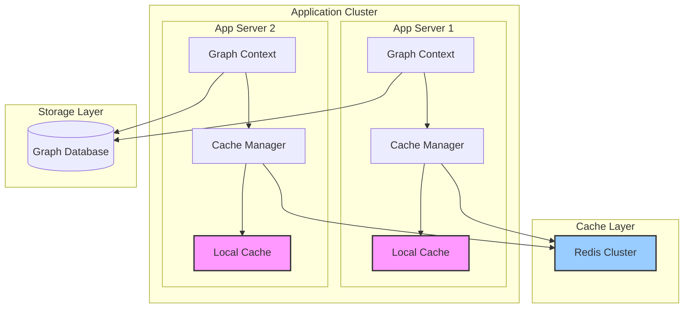

### High-Availability Configuration

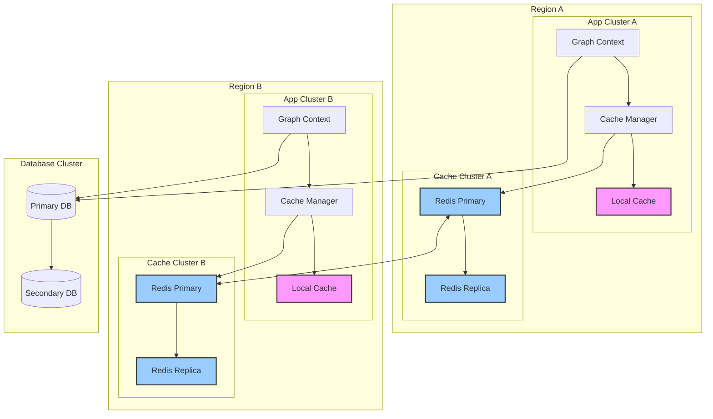

Note: These deployment diagrams are illustrative examples showing possible configurations. The actual deployment architecture should be designed based on specific requirements such as:
- Scale and performance needs
- High availability requirements
- Data consistency requirements
- Geographic distribution
- Infrastructure constraints
- Cost considerations

### Deployment Considerations

1. **Single-Node Deployment**
   - Suitable for development and small-scale deployments
   - Simple to maintain and debug
   - Limited by single node capacity
   - No high availability

2. **Distributed Cache Deployment**
   - Scales horizontally with application servers
   - Shared cache layer for consistency
   - Better resource utilization
   - Requires cache synchronization strategy

3. **High-Availability Configuration**
   - Multi-region support
   - Disaster recovery capability
   - Complex cache synchronization
   - Higher operational overhead

### Cache Synchronization Strategies

1. **Write-Through**
   ```mermaid
   sequenceDiagram
       participant App
       participant Local
       participant Redis
       participant DB

       App->>Local: Write Data
       App->>Redis: Write Data
       App->>DB: Write Data
       DB-->>App: Confirm
   ```

2. **Write-Behind**
   ```mermaid
   sequenceDiagram
       participant App
       participant Local
       participant Redis
       participant DB

       App->>Local: Write Data
       App->>Redis: Write Data
       Redis-->>App: Confirm
       Redis->>DB: Async Write
       DB-->>Redis: Confirm
   ```

## Limitations and Trade-offs

1. **Current Limitations**
   - No schema versioning support
   - Simple invalidation strategy
   - Basic query dependency tracking

2. **Known Trade-offs**
   - Memory usage vs cache effectiveness
   - Invalidation granularity vs complexity
   - Event handling overhead

## Future Enhancements

1. **Short Term**
   - Implement basic monitoring
   - Add cache size limits
   - Improve query dependency tracking

2. **Medium Term**
   - Add schema versioning support
   - Implement TTL support
   - Add partial cache invalidation

3. **Long Term**
   - Distributed cache support
   - Advanced query caching
   - Real-time cache updates
