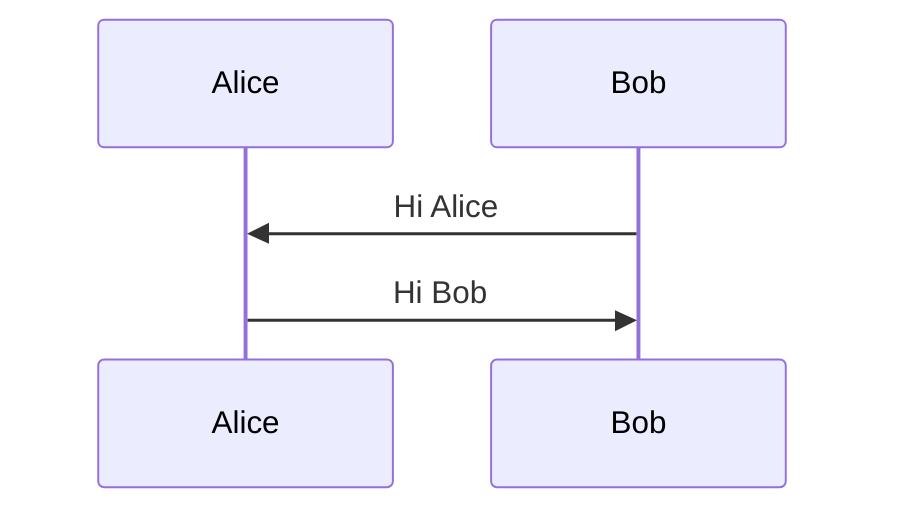
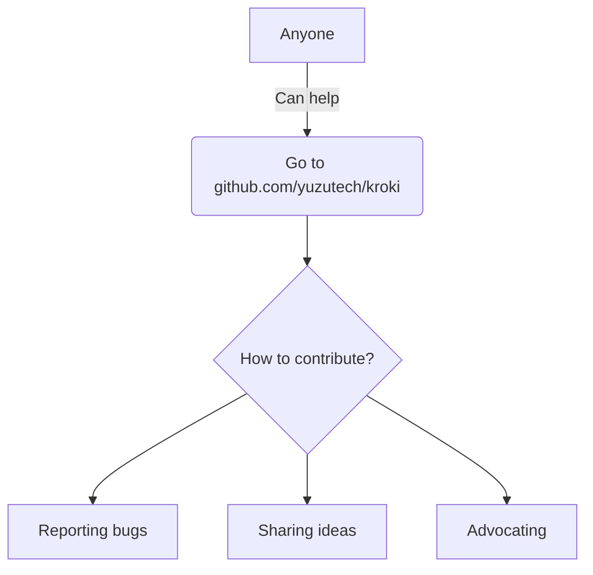

# Mermaid

## with options

## graph syntax

!!! warning
    When generating PDF, text within the `graph` syntax doesn't get output in WeasyPrint.
    However, it does appear when using Playwright/Chromium.
    As a countermeasure for WeasyPrint limitations, use PNG images.

