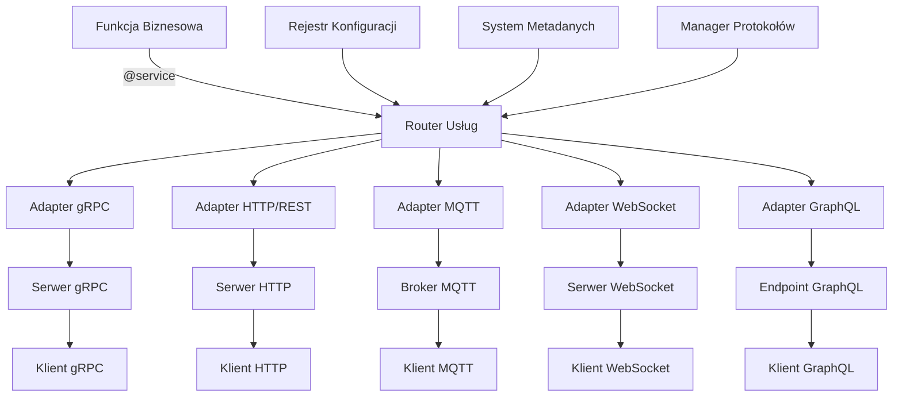

```mermaid
flowchart TB
    A["Funkcja Biznesowa"] --> |"@service"| B["Router Usług"]
    
    B --> C["Adapter gRPC"]
    B --> D["Adapter HTTP/REST"]
    B --> E["Adapter MQTT"]
    B --> F["Adapter WebSocket"]
    B --> G["Adapter GraphQL"]
    
    C --> H["Serwer gRPC"]
    D --> I["Serwer HTTP"]
    E --> J["Broker MQTT"]
    F --> K["Serwer WebSocket"]
    G --> L["Endpoint GraphQL"]
    
    H --> M["Klient gRPC"]
    I --> N["Klient HTTP"]
    J --> O["Klient MQTT"]
    K --> P["Klient WebSocket"]
    L --> Q["Klient GraphQL"]
    
    R["Rejestr Konfiguracji"] --> B
    S["System Metadanych"] --> B
    T["Manager Protokołów"] --> B
```