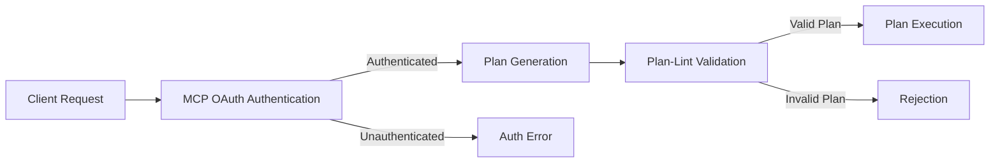

# Integrating Plan-Lint with MCP Servers

This guide explains how to integrate plan-lint with Model Context Protocol (MCP) servers to create a comprehensive security architecture that leverages both authentication and behavioral validation.

## Understanding the Relationship

MCP servers and plan-lint serve complementary security functions:

| Feature | MCP OAuth 2.1 | Plan-Lint |
|---------|--------------|-----------|
| **Primary Function** | Authentication & Authorization | Behavior Validation |
| **Validates** | Who can access resources | What actions are allowed |
| **Security Layer** | External boundary | Internal safety |
| **When Applied** | Before access is granted | Before plans execute |

## Security Architecture

When combined, MCP's OAuth and plan-lint create a defense-in-depth approach:



## Integration Patterns

### 1. MCP Tool Wrapper Pattern

The most straightforward integration is to wrap each MCP tool with plan-lint validation:

```python
from plan_lint.loader import load_policy
from plan_lint.core import validate_plan
from plan_lint.types import Plan

class PaymentTool:
    def __init__(self):
        # Load policy once during initialization
        self.policy, self.rego_policy = load_policy("payment_policy.rego")
    
    @mcp_server.tool("payments.transfer")
    def transfer(self, request):
        # Extract OAuth context from MCP request
        oauth_context = request.get_oauth_context()
        
        # Convert the request to a plan
        plan = Plan(
            goal="Transfer funds",
            context={
                "user_id": oauth_context["sub"], 
                "role": oauth_context["scope"].split(" ")
            },
            steps=[
                {
                    "id": "transfer-step",
                    "tool": "payments.transfer",
                    "args": request.get_args()
                }
            ]
        )
        
        # Validate plan
        result = validate_plan(plan, self.policy, rego_policy=self.rego_policy)
        
        if not result.valid:
            return {
                "status": "error",
                "code": "POLICY_VIOLATION",
                "message": f"Plan validation failed: {result.errors}"
            }
            
        # Perform the actual transfer if validation passed
        # ...
```

### 2. Middleware Pattern

For MCP servers with middleware support, you can implement plan-lint as a validation layer:

```python
class PlanLintMiddleware:
    def __init__(self, policy_path):
        self.policy, self.rego_policy = load_policy(policy_path)
    
    async def __call__(self, request, next):
        # Skip validation for non-plan requests
        if not request.is_plan_request():
            return await next(request)
        
        # Extract plan from request
        plan = request.get_plan()
        
        # Validate plan
        result = validate_plan(plan, self.policy, rego_policy=self.rego_policy)
        
        if not result.valid:
            return MCPResponse(
                status=403,
                body={
                    "error": "Policy Violation",
                    "details": [str(error) for error in result.errors]
                }
            )
        
        # Continue to the next middleware or handler
        return await next(request)

# Register middleware with MCP server
mcp_server.add_middleware(PlanLintMiddleware("security_policy.rego"))
```

### 3. OAuth-Aware Rego Policies

Create dynamic Rego policies that incorporate OAuth context:

```rego
package planlint

# Import OAuth scopes into policy evaluation
oauth_scopes := split(input.context.oauth_scopes, " ")

# Check if user has required scope
has_scope(required_scope) {
    some scope
    oauth_scopes[scope] == required_scope
}

# Different rules based on OAuth scopes
allow_write_operations if {
    has_scope("write:data")
}

# Validate SQL based on scopes
check_sql_operation(i) = violation if {
    step := input.steps[i]
    step.tool == "database.query"
    
    # Extract operation type
    query := lower(step.args.query)
    contains(query, "insert") 
    contains(query, "update")
    contains(query, "delete")
    
    # Check if write operations are allowed
    not allow_write_operations
    
    violation := {
        "step": i,
        "code": "INSUFFICIENT_SCOPE",
        "msg": "Write operations require the write:data scope"
    }
}
```

## Using MCP OAuth Tokens with Plan-Lint

When validating plans in an MCP context, the OAuth token can provide valuable context:

```python
def validate_mcp_plan(plan_json, auth_token):
    # Decode and validate the OAuth token
    oauth_claims = decode_verify_token(auth_token)
    
    # Parse the plan
    plan_data = json.loads(plan_json)
    
    # Enhance plan context with OAuth information
    if "context" not in plan_data:
        plan_data["context"] = {}
    
    # Add OAuth context to plan
    plan_data["context"].update({
        "user_id": oauth_claims["sub"],
        "oauth_scopes": oauth_claims["scope"],
        "oauth_client_id": oauth_claims["client_id"],
        "oauth_issued_at": oauth_claims["iat"],
        "oauth_expires_at": oauth_claims["exp"]
    })
    
    # Create Plan object
    plan = Plan(**plan_data)
    
    # Load policy
    policy, rego_policy = load_policy("security_policy.rego")
    
    # Validate with context-aware policy
    result = validate_plan(plan, policy, rego_policy=rego_policy)
    
    return result
```

## Example: Role-Based Security Policy

Here's a complete example of a Rego policy that leverages OAuth roles:

```rego
package planlint

default allow = false
default violations = []
default risk_score = 0.0

# Define role-based permissions
role_permissions = {
    "admin": {
        "max_transaction_amount": 50000,
        "can_query_all_records": true,
        "can_modify_data": true
    },
    "manager": {
        "max_transaction_amount": 10000,
        "can_query_all_records": true,
        "can_modify_data": false
    },
    "user": {
        "max_transaction_amount": 1000,
        "can_query_all_records": false,
        "can_modify_data": false
    }
}

# Get role from OAuth context, default to lowest privilege
user_role = role {
    role := input.context.oauth_role
    role_permissions[role]
}

user_role = "user" {
    not input.context.oauth_role
}

not_input.context.oauth_role {
    not input.context.oauth_role
}

# Allow rule based on violations and risk score
allow if {
    count(violations) == 0
    risk_score < 0.8
}

# Calculate risk score
risk_score = total {
    total := sum([violation.risk_score | violation = violations[_]])
}

# Validate transaction amounts based on role
violations[violation] {
    some i
    step := input.steps[i]
    step.tool == "payments.transfer"
    
    amount := to_number(step.args.amount)
    max_amount := role_permissions[user_role].max_transaction_amount
    
    amount > max_amount
    
    violation := {
        "step": i,
        "code": "EXCESSIVE_AMOUNT",
        "msg": sprintf("Amount %f exceeds maximum limit %f for role %s", 
              [amount, max_amount, user_role]),
        "risk_score": 0.7
    }
}

# Validate data access based on role
violations[violation] {
    some i
    step := input.steps[i]
    step.tool == "database.query"
    
    # Check for unrestricted queries
    query := lower(step.args.query)
    contains(query, "select * from users")
    
    # Verify permission to query all records
    not role_permissions[user_role].can_query_all_records
    
    violation := {
        "step": i,
        "code": "INSUFFICIENT_PERMISSION",
        "msg": sprintf("Role %s cannot query all user records", [user_role]),
        "risk_score": 0.6
    }
}

# Validate data modification based on role
violations[violation] {
    some i
    step := input.steps[i]
    step.tool == "database.query"
    
    # Check for data modification operations
    query := lower(step.args.query)
    contains(query, "update ") 
    
    # Verify permission to modify data
    not role_permissions[user_role].can_modify_data
    
    violation := {
        "step": i,
        "code": "INSUFFICIENT_PERMISSION",
        "msg": sprintf("Role %s cannot modify data", [user_role]),
        "risk_score": 0.8
    }
}
```

## Benefits of the Integrated Approach

1. **Defense in Depth**: Multiple security layers prevent a single point of failure
2. **Contextual Security**: Access decisions informed by both identity and behavior
3. **Fine-grained Control**: Different validation rules for different user roles
4. **Audit Trail**: Complete record of who did what and whether it was allowed
5. **Enhanced Privacy**: Sensitive operations can be blocked even for authenticated users

## Best Practices

1. Always run plan-lint validation **after** MCP OAuth authentication
2. Pass relevant OAuth context to the plan to inform validation decisions
3. Create role-specific policies that align with your OAuth scope design
4. Use consistent error handling between both systems
5. Log both authentication and validation decisions for complete audit trails
6. Implement comprehensive testing for both authentication and validation layers

## Advanced Integration Topics

- [Setting up OPA Server for Validation](../advanced/opa-integration.md)
- [CI/CD Pipeline Integration](../advanced/ci-cd-integration.md)
- [Custom Rule Development](../documentation/custom-rule-development.md) 