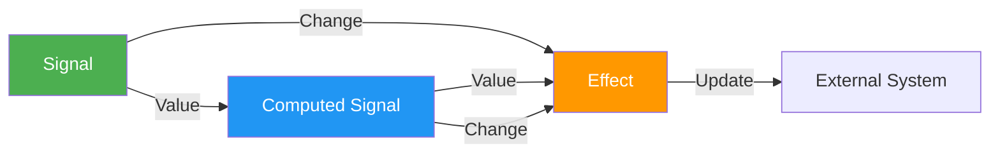

# reaktiv

 [](https://pypi.org/project/reaktiv/)    [](https://microsoft.github.io/pyright/)

**Reactive Computation Graphs for Python** with first-class async support, inspired by Angular's reactivity model.


## Installation

```bash
pip install reaktiv
# or with uv
uv pip install reaktiv
```

`reaktiv` creates efficient reactive computation graphs that only recalculate values when their dependencies change. The system automatically tracks dependencies between signals, computed values, and effects, eliminating the need for manual subscription management.

**Key features:**
- 🔄 **Efficient computation graph**: Only recomputes values affected by a change
- 🔍 **Automatic dependency tracking**: Dependencies are discovered at runtime
- 🧠 **Intelligent memoization**: Computed values are cached until dependencies change
- 🔌 **Side effects via subscriptions**: Changes propagate to effects for integration with external systems
- ⚡ **Async-first design**: Built for Python's asyncio ecosystem

## Documentation

Full documentation is available at [https://reaktiv.readthedocs.io/](https://reaktiv.readthedocs.io/).

## Quick Start

### Basic Reactivity

```python
from reaktiv import signal, computed, effect

# Create some signals
name = signal("Alice")
age = signal(30)
city = signal("New York")

# Computed value with automatically tracked dependencies
# The system detects that this depends on name and age
greeting = computed(lambda: f"{name()} is {age()} years old")

# Another computed value with different dependencies
# The system detects this depends only on name and city
location = computed(lambda: f"{name()} lives in {city()}")

# Create effects to demonstrate updates
print("Initial Setup:")
greeting_effect = effect(lambda: print(f"Greeting: {greeting()}"))
location_effect = effect(lambda: print(f"Location: {location()}"))

# Changing age only triggers recomputation of greeting
print("\nChanging age to 31:")
age.set(31)
# Only greeting recomputed (location unaffected)

# Changing city only triggers recomputation of location
print("\nChanging city to Boston:")
city.set("Boston")
# Only location recomputed (greeting unaffected)

# Changing name triggers recomputation of both derived values
print("\nChanging name to Bob:")
name.set("Bob")
# Both greeting and location recomputed
```

### Using `update()`

Instead of calling `set(new_value)`, `update()` lets you modify a signal based on its current value.

```python
from reaktiv import signal

counter = signal(0)

# Standard way
counter.set(counter() + 1)

# Using update() for cleaner syntax
counter.update(lambda x: x + 1)

print(counter())  # 2
```

### Computed Values

```python
from reaktiv import signal, computed

# Synchronous context example
price = signal(100)
tax_rate = signal(0.2)
total = computed(lambda: price() * (1 + tax_rate()))

print(total())  # 120.0
tax_rate.set(0.25)
print(total())  # 125.0
```

## Core Concepts



## How it Works

`reaktiv` provides three core primitives:

1. **Signals**: Store a value and notify dependents when it changes
2. **Computed Signals**: Derive values that automatically update when dependencies change
3. **Effects**: Run side effects when signals or computed signals change

## Why reaktiv?

If you've worked with modern frontend frameworks like React, Vue, or Angular, you're familiar with the power of reactive state management. The idea is simple but transformative: when data changes, everything that depends on it updates automatically. 

While this pattern revolutionized frontend development, **its benefits are equally powerful in backend systems** where complex state management is often overlooked or implemented with brittle, ad-hoc solutions.

`reaktiv` brings these **reactive programming** advantages to your Python backend projects:

- **Automatic state dependency tracking:** No more manually tracing which components need updating when data changes
- **Declarative state relationships:** Define how data is transformed once, not every time it changes
- **Efficient fine-grained updates:** Only recompute what actually needs to change
- **Async-first design:** Seamlessly integrates with Python's `asyncio` for managing real-time data flows
- **Zero external dependencies:** Lightweight with minimal overhead
- **Type-safe:** Fully annotated for clarity and maintainability

## Benefits for Backend Development

`reaktiv` addresses key challenges in backend state management:

1. **Eliminates manual dependency tracking**: No more forgotten update logic when state changes
2. **Prevents state synchronization bugs**: Updates happen automatically and consistently
3. **Improves performance**: Only affected computations are recalculated
4. **Reduces cognitive load**: Declare relationships once, not throughout your codebase
5. **Simplifies testing**: Clean separation of state, derivation, and effects

Even in "stateless" architectures, ephemeral state still exists during request processing. `reaktiv` helps manage this complexity without the boilerplate of observers, callbacks, or event dispatchers.

## Beyond Pub/Sub: State Management in Backend Systems

Many backend developers view reactive libraries as just another pub/sub system and question their value in "stateless" architectures. However, `reaktiv` addresses fundamentally different problems:

### Traditional Pub/Sub vs. Reaktiv

| Pub/Sub Systems | Reaktiv |
|----------------|---------|
| Message delivery between components | Automatic state dependency tracking |
| Point-to-point or broadcast messaging | Fine-grained computation graphs |
| Manual subscription management | Automatic dependency detection |
| Focus on message transport | Focus on state derivation |
| Stateless by design | Intentional state management |

### State in "Stateless" Systems

Even in "stateless" microservices and serverless functions, state exists during request processing:

- Configuration management
- Request context propagation
- In-memory caching
- Rate limiting and circuit breaking
- Feature flag evaluation
- Connection pooling
- Runtime metrics collection

`reaktiv` helps manage this ephemeral state with less code, fewer bugs, and better maintainability.

## Basic Examples

### Feature Flag System with Dynamic Rules

```python
from reaktiv import signal, computed, effect
import time

# Core state
user_segments = signal({"user1": ["premium", "beta_tester"]})
feature_flags = signal({
    "new_dashboard": {"enabled": True, "segments": ["premium"]},
    "dark_mode": {"enabled": True, "segments": []},
    "beta_feature": {"enabled": True, "segments": ["beta_tester"]}
})

# Computed user permissions that update automatically
user_features = computed(lambda: {
    user_id: [
        flag_name 
        for flag_name, flag in feature_flags().items()
        if flag["enabled"] and (
            not flag["segments"] or 
            any(segment in user_segments().get(user_id, []) for segment in flag["segments"])
        )
    ]
    for user_id in user_segments()
})

# Add real-time monitoring
def monitor_features():
    features = user_features()
    for user_id, enabled_features in features.items():
        if "beta_feature" in enabled_features:
            print(f"User {user_id} has access to beta features")

feature_monitor = effect(monitor_features)

# When segments change, permissions automatically update
user_segments.update(lambda segments: {**segments, "user2": ["premium"]})
```

## Real-World Backend Use Cases

### 1. Intelligent Cache Management

```python
from reaktiv import signal, computed, effect

# Database-derived state (imagine this comes from your database)
user_data = signal({})
permissions = signal({})
content_items = signal({})

# Computed caches that automatically update when source data changes
user_permissions = computed(lambda: {
    user_id: [perm for perm_id, perm in permissions().items() 
              if perm['user_id'] == user_id]
    for user_id in user_data()
})

authorized_content = computed(lambda: {
    user_id: [item for item_id, item in content_items().items()
              if any(p['level'] >= item['required_level'] for p in user_permissions().get(user_id, []))]
    for user_id in user_data()
})

# Demonstration of automatic cache updates
def demo_reactive_cache():
    # Initial data setup
    user_data.set({"user1": {"name": "Alice"}, "user2": {"name": "Bob"}})
    permissions.set({
        "p1": {"user_id": "user1", "level": 5},  # Admin
        "p2": {"user_id": "user2", "level": 2}   # Editor
    })
    content_items.set({
        "c1": {"title": "Public Content", "required_level": 1},
        "c2": {"title": "Admin Content", "required_level": 5}
    })
    
    # Access permissions and content (cache is computed on first access)
    print("Bob can access:", [item["title"] for item in authorized_content().get("user2", [])])
    # Output: Bob can access: ['Public Content']
    
    # Update Bob's permission level - cache automatically updates!
    permissions.update(lambda p: {**p, "p2": {"user_id": "user2", "level": 5}})
    
    # Cache is automatically recalculated only for Bob
    print("Bob can now access:", [item["title"] for item in authorized_content().get("user2", [])])
    # Output: Bob can now access: ['Public Content', 'Admin Content']
    
    # No manual cache invalidation needed anywhere!

demo_reactive_cache()
```

### 2. Adaptive Rate Limiting & Circuit Breaking

```python
from reaktiv import signal, computed, effect
import time
import asyncio

# Track API calls and failures
endpoint_calls = signal({})  # endpoint: [timestamp, timestamp...]
endpoint_failures = signal({})  # endpoint: [timestamp, timestamp...]

# Computed circuit breakers that automatically update
circuit_status = computed(lambda: {
    endpoint: "open" if len(failures) >= 5 and (time.time() - failures[-1]) < 30 else "closed"
    for endpoint, failures in endpoint_failures().items()
})

# Dynamic rate limiting based on traffic patterns
rate_limits = computed(lambda: {
    endpoint: max(10, min(1000, len(calls) // 10)) 
    for endpoint, calls in endpoint_calls().items() 
    if calls and time.time() - calls[0] < 60
})

# Add monitoring effect to see changes in real-time
def monitor_circuit_status():
    status = circuit_status()
    if status:
        print(f"Circuit Status: {status}")

circuit_monitor = effect(monitor_circuit_status)

# Simulate API calls and failures
async def simulate_traffic():
    print("\n=== Simulating API Traffic and Failures ===")
    
    # Record some successful calls
    endpoint_calls.update(lambda calls: {
        **calls, 
        "api/users": [time.time() - i for i in range(20)]
    })
    print(f"Rate limit for api/users: {rate_limits()['api/users']} requests/min")
    
    # Simulate failures for api/orders
    endpoint_failures.update(lambda failures: {
        **failures,
        "api/orders": [time.time() - i for i in range(3)]
    })
    print(f"Circuit status for api/orders: {circuit_status()['api/orders']}")
    
    # Simulate more failures to trigger circuit breaker
    print("Adding more failures to api/orders...")
    endpoint_failures.update(lambda failures: {
        **failures,
        "api/orders": failures["api/orders"] + [time.time() for _ in range(3)]
    })
    print(f"Circuit status for api/orders: {circuit_status()['api/orders']}")

# Run this example with: asyncio.run(simulate_traffic())
```

### 3. Multi-Layer Configuration Management

```python
from reaktiv import signal, computed, effect
import asyncio

# Configuration at different levels
global_config = signal({"log_level": "INFO", "timeout": 30})
service_config = signal({"auth": {"timeout": 10}})
instance_config = signal({"log_level": "DEBUG"})

# Computed effective configuration with correct precedence
effective_config = computed(lambda: {
    **global_config(),
    **{k: v for k, v in service_config().items() if not isinstance(v, dict)},
    **instance_config()
})

# Nested configs are merged properly
auth_config = computed(lambda: {
    **global_config(),
    **(service_config().get("auth", {}))
})

# When any config source changes, all systems update automatically
def log_config_changes():
    print(f"Current effective config: {effective_config()}")
    print(f"Auth specific config: {auth_config()}")

logger_config = effect(log_config_changes)

async def demo_configuration():
    print("\n=== Configuration Management Demo ===")
    
    # Initial configuration state
    print(f"Initial effective config: {effective_config()}")
    print(f"Initial auth config: {auth_config()}")
    
    # Change global config
    print("\nUpdating global timeout to 60 seconds...")
    global_config.update(lambda cfg: {**cfg, "timeout": 60})
    await asyncio.sleep(0.1)  # Allow effects to process
    
    # Override at service level
    print("\nAdding database configuration at service level...")
    service_config.update(lambda cfg: {
        **cfg, 
        "database": {"host": "localhost", "port": 5432}
    })
    await asyncio.sleep(0.1)  # Allow effects to process
    
    # Change instance config
    print("\nChanging instance log_level to TRACE...")
    instance_config.update(lambda cfg: {**cfg, "log_level": "TRACE"})
    await asyncio.sleep(0.1)  # Allow effects to process

# Run this example with: asyncio.run(demo_configuration())
```

## Advanced Examples

### 1. Resource Pool Management

```python
from reaktiv import signal, computed, effect
import time

# Connection pool state
db_connections = signal({})  # id: {created_at, last_used, state}
connection_requests = signal(0)

# Auto-scaling connection pool
idle_connections = computed(lambda: [
    conn_id for conn_id, conn in db_connections().items() 
    if conn['state'] == 'idle' and time.time() - conn['last_used'] < 60
])

connections_needed = computed(lambda: max(0, connection_requests() - len(idle_connections())))

# Effect that manages pool size based on demand
def manage_pool():
    current_needed = connections_needed()
    if current_needed > 0:
        create_new_connections(current_needed)
    elif len(idle_connections()) > 10 and connection_requests() < 5:
        close_excess_connections()

pool_manager = effect(manage_pool)
```

### 2. Multi-Stage Data Processing Pipeline

```python
from reaktiv import signal, computed, effect, batch
import json

# Raw event stream
raw_events = signal([])

# Normalized data
normalized_events = computed(lambda: [
    {**event, "timestamp": parse_timestamp(event.get("ts", 0))}
    for event in raw_events()
])

# Filtered data
error_events = computed(lambda: [
    event for event in normalized_events()
    if event.get("level") == "ERROR"
])

# Aggregated metrics
error_count_by_service = computed(lambda: {
    service: len([e for e in error_events() if e.get("service") == service])
    for service in set(e.get("service", "unknown") for e in error_events())
})

# Effect to trigger alerts
def check_alerts():
    counts = error_count_by_service()
    for service, count in counts.items():
        if count > 5:
            print(f"ALERT: {service} has {count} errors")

alert_system = effect(check_alerts)

# Adding data triggers the entire pipeline automatically
def ingest_batch(new_events):
    raw_events.update(lambda events: events + new_events)

# Multiple updates in a batch to prevent intermediate recalculations
with batch():
    raw_events.update(lambda events: events + [
        {"service": "auth", "level": "ERROR", "ts": 1619712000},
        {"service": "auth", "level": "ERROR", "ts": 1619712060}
    ])
```

### 3. Real-Time System Monitoring

```python
from reaktiv import signal, computed, effect
import asyncio

# System metrics
cpu_usage = signal([])
memory_usage = signal([])
disk_io = signal([])

# Derived analytics
avg_cpu = computed(lambda: sum(cpu_usage()[-5:]) / 5 if len(cpu_usage()) >= 5 else 0)
avg_memory = computed(lambda: sum(memory_usage()[-5:]) / 5 if len(memory_usage()) >= 5 else 0)

# System status derived from multiple metrics
system_status = computed(lambda: 
    "critical" if avg_cpu() > 90 or avg_memory() > 90 else
    "warning" if avg_cpu() > 70 or avg_memory() > 70 else
    "normal"
)

# Single monitoring effect that updates based on derived status
def update_monitoring_dashboard():
    status = system_status()
    print(f"System status: {status}")
    print(f"CPU: {avg_cpu():.1f}%, Memory: {avg_memory():.1f}%")
    
    if status == "critical":
        print("⚠️ ALERT: System resources critical!")

dashboard = effect(update_monitoring_dashboard)

# When new metrics arrive, all derived values and the dashboard update automatically
async def simulate_metrics():
    for i in range(10):
        cpu_usage.update(lambda readings: readings + [50 + i * 5])
        memory_usage.update(lambda readings: readings + [60 + i * 4])
        await asyncio.sleep(1)

# No need to manually update the dashboard - it reacts to changes automatically
```

### 4. API Gateway Rate Limiting Example

```python
from reaktiv import signal, computed, effect
import time

# Per-client request tracking
client_requests = signal({})  # client_id: [(timestamp, endpoint), ...]

# Computed rate limits that automatically update
requests_per_minute = computed(lambda: {
    client_id: len([req for timestamp, _ in requests 
                   if time.time() - timestamp < 60])
    for client_id, requests in client_requests().items()
})

endpoint_requests = computed(lambda: {
    endpoint: sum(1 for client_reqs in client_requests().values() 
                 for _, ep in client_reqs if ep == endpoint)
    for endpoint in set(ep for reqs in client_requests().values() 
                       for _, ep in reqs)
})

# Rate limit decision making
should_rate_limit = computed(lambda: {
    client_id: requests_per_minute().get(client_id, 0) > 100
    for client_id in client_requests()
})

# Real-time monitoring
def monitor_rate_limits():
    limits = should_rate_limit()
    throttled = [client for client, limited in limits.items() if limited]
    if throttled:
        print(f"Rate limiting clients: {throttled}")

rate_limit_monitor = effect(monitor_rate_limits)

# When new requests come in, all rate limits automatically recalculate
def track_request(client_id, endpoint):
    client_requests.update(lambda reqs: {
        **reqs,
        client_id: reqs.get(client_id, []) + [(time.time(), endpoint)]
    })
```

## Example Application: Health Monitoring System

This example shows how `reaktiv` simplifies building a real-time health monitoring system that ingests metrics, computes derived health indicators, and triggers alerts.

```python
from reaktiv import signal, computed, effect
import asyncio
import time

# Core state signals
server_metrics = signal({})  # server_id -> {cpu, memory, disk, last_seen}
alert_thresholds = signal({"cpu": 80, "memory": 90, "disk": 95})
maintenance_mode = signal({})  # server_id -> bool

# Derived state
servers_online = computed(lambda: {
    server_id: time.time() - metrics["last_seen"] < 60
    for server_id, metrics in server_metrics().items()
})

health_status = computed(lambda: {
    server_id: (
        "maintenance" if maintenance_mode().get(server_id, False) else
        "offline" if not servers_online().get(server_id, False) else
        "alert" if (
            metrics["cpu"] > alert_thresholds()["cpu"] or
            metrics["memory"] > alert_thresholds()["memory"] or
            metrics["disk"] > alert_thresholds()["disk"]
        ) else 
        "healthy"
    )
    for server_id, metrics in server_metrics().items()
})

servers_by_status = computed(lambda: {
    status: [server_id for server_id, s in health_status().items() if s == status]
    for status in ["healthy", "alert", "offline", "maintenance"]
})

# Effects for monitoring and alerting
def update_dashboard():
    statuses = servers_by_status()
    print(f"Dashboard: {len(statuses['healthy'])} healthy, {len(statuses['alert'])} in alert")
    
    if statuses["alert"]:
        print(f"⚠️ ALERT: Servers in alert state: {statuses['alert']}")

dashboard_effect = effect(update_dashboard)

async def main():
    # Update metrics - all derived values and effects update automatically
    server_metrics.set({
        "server1": {"cpu": 70, "memory": 65, "disk": 80, "last_seen": time.time()},
        "server2": {"cpu": 85, "memory": 50, "disk": 70, "last_seen": time.time()}
    })
    
    await asyncio.sleep(1)
    
    # Put a server in maintenance - dashboard updates automatically
    maintenance_mode.set({"server2": True})
    
    await asyncio.sleep(1)
    
    # Adjust thresholds - alerts recalculate automatically
    alert_thresholds.set({"cpu": 75, "memory": 90, "disk": 95})

asyncio.run(main())
```

## More Examples

You can find more example scripts in the examples folder to help you get started with using this project.

---

**Inspired by** Angular Signals • **Built for** Python's async-first world • **Made in** Hamburg