# UnitAPI: Universal Hardware Interface as Network Devices [<span style='font-size:20px;'>&#x270D;</span>](git@github.com:UnitApi/python/edit/main/docs/index.md)

## Overview

UnitAPI (Unit Hardware API) is a comprehensive Python framework for managing and interacting with network-connected hardware devices across different platforms and protocols. It provides a unified, flexible, and secure approach to device communication and control.

## Key Features

### 1. Device Management
- Automatic device discovery
- Dynamic device registration
- Multi-protocol support
- Flexible device abstraction

### 2. Communication Protocols
- WebSocket
- MQTT
- Custom protocol extensions

### 3. Security
- Token-based authentication
- Encryption
- Access control
- Audit logging

### 4. Device Types
- Cameras
- Microphones
- Speakers
- GPIO Controllers
- Custom device implementations

## Architecture

### High-Level Architecture

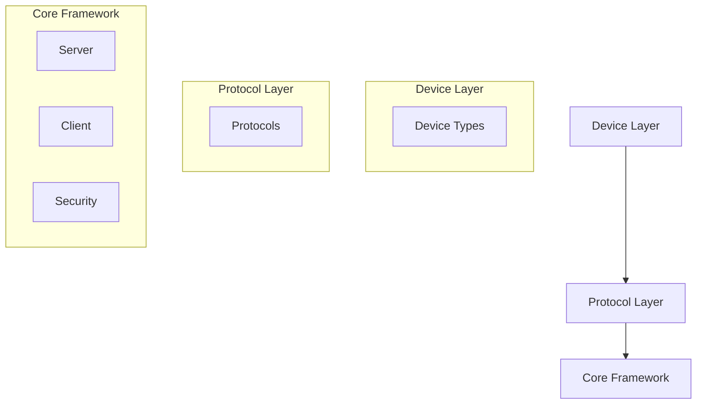

### Component Diagram

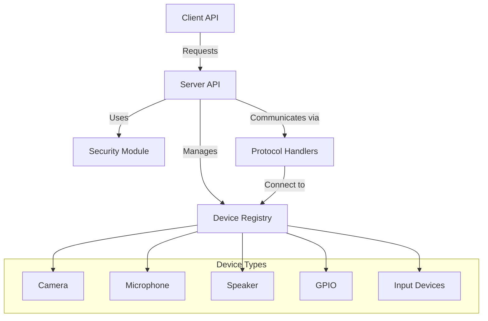

### Device Inheritance Structure

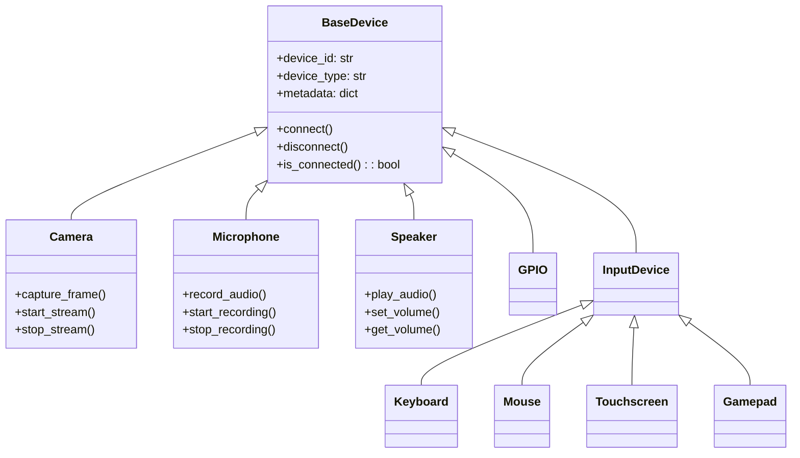

### Communication Sequence

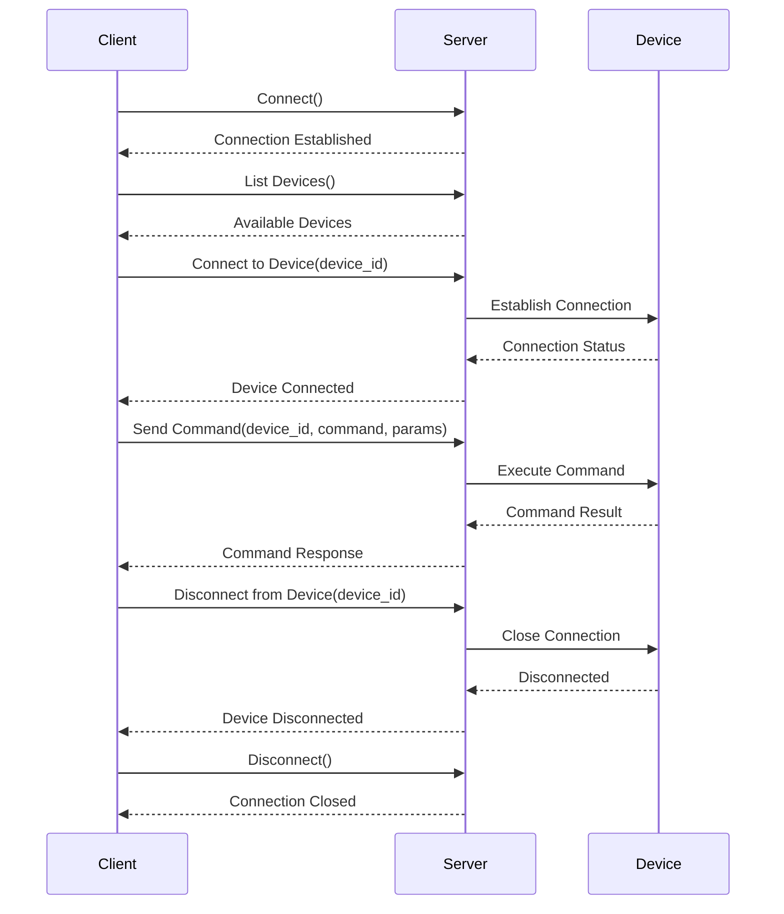

### Device Discovery Process

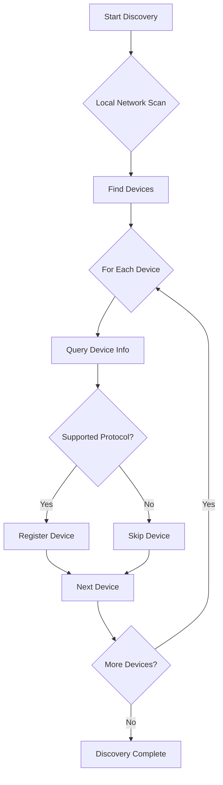

### Device Connection Lifecycle

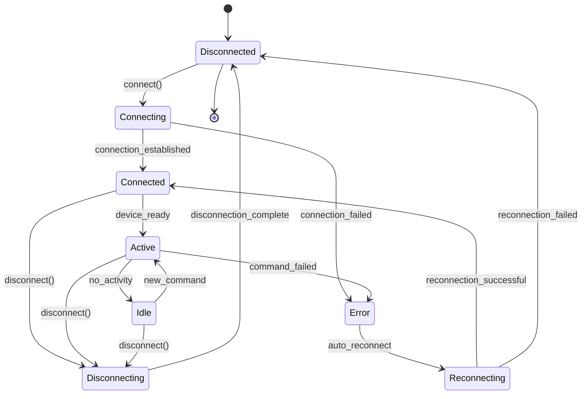

### Deployment Architecture

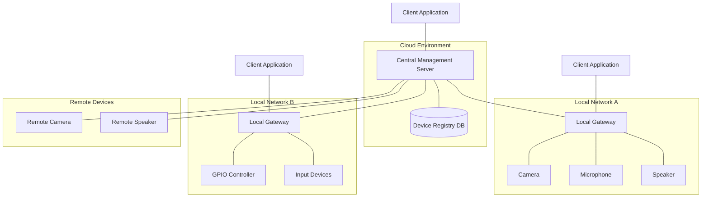

### Network Topology

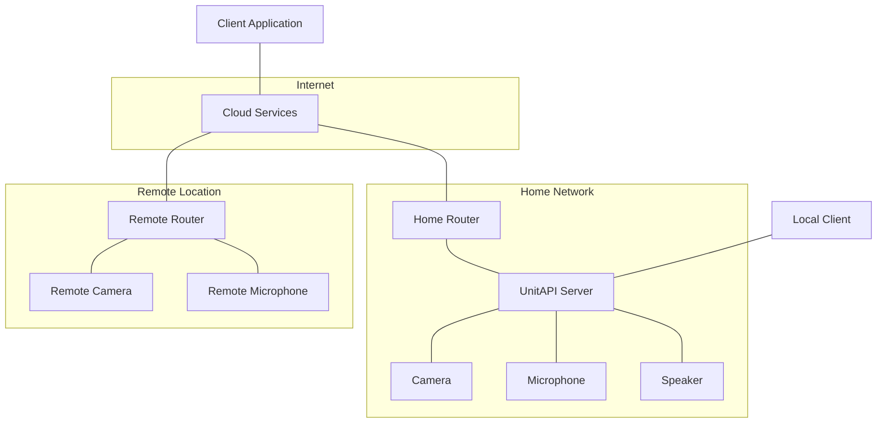

### Implementation Timeline

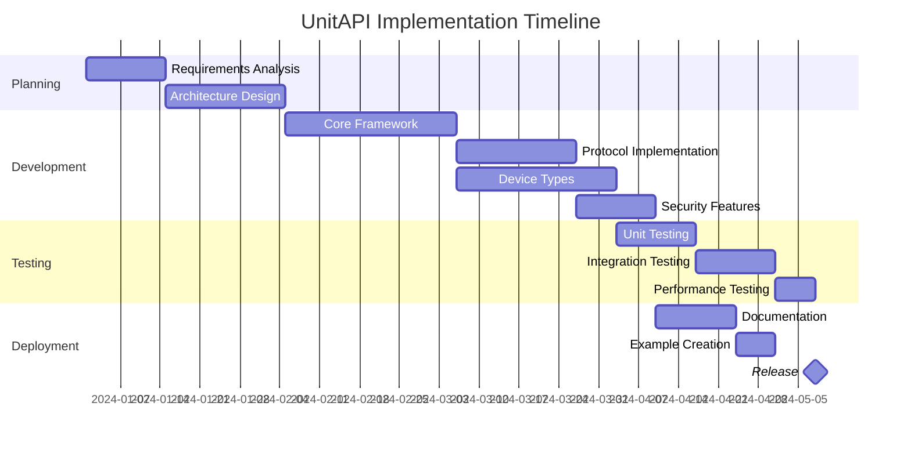

### Device Type Distribution

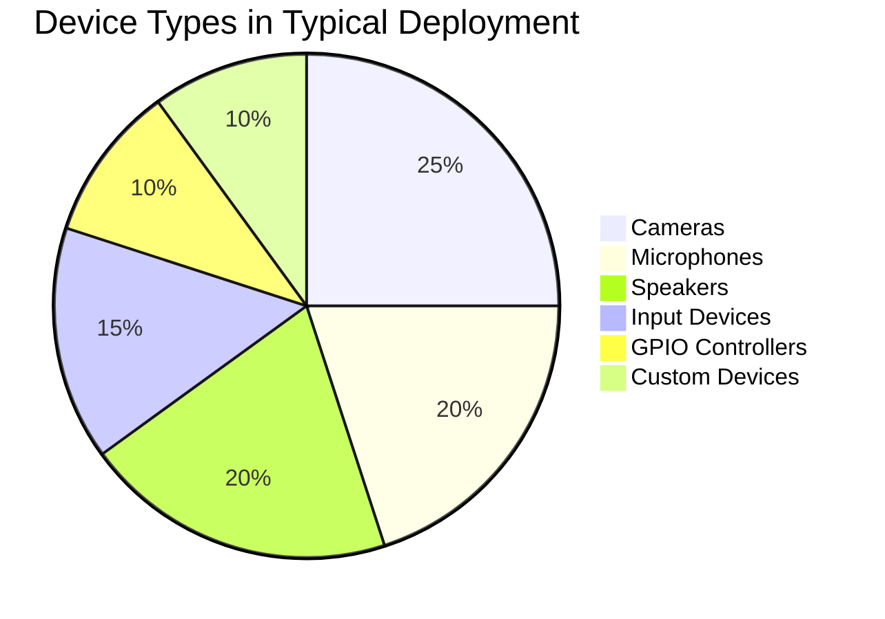

### User Experience Journey

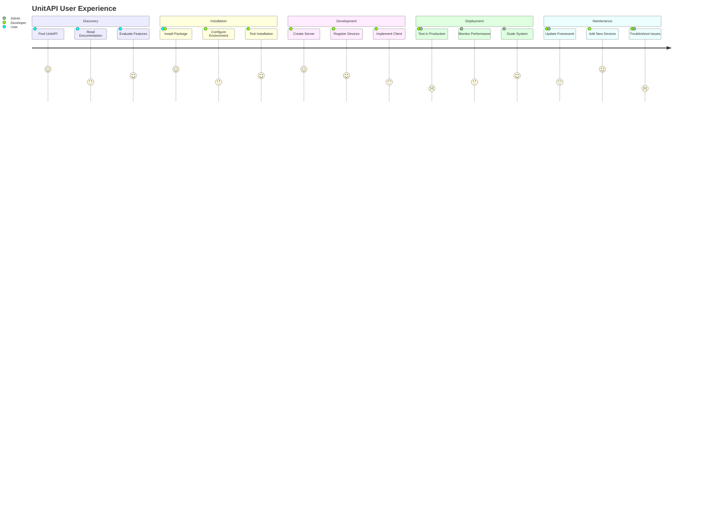

## Quick Start

### Installation

```bash
pip install unitapi
```

#### Optional Protocol Support
```bash
# Install with specific protocol support
pip install unitapi[mqtt]
pip install unitapi[websocket]
```

### Basic Usage

#### Server Setup
```python
from unitapi.core.server import UnitAPIServer

# Create a server instance
server = UnitAPIServer(host='0.0.0.0', port=7890)

# Register a device
server.register_device(
    device_id='temp_sensor_01', 
    device_type='sensor',
    metadata={
        'location': 'living_room',
        'capabilities': ['temperature', 'humidity']
    }
)

# Start the server
server.start()
```

#### Client Interaction
```python
from unitapi.core.client import UnitAPIClient

# Create a client
client = UnitAPIClient(server_host='localhost', server_port=7890)

# List available devices
devices = client.list_devices()
print("Available Devices:", devices)
```

## Core Concepts

### 1. Devices
- Represent physical or virtual network-connected devices
- Provide a consistent interface for interaction
- Support custom device type creation

### 2. Protocols
- Abstraction layer for different communication methods
- Easy integration of new protocols
- Seamless device communication

### 3. Security
- Comprehensive authentication mechanisms
- Fine-grained access control
- Encryption of device communications

## Use Cases

- Smart Home Automation
- Industrial IoT
- Remote Monitoring
- Network Device Management
- Distributed Sensor Networks
- Remote Audio Control

## Documentation Sections

1. [Installation Guide](installation.md)
2. [Usage Guide](usage.md)
3. [Device Types](device_types.md)
4. [Protocols](protocols.md)
5. [Security](security.md)
6. [Examples](examples.md)
7. [Remote Speaker Agent](remote_speaker_agent.md)

## Contributing

We welcome contributions! Please read our [Contribution Guidelines](CONTRIBUTING.md) for details on how to get started.

## Support

- GitHub Issues: [UnitAPI Issues](https://github.com/UnitApi/python/issues)
- Email: support@unitapi.com

## License

UnitAPI is open-source software licensed under the MIT License.

## Version

Current Version: 0.1.5

## Compatibility

- Python 3.8+
- Supported Platforms:
  - Windows 10/11
  - macOS 10.15+
  - Linux (Ubuntu 20.04+, Debian 10+)
  - Raspberry Pi (Raspbian/Raspberry Pi OS)

## Performance Characteristics

- Low-latency device communication
- Minimal overhead
- Scalable architecture
- Async-first design

## Roadmap

### Upcoming Features
- Enhanced machine learning integration
- More device type support
- Advanced discovery mechanisms
- Cloud service integrations
- Improved remote device management

## Disclaimer

UnitAPI is an evolving project. While we strive for stability, 
the API may change in future versions.

## Acknowledgments

Thanks to all contributors and the open-source community 
for making this project possible.

# UnitAPI Device Types [<span style='font-size:20px;'>&#x270D;</span>](git@github.com:UnitApi/python/edit/main/docs/device_types.md)

UnitAPI supports various device types, each with its own capabilities and interfaces. This document provides detailed information about the built-in device types and how to create custom device types.

## Overview

UnitAPI's device abstraction layer provides a consistent interface for interacting with different types of hardware and virtual devices. Each device type inherits from the `BaseDevice` class and implements specific functionality relevant to that device category.

UnitAPI device types are organized into the following categories:
- **Sensor Devices**: Devices that capture data from the environment (cameras, microphones, etc.)
- **Output Devices**: Devices that produce output (speakers, displays, etc.)
- **Input Devices**: Devices that accept user input (mouse, keyboard, touchscreen, gamepad, etc.)
- **GPIO Devices**: Devices that interact with general-purpose input/output pins

## Built-in Device Types

### 1. Camera Devices

Camera devices provide interfaces for capturing images and video streams.

#### Features
- Image capture
- Video streaming
- Camera configuration (resolution, FPS)
- Connection management

#### Example Usage
```python
from unitapi.devices.camera import CameraDevice
import asyncio

async def main():
    # Create a camera device
    camera = CameraDevice(
        device_id='camera_01',
        name='Main Camera',
        metadata={
            'resolution': '1080p',
            'fps': 30,
            'location': 'front_door'
        }
    )
    
    # Connect to the camera
    await camera.connect()
    
    # Capture an image
    image_data = await camera.capture_image()
    print(f"Image captured: {image_data}")
    
    # Start a video stream
    stream_info = await camera.start_video_stream(duration=10)
    print(f"Stream started: {stream_info}")
    
    # Disconnect when done
    await camera.disconnect()

asyncio.run(main())
```

### 2. Microphone Devices

Microphone devices provide interfaces for recording audio.

#### Features
- Audio recording
- Sample rate and channel configuration
- Connection management

#### Example Usage
```python
from unitapi.devices.microphone import MicrophoneDevice
import asyncio

async def main():
    # Create a microphone device
    mic = MicrophoneDevice(
        device_id='mic_01',
        name='Desktop Microphone',
        metadata={
            'sample_rate': 44100,
            'channels': 2,
            'location': 'office'
        }
    )
    
    # Connect to the microphone
    await mic.connect()
    
    # Record audio
    audio_data = await mic.record_audio(duration=5, sample_rate=44100)
    print(f"Audio recorded: {audio_data}")
    
    # Disconnect when done
    await mic.disconnect()

asyncio.run(main())
```

### 3. GPIO Devices

GPIO (General Purpose Input/Output) devices provide interfaces for controlling digital pins, typically on devices like Raspberry Pi.

#### Features
- Pin mode configuration (input/output)
- Digital read/write operations
- PWM (Pulse Width Modulation) control
- Connection management

#### Example Usage
```python
from unitapi.devices.gpio import GPIODevice
import asyncio

async def main():
    # Create GPIO device
    gpio = GPIODevice(
        device_id='rpi_gpio_01', 
        name='Raspberry Pi GPIO',
        metadata={'total_pins': 40}
    )
    
    # Connect to the GPIO device
    await gpio.connect()
    
    # Set pin mode and control
    await gpio.set_pin_mode(18, 'output')
    await gpio.digital_write(18, True)
    
    # Read from a pin
    await gpio.set_pin_mode(17, 'input')
    pin_value = await gpio.digital_read(17)
    print(f"Pin 17 value: {pin_value}")
    
    # PWM control
    await gpio.set_pin_mode(12, 'output')
    await gpio.pwm_write(12, 0.5)  # 50% duty cycle
    
    # Disconnect when done
    await gpio.disconnect()

asyncio.run(main())
```

### 4. Speaker Devices

Speaker devices provide interfaces for playing audio.

#### Features
- Audio playback
- Volume control
- Audio format configuration
- Connection management

#### Example Usage
```python
from unitapi.devices.remote_speaker_device import RemoteSpeakerDevice
import asyncio

async def main():
    # Create a speaker device
    speaker = RemoteSpeakerDevice(
        device_id='speaker_01',
        name='Living Room Speaker',
        metadata={
            'sample_rate': 44100,
            'channels': 2,
            'location': 'living_room'
        }
    )
    
    # Connect to the speaker
    await speaker.connect()
    
    # Play audio
    await speaker.play_audio('path/to/audio.wav')
    
    # Play a test tone
    await speaker.play_test_tone(frequency=440, duration=2.0)
    
    # Disconnect when done
    await speaker.disconnect()

asyncio.run(main())
```

### 5. Mouse Devices

Mouse devices provide interfaces for controlling cursor movement and button actions.

#### Features
- Cursor movement (absolute and relative)
- Button actions (click, double-click, press, release)
- Scrolling
- Drag operations
- Connection management

#### Example Usage
```python
from unitapi.devices import MouseDevice
import asyncio

async def main():
    # Create a mouse device
    mouse = MouseDevice(
        device_id='mouse_01',
        name='Virtual Mouse',
        metadata={'dpi': 1200}
    )
    
    # Connect to the mouse
    await mouse.connect()
    
    # Move the mouse to an absolute position
    await mouse.move_to(500, 300)
    
    # Perform a left click
    await mouse.click()
    
    # Perform a right click
    await mouse.click(button="right")
    
    # Perform a drag operation
    await mouse.drag(700, 400)
    
    # Scroll the mouse wheel
    await mouse.scroll(5)  # Scroll up
    
    # Disconnect when done
    await mouse.disconnect()

asyncio.run(main())
```

### 6. Keyboard Devices

Keyboard devices provide interfaces for simulating keyboard input.

#### Features
- Key press and release
- Text typing
- Hotkey combinations
- Modifier key support
- Connection management

#### Example Usage
```python
from unitapi.devices import KeyboardDevice
import asyncio

async def main():
    # Create a keyboard device
    keyboard = KeyboardDevice(
        device_id='keyboard_01',
        name='Virtual Keyboard',
        metadata={'layout': 'us'}
    )
    
    # Connect to the keyboard
    await keyboard.connect()
    
    # Type some text
    await keyboard.type_text("Hello, UnitAPI!")
    
    # Press individual keys
    await keyboard.press_key("a")
    
    # Press a hotkey combination (Ctrl+C)
    await keyboard.press_hotkey("ctrl", "c")
    
    # Disconnect when done
    await keyboard.disconnect()

asyncio.run(main())
```

### 7. Touchscreen Devices

Touchscreen devices provide interfaces for simulating touch input.

#### Features
- Single and multi-touch support
- Tap and double-tap gestures
- Swipe gestures
- Pinch gestures (zoom in/out)
- Rotation gestures
- Connection management

#### Example Usage
```python
from unitapi.devices import TouchscreenDevice
import asyncio

async def main():
    # Create a touchscreen device
    touchscreen = TouchscreenDevice(
        device_id='touchscreen_01',
        name='Virtual Touchscreen',
        metadata={
            'width': 1920,
            'height': 1080,
            'multi_touch': True
        }
    )
    
    # Connect to the touchscreen
    await touchscreen.connect()
    
    # Perform a tap
    await touchscreen.tap(500, 300)
    
    # Perform a swipe
    await touchscreen.swipe(200, 500, 800, 500, duration=0.5)
    
    # Perform a pinch (zoom out)
    await touchscreen.pinch(
        center_x=960,
        center_y=540,
        start_distance=200,
        end_distance=100,
        duration=0.5
    )
    
    # Disconnect when done
    await touchscreen.disconnect()

asyncio.run(main())
```

### 8. Gamepad Devices

Gamepad devices provide interfaces for simulating game controller input.

#### Features
- Button press and release
- Analog trigger control
- Analog stick movement
- Vibration/rumble control
- Controller state management
- Connection management

#### Example Usage
```python
from unitapi.devices import GamepadDevice
import asyncio

async def main():
    # Create a gamepad device
    gamepad = GamepadDevice(
        device_id='gamepad_01',
        name='Virtual Gamepad',
        metadata={'controller_type': 'xbox'}
    )
    
    # Connect to the gamepad
    await gamepad.connect()
    
    # Press buttons
    await gamepad.press_button("a")
    await gamepad.press_button("b")
    
    # Set trigger values
    await gamepad.set_trigger("left_trigger", 0.5)
    
    # Move analog sticks
    await gamepad.move_stick("left_stick", 0.5, 0.0)  # Move right
    
    # Set vibration/rumble
    await gamepad.set_vibration(left_motor=0.7, right_motor=0.3)
    
    # Get current gamepad state
    state = await gamepad.get_state()
    print(f"Gamepad state: {state}")
    
    # Disconnect when done
    await gamepad.disconnect()

asyncio.run(main())
```

## Creating Custom Device Types

You can create custom device types by inheriting from the `BaseDevice` class or one of its subclasses.

### Basic Custom Device

```python
from unitapi.devices.base import BaseDevice, DeviceStatus
import asyncio
import logging

class CustomDevice(BaseDevice):
    """Custom device implementation."""
    
    def __init__(self, device_id: str, name: str, metadata=None):
        """Initialize custom device."""
        super().__init__(
            device_id=device_id,
            name=name,
            device_type="custom",
            metadata=metadata or {}
        )
        self.logger = logging.getLogger(__name__)
    
    async def connect(self) -> bool:
        """Connect to the device."""
        try:
            # Custom connection logic
            await asyncio.sleep(1)  # Simulate connection delay
            self.status = DeviceStatus.ONLINE
            self.logger.info(f"Device {self.device_id} connected")
            return True
        except Exception as e:
            self.status = DeviceStatus.ERROR
            self.logger.error(f"Connection failed: {e}")
            return False
    
    async def disconnect(self) -> bool:
        """Disconnect from the device."""
        try:
            # Custom disconnection logic
            await asyncio.sleep(0.5)  # Simulate disconnection delay
            self.status = DeviceStatus.OFFLINE
            self.logger.info(f"Device {self.device_id} disconnected")
            return True
        except Exception as e:
            self.logger.error(f"Disconnection failed: {e}")
            return False
    
    async def execute_command(self, command: str, params=None) -> dict:
        """Execute a command on the device."""
        try:
            if command == "custom_command":
                # Implement custom command logic
                return {"status": "success", "result": "Custom command executed"}
            else:
                raise ValueError(f"Unsupported command: {command}")
        except Exception as e:
            self.logger.error(f"Command execution failed: {e}")
            return {"error": str(e)}
```

### Custom Sensor Device

```python
from unitapi.devices.base import SensorDevice
import asyncio
import random
import logging

class TemperatureSensor(SensorDevice):
    """Temperature sensor implementation."""
    
    def __init__(self, device_id: str, name: str, metadata=None):
        """Initialize temperature sensor."""
        super().__init__(
            device_id=device_id,
            name=name,
            device_type="temperature_sensor",
            metadata=metadata or {}
        )
        self.logger = logging.getLogger(__name__)
        self.min_temp = metadata.get("min_temp", 15.0) if metadata else 15.0
        self.max_temp = metadata.get("max_temp", 30.0) if metadata else 30.0
    
    async def read_sensor(self) -> dict:
        """Read temperature data."""
        try:
            # Simulate temperature reading
            await asyncio.sleep(0.5)
            temperature = random.uniform(self.min_temp, self.max_temp)
            
            return {
                "device_id": self.device_id,
                "timestamp": asyncio.get_event_loop().time(),
                "temperature": round(temperature, 1),
                "unit": "°C"
            }
        except Exception as e:
            self.logger.error(f"Sensor reading failed: {e}")
            return {"error": str(e)}
```

## Device Registration

Once you've created a device, you need to register it with the UnitAPI server:

```python
from unitapi.core.server import UnitAPIServer
import asyncio

async def main():
    # Create a server
    server = UnitAPIServer(host='0.0.0.0', port=7890)
    
    # Create a custom device
    custom_device = CustomDevice(
        device_id='custom_01',
        name='My Custom Device',
        metadata={'capability': 'custom_function'}
    )
    
    # Register the device
    server.register_device(
        device_id=custom_device.device_id,
        device_type=custom_device.type,
        metadata=custom_device.metadata
    )
    
    # Start the server
    await server.start()

asyncio.run(main())
```

## Device Discovery

UnitAPI provides a device discovery mechanism that can automatically detect and register devices:

```python
from examples.device_discovery import DeviceDiscoveryService
import asyncio

async def main():
    # Create a discovery service
    discovery = DeviceDiscoveryService(
        server_host='0.0.0.0',
        server_port=7890,
        discovery_port=7891,
        debug=True
    )
    
    # Discover devices
    devices = await discovery.discover_devices()
    print(f"Discovered {len(devices)} devices")
    
    # Start the discovery service
    await discovery.start()

asyncio.run(main())
```

## Best Practices

1. **Asynchronous Operations**: Always use `async`/`await` for device operations to ensure non-blocking behavior.
2. **Error Handling**: Implement proper error handling in all device methods.
3. **Logging**: Use the logging module to provide informative logs for debugging.
4. **Status Management**: Keep the device status updated (`ONLINE`, `OFFLINE`, `ERROR`, `BUSY`).
5. **Resource Cleanup**: Ensure proper cleanup in the `disconnect` method.
6. **Metadata**: Use metadata to store device-specific configuration and capabilities.
7. **Command Interface**: Implement a consistent command interface through the `execute_command` method.

# UnitAPI Usage Guide [<span style='font-size:20px;'>&#x270D;</span>](git@github.com:UnitApi/python/edit/main/docs/usage.md)

## Basic Concepts

UnitAPI provides a flexible framework for managing network-connected devices across different protocols and platforms.

## Core Components

- **Server**: Manages device registration and communication
- **Client**: Interacts with the server to control devices
- **Devices**: Represent different types of network peripherals
- **Protocols**: Support for various communication methods

## Quick Start

### Starting a Server

```python
from unitapi.core.server import UnitAPIServer

# Create a server instance
server = UnitAPIServer(host='localhost', port=7890)

# Register a device
server.register_device(
    device_id='temp_sensor_01', 
    device_type='sensor',
    metadata={
        'location': 'living_room',
        'capabilities': ['temperature', 'humidity']
    }
)

# Start the server
server.start()
```

### Client Interaction

```python
from unitapi.core.client import UnitAPIClient

# Create a client
client = UnitAPIClient(server_host='localhost', server_port=7890)

# List available devices
devices = client.list_devices()
print("Available Devices:", devices)

# List specific device type
sensor_devices = client.list_devices(device_type='sensor')
print("Sensor Devices:", sensor_devices)
```

## Device Types

### Camera Devices

```python
from unitapi.devices.camera import CameraDevice
import asyncio

# Create a camera device
camera = CameraDevice(
    device_id='camera_01',
    name='Main Camera',
    metadata={
        'resolution': '1080p',
        'fps': 30,
        'location': 'front_door'
    }
)

# Connect to the camera
await camera.connect()

# Capture an image
image_data = await camera.capture_image()
print(f"Image captured: {image_data}")

# Start a video stream
stream_info = await camera.start_video_stream(duration=10)
print(f"Stream started: {stream_info}")
```

### Microphone Devices

```python
from unitapi.devices.microphone import MicrophoneDevice
import asyncio

# Create a microphone device
mic = MicrophoneDevice(
    device_id='mic_01',
    name='Desktop Microphone',
    metadata={
        'sample_rate': 44100,
        'channels': 2,
        'location': 'office'
    }
)

# Connect to the microphone
await mic.connect()

# Record audio
audio_data = await mic.record_audio(duration=5, sample_rate=44100)
print(f"Audio recorded: {audio_data}")
```

### GPIO Devices

```python
from unitapi.devices.gpio import GPIODevice
import asyncio

# Create GPIO device
gpio = GPIODevice(
    device_id='rpi_gpio_01', 
    name='Raspberry Pi GPIO',
    metadata={'total_pins': 40}
)

# Connect to the GPIO device
await gpio.connect()

# Set pin mode and control
await gpio.set_pin_mode(18, 'output')
await gpio.digital_write(18, True)

# Read from a pin
await gpio.set_pin_mode(17, 'input')
pin_value = await gpio.digital_read(17)
print(f"Pin 17 value: {pin_value}")

# PWM control
await gpio.set_pin_mode(12, 'output')
await gpio.pwm_write(12, 0.5)  # 50% duty cycle
```

## Device Discovery

UnitAPI provides a comprehensive device discovery mechanism that can detect devices on the local network and on the local machine.

```python
from examples.device_discovery import DeviceDiscoveryService
import asyncio

# Create a discovery service
discovery = DeviceDiscoveryService(
    server_host='0.0.0.0',
    server_port=7890,
    discovery_port=7891,
    debug=True
)

# Discover devices
devices = await discovery.discover_devices()
print(f"Discovered {len(devices)} devices")

# Start the discovery service
await discovery.start()
```

## Remote Speaker Agent

UnitAPI includes a Remote Speaker Agent that allows you to control speakers on a remote machine. See the [Remote Speaker Agent documentation](remote_speaker_agent.md) for details.

```python
# Connect to a remote speaker agent
from unitapi.core.client import UnitAPIClient
import asyncio

# Create a client
client = UnitAPIClient(server_host='remote-host', server_port=7890)

# List available speakers
speakers = await client.list_devices(device_type='speaker')
print("Available Speakers:", speakers)

# Play audio on a specific speaker
await client.execute_command(
    device_id='speaker_01',
    command='play_audio',
    params={
        'file': 'path/to/audio.wav'
    }
)
```

## Authentication and Security

```python
from unitapi.security.authentication import AuthenticationManager

# Create authentication manager
auth_manager = AuthenticationManager()

# Register a user
await auth_manager.register_user(
    username='admin', 
    password='secure_password', 
    roles=['admin', 'user']
)

# Authenticate
token = await auth_manager.authenticate('admin', 'secure_password')
```

## Protocol Support

### WebSocket Protocol

```python
from unitapi.protocols.websocket import WebSocketProtocol
import asyncio

# Create WebSocket protocol handler
ws_client = WebSocketProtocol(host='localhost', port=8765)

# Connect and send message
await ws_client.connect()
await ws_client.send('device_command', {
    'device_id': 'sensor_01',
    'command': 'read_temperature'
})

# Add a message handler
async def handle_temperature_data(data):
    print(f"Received temperature: {data}")

ws_client.add_message_handler('temperature_data', handle_temperature_data)

# Disconnect when done
await ws_client.disconnect()
```

### MQTT Protocol

```python
from unitapi.protocols.mqtt import MQTTProtocol
import asyncio

# Create MQTT protocol handler
mqtt_client = MQTTProtocol(broker='localhost', port=1883)

# Connect and publish
await mqtt_client.connect()
await mqtt_client.publish('unitapi/devices/temperature', '22.5')

# Subscribe to a topic
await mqtt_client.subscribe('unitapi/devices/+/status')

# Add a message handler
def handle_status_message(topic, payload):
    print(f"Received status on {topic}: {payload}")

mqtt_client.add_message_handler('unitapi/devices/+/status', handle_status_message)
```

## Docker Support

UnitAPI includes Docker examples that demonstrate how to containerize UnitAPI applications. See the [Docker example README](../examples/docker/README.md) for details.

```bash
# Navigate to the docker example directory
cd examples/docker

# Start the containers
docker-compose up -d

# Access the client container
docker exec -it unitapi-speaker-client bash
```

## Error Handling

```python
try:
    # Device operations
    await device.connect()
    data = await device.read_sensor()
except Exception as e:
    # Handle connection or read errors
    print(f"Device error: {e}")
```

## Best Practices

1. Always use async/await for device operations
2. Implement proper error handling
3. Use authentication and access control
4. Keep sensitive information secure
5. Monitor device states and connections
6. Use device discovery for automatic setup

## Logging

```python
import logging

# Configure logging
logging.basicConfig(
    level=logging.INFO,
    format='%(asctime)s - %(name)s - %(levelname)s - %(message)s'
)
```

## Extensibility

You can easily extend UnitAPI by:
- Creating custom device types
- Implementing new protocol handlers
- Adding dynamic access rules
- Integrating with existing systems

# UnitAPI Installation Guide [<span style='font-size:20px;'>&#x270D;</span>](git@github.com:UnitApi/python/edit/main/docs/installation.md)

## Prerequisites

- Python 3.8+
- pip package manager

## Installation Methods

### 1. pip Installation (Recommended)

```bash
pip install unitapi
```

### 2. Optional Protocol Support

```bash
# Install with MQTT support
pip install unitapi[mqtt]

# Install with WebSocket support
pip install unitapi[websocket]
```

### 3. From Source

```bash
# Clone the repository
git clone https://github.com/UnitApi/python.git
cd unitapi

# Install dependencies
pip install -r requirements.txt

# Install the package
pip install .
```

## Verification

To verify the installation, run:

```bash
python -c "import unitapi; print(unitapi.__version__)"
```

## Dependencies

### Core Dependencies
- `asyncio`
- `pydantic`
- `cryptography`
- `python-jose`

### Optional Dependencies
- `paho-mqtt` (for MQTT support)
- `websockets` (for WebSocket support)
- `pyaudio` (for audio device support)
- `opencv-python` (for camera support)

## Troubleshooting

### Common Installation Issues

1. **Python Version Compatibility**
   - Ensure you're using Python 3.8 or newer
   - Use `python3 -m pip install unitapi` if multiple Python versions are installed

2. **Permission Issues**
   - On Unix-like systems, use `sudo pip install unitapi` 
   - Recommended: Use virtual environments

3. **Dependency Conflicts**
   - Create a virtual environment before installation
   ```bash
   python3 -m venv unitapi_env
   source unitapi_env/bin/activate  # On Windows: unitapi_env\Scripts\activate
   pip install unitapi
   ```

4. **PyAudio Installation Issues**
   - On Linux, you may need to install PortAudio development headers:
   ```bash
   sudo apt-get install portaudio19-dev
   pip install pyaudio
   ```
   - On macOS, you can use Homebrew:
   ```bash
   brew install portaudio
   pip install pyaudio
   ```
   - On Windows, you might need to install a pre-built wheel:
   ```bash
   pip install pipwin
   pipwin install pyaudio
   ```

## Development Installation

For contributors and developers:

```bash
# Clone the repository
git clone https://github.com/UnitApi/python.git
cd unitapi

# Create virtual environment
python3 -m venv venv
source venv/bin/activate  # Activate virtual environment

# Install development dependencies
pip install -r requirements.txt
pip install -r requirements-dev.txt

# Install the package in editable mode
pip install -e .
```

## System-Specific Notes

### Raspberry Pi
- Ensure `python3-dev` package is installed
```bash
sudo apt-get update
sudo apt-get install python3-dev
pip install unitapi
```

### Docker
```dockerfile
FROM python:3.9-slim

# Install UnitAPI
RUN pip install unitapi

# Optional: Install additional protocol support
RUN pip install unitapi[mqtt,websocket]
```

## Updating UnitAPI

```bash
# Upgrade to latest version
pip install --upgrade unitapi

# Upgrade with specific protocol support
pip install --upgrade unitapi[mqtt]
```

## Uninstallation

```bash
pip uninstall unitapi
```

## Remote Speaker Agent Installation

For installing the Remote Speaker Agent on a remote machine, see the [Remote Speaker Agent documentation](remote_speaker_agent.md).

### Quick Remote Installation

```bash
# Install on a remote machine via SSH
scripts/install_remote_speaker_agent_via_ssh.sh remote-host [remote-user]

# Example:
scripts/install_remote_speaker_agent_via_ssh.sh 192.168.1.100 pi

# UnitAPI Protocols [<span style='font-size:20px;'>&#x270D;</span>](git@github.com:UnitApi/python/edit/main/docs/protocols.md)

UnitAPI supports multiple communication protocols for device interaction. This document provides detailed information about the built-in protocols and how to implement custom protocols.

## Overview

The protocol layer in UnitAPI provides an abstraction for different communication methods, allowing devices to communicate regardless of the underlying protocol. This enables seamless integration of devices that use different communication standards.

## Built-in Protocols

### 1. WebSocket Protocol

The WebSocket protocol provides real-time, bidirectional communication between clients and servers. It's ideal for applications that require low-latency, high-frequency updates.

#### Features
- Real-time bidirectional communication
- Message-based data exchange
- Support for both client and server roles
- Custom message handlers

#### Example Usage (Client)
```python
from unitapi.protocols.websocket import WebSocketProtocol
import asyncio

async def main():
    # Create WebSocket protocol handler
    ws_client = WebSocketProtocol(host='localhost', port=8765)
    
    # Connect to WebSocket server
    await ws_client.connect()
    
    # Define a message handler
    async def handle_temperature_data(data):
        print(f"Received temperature: {data}")
    
    # Register the message handler
    ws_client.add_message_handler('temperature_data', handle_temperature_data)
    
    # Send a message
    await ws_client.send('device_command', {
        'device_id': 'sensor_01',
        'command': 'read_temperature'
    })
    
    # Wait for some time to receive messages
    await asyncio.sleep(10)
    
    # Disconnect when done
    await ws_client.disconnect()

asyncio.run(main())
```

#### Example Usage (Server)
```python
from unitapi.protocols.websocket import WebSocketProtocol
import asyncio

async def main():
    # Create WebSocket protocol handler
    ws_server = WebSocketProtocol(host='0.0.0.0', port=8765)
    
    # Start WebSocket server
    await ws_server.create_server()
    
    # The server will handle incoming connections and messages automatically
    # based on the internal _handle_client and _process_message methods

asyncio.run(main())
```

### 2. MQTT Protocol

MQTT (Message Queuing Telemetry Transport) is a lightweight publish-subscribe messaging protocol designed for constrained devices and low-bandwidth, high-latency networks. It's ideal for IoT applications.

#### Features
- Publish-subscribe messaging pattern
- Quality of Service (QoS) levels
- Retained messages
- Last Will and Testament (LWT)

#### Example Usage
```python
from unitapi.protocols.mqtt import MQTTProtocol
import asyncio

async def main():
    # Create MQTT protocol handler
    mqtt_client = MQTTProtocol(broker='localhost', port=1883)
    
    # Connect to MQTT broker
    await mqtt_client.connect()
    
    # Define a message handler
    def handle_temperature_data(topic, payload):
        print(f"Received temperature on {topic}: {payload}")
    
    # Subscribe to a topic
    await mqtt_client.subscribe('unitapi/devices/+/temperature')
    
    # Register the message handler
    mqtt_client.add_message_handler('unitapi/devices/+/temperature', handle_temperature_data)
    
    # Publish a message
    await mqtt_client.publish('unitapi/devices/sensor_01/temperature', '22.5')
    
    # Wait for some time to receive messages
    await asyncio.sleep(10)
    
    # Disconnect when done
    await mqtt_client.disconnect()

asyncio.run(main())
```

## Protocol Selection

UnitAPI allows you to choose the appropriate protocol based on your application's requirements:

```python
from unitapi.core.server import UnitAPIServer
from unitapi.protocols.websocket import WebSocketProtocol
from unitapi.protocols.mqtt import MQTTProtocol
import asyncio

async def main():
    # Create a server
    server = UnitAPIServer(host='0.0.0.0', port=7890)
    
    # Create protocol handlers
    websocket = WebSocketProtocol(host='0.0.0.0', port=8765)
    mqtt = MQTTProtocol(broker='localhost', port=1883)
    
    # Start the server and protocols
    server_task = asyncio.create_task(server.start())
    websocket_task = asyncio.create_task(websocket.create_server())
    
    # Connect MQTT client
    await mqtt.connect()
    
    # Wait for all tasks
    await asyncio.gather(server_task, websocket_task)

asyncio.run(main())
```

## Creating Custom Protocols

You can create custom protocols by implementing the necessary methods for your specific communication needs.

### Basic Custom Protocol

```python
import asyncio
import logging
from typing import Dict, Any, Callable

class CustomProtocol:
    """Custom protocol implementation."""
    
    def __init__(self, host: str, port: int):
        """Initialize custom protocol."""
        self.host = host
        self.port = port
        self.logger = logging.getLogger(__name__)
        self._message_handlers = {}
        self._connected = False
    
    async def connect(self) -> bool:
        """Connect to the custom protocol server."""
        try:
            # Implement custom connection logic
            await asyncio.sleep(1)  # Simulate connection delay
            self._connected = True
            self.logger.info(f"Connected to {self.host}:{self.port}")
            return True
        except Exception as e:
            self.logger.error(f"Connection failed: {e}")
            return False
    
    async def disconnect(self) -> bool:
        """Disconnect from the custom protocol server."""
        try:
            # Implement custom disconnection logic
            await asyncio.sleep(0.5)  # Simulate disconnection delay
            self._connected = False
            self.logger.info(f"Disconnected from {self.host}:{self.port}")
            return True
        except Exception as e:
            self.logger.error(f"Disconnection failed: {e}")
            return False
    
    async def send(self, message_type: str, data: Dict[str, Any]) -> bool:
        """Send a message via the custom protocol."""
        try:
            if not self._connected:
                raise ConnectionError("Not connected")
            
            # Implement custom message sending logic
            self.logger.info(f"Sending message: {message_type}")
            
            # Simulate message sending
            await asyncio.sleep(0.2)
            
            return True
        except Exception as e:
            self.logger.error(f"Message sending failed: {e}")
            return False
    
    def add_message_handler(self, message_type: str, handler: Callable) -> None:
        """Register a handler for specific message types."""
        self._message_handlers[message_type] = handler
        self.logger.info(f"Registered handler for message type: {message_type}")
    
    async def create_server(self) -> None:
        """Create a server for the custom protocol."""
        try:
            # Implement custom server creation logic
            self.logger.info(f"Starting server on {self.host}:{self.port}")
            
            # Simulate server running
            while True:
                await asyncio.sleep(1)
        except Exception as e:
            self.logger.error(f"Server creation failed: {e}")
```

## Protocol Interoperability

UnitAPI's protocol abstraction allows devices to communicate regardless of the underlying protocol. This is achieved through a common message format and protocol-specific adapters.

### Example: Cross-Protocol Communication

```python
from unitapi.core.server import UnitAPIServer
from unitapi.protocols.websocket import WebSocketProtocol
from unitapi.protocols.mqtt import MQTTProtocol
import asyncio

async def main():
    # Create a server
    server = UnitAPIServer(host='0.0.0.0', port=7890)
    
    # Create protocol handlers
    websocket = WebSocketProtocol(host='0.0.0.0', port=8765)
    mqtt = MQTTProtocol(broker='localhost', port=1883)
    
    # Connect protocols
    await websocket.connect()
    await mqtt.connect()
    
    # Define a message handler that bridges protocols
    async def bridge_temperature_data(data):
        # When temperature data is received via WebSocket,
        # republish it via MQTT
        if 'temperature' in data:
            device_id = data.get('device_id', 'unknown')
            temperature = data.get('temperature')
            await mqtt.publish(f'unitapi/devices/{device_id}/temperature', str(temperature))
    
    # Register the bridge handler
    websocket.add_message_handler('temperature_data', bridge_temperature_data)
    
    # Start the server
    await server.start()

asyncio.run(main())
```

## Best Practices

1. **Protocol Selection**: Choose the appropriate protocol based on your application's requirements:
   - WebSocket for real-time, bidirectional communication
   - MQTT for lightweight, publish-subscribe messaging in IoT applications

2. **Error Handling**: Implement proper error handling for connection, disconnection, and message sending/receiving.

3. **Message Handlers**: Use message handlers to process incoming messages asynchronously.

4. **Connection Management**: Ensure proper connection and disconnection to avoid resource leaks.

5. **Security**: Consider security implications when selecting and implementing protocols:
   - Use secure variants (WSS for WebSocket, MQTTS for MQTT)
   - Implement authentication and authorization
   - Encrypt sensitive data

6. **Logging**: Use the logging module to provide informative logs for debugging.

7. **Asynchronous Operations**: Always use `async`/`await` for protocol operations to ensure non-blocking behavior.

# UnitAPI Security [<span style='font-size:20px;'>&#x270D;</span>](git@github.com:UnitApi/python/edit/main/docs/security.md)

UnitAPI provides comprehensive security features to protect device communications and ensure proper access control. This document outlines the security mechanisms available in UnitAPI and best practices for securing your applications.

## Overview

Security is a critical aspect of any IoT or device management system. UnitAPI implements several security layers to protect against unauthorized access, data breaches, and other security threats.

## Authentication

UnitAPI provides a flexible authentication system that supports various authentication methods.

### Token-based Authentication

```python
from unitapi.security.authentication import AuthenticationManager
import asyncio

async def main():
    # Create authentication manager
    auth_manager = AuthenticationManager()
    
    # Register a user
    await auth_manager.register_user(
        username='admin', 
        password='secure_password', 
        roles=['admin', 'user']
    )
    
    # Authenticate and get token
    token = await auth_manager.authenticate('admin', 'secure_password')
    print(f"Authentication token: {token}")
    
    # Verify token
    is_valid = await auth_manager.verify_token(token)
    print(f"Token is valid: {is_valid}")
    
    # Get user information from token
    user_info = await auth_manager.get_user_from_token(token)
    print(f"User info: {user_info}")

asyncio.run(main())
```

### Integrating Authentication with Server

```python
from unitapi.core.server import UnitAPIServer
from unitapi.security.authentication import AuthenticationManager
import asyncio

async def main():
    # Create server
    server = UnitAPIServer(host='0.0.0.0', port=7890)
    
    # Create authentication manager
    auth_manager = AuthenticationManager()
    
    # Register users
    await auth_manager.register_user('admin', 'admin_password', ['admin'])
    await auth_manager.register_user('user', 'user_password', ['user'])
    
    # Set authentication manager for server
    server.set_authentication_manager(auth_manager)
    
    # Start server
    await server.start()

asyncio.run(main())
```

### Client Authentication

```python
from unitapi.core.client import UnitAPIClient
import asyncio

async def main():
    # Create client
    client = UnitAPIClient(server_host='localhost', server_port=7890)
    
    # Authenticate
    token = await client.authenticate('admin', 'admin_password')
    
    # Use token for subsequent requests
    client.set_auth_token(token)
    
    # List devices (authenticated request)
    devices = await client.list_devices()
    print(f"Devices: {devices}")

asyncio.run(main())
```

## Access Control

UnitAPI implements a role-based access control system that allows fine-grained control over device operations.

### Access Control Manager

```python
from unitapi.security.access_control import AccessControlManager
import asyncio

async def main():
    # Create access control manager
    acl_manager = AccessControlManager()
    
    # Define static rules
    acl_manager.add_rule('admin', 'device:*', 'read:*')
    acl_manager.add_rule('admin', 'device:*', 'write:*')
    acl_manager.add_rule('user', 'device:sensor', 'read:*')
    acl_manager.add_rule('user', 'device:camera', 'read:image')
    
    # Check access
    admin_can_write = acl_manager.check_access('admin', 'device:camera', 'write:config')
    user_can_read = acl_manager.check_access('user', 'device:sensor', 'read:temperature')
    user_cannot_write = not acl_manager.check_access('user', 'device:camera', 'write:config')
    
    print(f"Admin can write camera config: {admin_can_write}")
    print(f"User can read sensor temperature: {user_can_read}")
    print(f"User cannot write camera config: {user_cannot_write}")
    
    # Define dynamic rule
    def temperature_limit_rule(role, resource, action, context):
        if resource == 'device:thermostat' and action == 'write:temperature':
            # Prevent temperature changes beyond safe limits
            temp = context.get('temperature', 0)
            return 18 <= temp <= 30
        return True
    
    # Add dynamic rule
    acl_manager.add_dynamic_rule(temperature_limit_rule)
    
    # Check dynamic rule
    safe_temp = acl_manager.check_access(
        'user', 'device:thermostat', 'write:temperature',
        context={'temperature': 22}
    )
    
    unsafe_temp = not acl_manager.check_access(
        'user', 'device:thermostat', 'write:temperature',
        context={'temperature': 35}
    )
    
    print(f"User can set safe temperature: {safe_temp}")
    print(f"User cannot set unsafe temperature: {unsafe_temp}")

asyncio.run(main())
```

### Integrating Access Control with Server

```python
from unitapi.core.server import UnitAPIServer
from unitapi.security.authentication import AuthenticationManager
from unitapi.security.access_control import AccessControlManager
import asyncio

async def main():
    # Create server
    server = UnitAPIServer(host='0.0.0.0', port=7890)
    
    # Create authentication manager
    auth_manager = AuthenticationManager()
    
    # Register users
    await auth_manager.register_user('admin', 'admin_password', ['admin'])
    await auth_manager.register_user('user', 'user_password', ['user'])
    
    # Create access control manager
    acl_manager = AccessControlManager()
    
    # Define access rules
    acl_manager.add_rule('admin', 'device:*', '*')
    acl_manager.add_rule('user', 'device:sensor', 'read:*')
    
    # Set security managers for server
    server.set_authentication_manager(auth_manager)
    server.set_access_control_manager(acl_manager)
    
    # Start server
    await server.start()

asyncio.run(main())
```

## Encryption

UnitAPI provides encryption utilities to secure sensitive data.

### Data Encryption

```python
from unitapi.security.encryption import EncryptionManager
import asyncio

async def main():
    # Create encryption manager
    encryption_manager = EncryptionManager()
    
    # Generate encryption key
    key = encryption_manager.generate_key()
    
    # Encrypt data
    sensitive_data = "This is sensitive information"
    encrypted_data = encryption_manager.encrypt(sensitive_data, key)
    print(f"Encrypted data: {encrypted_data}")
    
    # Decrypt data
    decrypted_data = encryption_manager.decrypt(encrypted_data, key)
    print(f"Decrypted data: {decrypted_data}")
    
    # Secure hash
    password = "user_password"
    hashed_password = encryption_manager.hash_password(password)
    print(f"Hashed password: {hashed_password}")
    
    # Verify password
    is_valid = encryption_manager.verify_password(password, hashed_password)
    print(f"Password is valid: {is_valid}")

asyncio.run(main())
```

### Secure Communication

```python
from unitapi.protocols.websocket import WebSocketProtocol
from unitapi.security.encryption import EncryptionManager
import asyncio
import json

# Create encryption manager
encryption_manager = EncryptionManager()
key = encryption_manager.generate_key()

async def main():
    # Create WebSocket protocol handler
    ws_client = WebSocketProtocol(host='localhost', port=8765)
    
    # Connect to WebSocket server
    await ws_client.connect()
    
    # Define a secure message handler
    async def handle_encrypted_data(data):
        # Decrypt the received data
        encrypted_payload = data.get('payload')
        decrypted_payload = encryption_manager.decrypt(encrypted_payload, key)
        payload = json.loads(decrypted_payload)
        print(f"Received decrypted data: {payload}")
    
    # Register the message handler
    ws_client.add_message_handler('encrypted_data', handle_encrypted_data)
    
    # Send an encrypted message
    payload = {
        'device_id': 'sensor_01',
        'command': 'read_temperature',
        'timestamp': asyncio.get_event_loop().time()
    }
    
    # Encrypt the payload
    encrypted_payload = encryption_manager.encrypt(json.dumps(payload), key)
    
    # Send the encrypted message
    await ws_client.send('encrypted_data', {
        'payload': encrypted_payload
    })
    
    # Wait for some time to receive messages
    await asyncio.sleep(10)
    
    # Disconnect when done
    await ws_client.disconnect()

asyncio.run(main())
```

## Audit Logging

UnitAPI includes audit logging capabilities to track security-related events.

```python
from unitapi.security.authentication import AuthenticationManager
from unitapi.security.access_control import AccessControlManager
import logging
import asyncio

# Configure logging
logging.basicConfig(
    level=logging.INFO,
    format='%(asctime)s - %(name)s - %(levelname)s - %(message)s',
    filename='unitapi_audit.log'
)

async def main():
    # Create authentication manager with audit logging
    auth_manager = AuthenticationManager(enable_audit=True)
    
    # Register a user
    await auth_manager.register_user('admin', 'admin_password', ['admin'])
    
    # Authenticate (this will generate an audit log entry)
    token = await auth_manager.authenticate('admin', 'admin_password')
    
    # Failed authentication attempt (this will generate an audit log entry)
    try:
        await auth_manager.authenticate('admin', 'wrong_password')
    except Exception:
        pass
    
    # Create access control manager with audit logging
    acl_manager = AccessControlManager(enable_audit=True)
    
    # Define access rules
    acl_manager.add_rule('admin', 'device:camera', 'read:image')
    
    # Check access (this will generate an audit log entry)
    acl_manager.check_access('admin', 'device:camera', 'read:image')
    
    # Denied access attempt (this will generate an audit log entry)
    acl_manager.check_access('user', 'device:camera', 'write:config')

asyncio.run(main())
```

## Security Best Practices

### 1. Authentication and Authorization

- Always use authentication for production deployments
- Implement role-based access control
- Use strong passwords and consider password policies
- Regularly rotate authentication tokens

### 2. Secure Communication

- Use encrypted protocols (WSS instead of WS, MQTTS instead of MQTT)
- Encrypt sensitive data before transmission
- Validate and sanitize all input data
- Implement TLS/SSL for all network communications

### 3. Device Security

- Secure device credentials
- Implement device authentication
- Regularly update device firmware
- Monitor device behavior for anomalies

### 4. Audit and Monitoring

- Enable audit logging
- Regularly review audit logs
- Set up alerts for suspicious activities
- Implement monitoring for security events

### 5. Secure Deployment

- Follow the principle of least privilege
- Secure the server environment
- Keep dependencies updated
- Regularly perform security assessments

## Secure Configuration Example

Here's a comprehensive example of a secure UnitAPI configuration:

```python
from unitapi.core.server import UnitAPIServer
from unitapi.security.authentication import AuthenticationManager
from unitapi.security.access_control import AccessControlManager
from unitapi.security.encryption import EncryptionManager
from unitapi.protocols.websocket import WebSocketProtocol
import asyncio
import logging

# Configure logging
logging.basicConfig(
    level=logging.INFO,
    format='%(asctime)s - %(name)s - %(levelname)s - %(message)s',
    filename='unitapi_secure.log'
)

async def main():
    # Create server
    server = UnitAPIServer(host='0.0.0.0', port=7890)
    
    # Create authentication manager
    auth_manager = AuthenticationManager(enable_audit=True)
    
    # Register users
    await auth_manager.register_user('admin', 'strong_admin_password', ['admin'])
    await auth_manager.register_user('operator', 'strong_operator_password', ['operator'])
    await auth_manager.register_user('viewer', 'strong_viewer_password', ['viewer'])
    
    # Create access control manager
    acl_manager = AccessControlManager(enable_audit=True)
    
    # Define access rules
    # Admin can do everything
    acl_manager.add_rule('admin', 'device:*', '*')
    
    # Operator can read all devices and control some
    acl_manager.add_rule('operator', 'device:*', 'read:*')
    acl_manager.add_rule('operator', 'device:sensor', 'write:config')
    acl_manager.add_rule('operator', 'device:camera', 'write:config')
    
    # Viewer can only read
    acl_manager.add_rule('viewer', 'device:*', 'read:*')
    
    # Create encryption manager
    encryption_manager = EncryptionManager()
    
    # Set security managers for server
    server.set_authentication_manager(auth_manager)
    server.set_access_control_manager(acl_manager)
    server.set_encryption_manager(encryption_manager)
    
    # Create secure WebSocket protocol
    # In production, use wss:// instead of ws://
    websocket = WebSocketProtocol(host='0.0.0.0', port=8765)
    
    # Start the server and protocols
    server_task = asyncio.create_task(server.start())
    websocket_task = asyncio.create_task(websocket.create_server())
    
    # Wait for all tasks
    await asyncio.gather(server_task, websocket_task)

asyncio.run(main())
```

## Conclusion

Security is a critical aspect of any device management system. UnitAPI provides comprehensive security features to protect your devices and data. By following the best practices outlined in this document, you can ensure that your UnitAPI applications are secure and resilient against security threats.

# SSH Tools for UnitAPI [<span style='font-size:20px;'>&#x270D;</span>](git@github.com:UnitApi/python/edit/main/docs/ssh_tools.md)

This document describes the SSH tools available in the UnitAPI project for connecting to and managing remote devices.

## Overview

The UnitAPI project includes Python-based SSH tools that allow for easy connection to remote devices, such as Raspberry Pi, for installation and management of UnitAPI services. These tools provide a more robust and flexible alternative to the bash-based scripts.

## Available Tools

### 1. SSH Connector (`scripts/ssh_connect.py`)

A Python implementation of an SSH client with URL-like parameter parsing, similar to the `ssh_connect.sh` bash script. This tool provides a simple interface for establishing SSH connections to remote devices.

#### Features

- URL-like connection format (`user@server`)
- Password-based authentication
- Key-based authentication
- Command execution
- Interactive shell
- Verbose logging

#### Usage

```bash
python scripts/ssh_connect.py [user@server] [password] [options]
```

#### Options

- `-h, --help`: Show help message
- `-i, --identity FILE`: Specify an identity file for key-based authentication
- `-P, --port PORT`: Specify SSH port (default: 22)
- `-v, --verbose`: Enable verbose SSH output
- `-c, --command CMD`: Execute a command on the remote server

#### Examples

```bash
# Connect with password
python scripts/ssh_connect.py pi@192.168.1.100 raspberry

# Connect with identity file
python scripts/ssh_connect.py pi@192.168.1.100 -i ~/.ssh/id_rsa

# Connect with custom port
python scripts/ssh_connect.py admin@server.local mypassword -P 2222

# Execute a command
python scripts/ssh_connect.py pi@192.168.1.100 -c 'ls -la'
```

### 2. Remote Keyboard Server Installer (`scripts/install_remote_keyboard_server.py`)

A Python implementation of the Remote Keyboard Server installation script. This tool automates the process of installing and configuring the UnitAPI Remote Keyboard Server on a Raspberry Pi.

#### Features

- SSH connection to Raspberry Pi
- Installation of required packages
- Setup of Python environment
- Configuration of systemd service
- Service management

#### Usage

```bash
python scripts/install_remote_keyboard_server.py [options]
```

#### Options

- `--host HOST`: Raspberry Pi host address
- `--user USER`: SSH username (default: pi)
- `--password PASSWORD`: SSH password
- `--port PORT`: SSH port (default: 22)
- `--install-dir DIR`: Installation directory on Raspberry Pi (default: /home/pi/unitapi)
- `--server-port PORT`: UnitAPI server port (default: 7890)
- `--identity FILE`: Path to SSH identity file for key-based authentication
- `--verbose`: Enable verbose output

#### Examples

```bash
# Install with password authentication
python scripts/install_remote_keyboard_server.py --host 192.168.1.100 --password raspberry

# Install with key-based authentication
python scripts/install_remote_keyboard_server.py --host 192.168.1.100 --identity ~/.ssh/id_rsa

# Install with custom server port
python scripts/install_remote_keyboard_server.py --host 192.168.1.100 --password raspberry --server-port 8000
```

### 3. SSH Connector Example (`examples/ssh_connector_example.py`)

A simple example script that demonstrates how to use the SSHConnector class to establish an SSH connection to a remote device and execute commands.

#### Features

- Connects to a remote device using the SSHConnector class
- Executes a series of system information commands
- Displays the results
- Supports both password and key-based authentication
- Loads connection details from .env file

#### Usage

```bash
python examples/ssh_connector_example.py
```

#### Example Output

```
=== SSH Connection Details ===
Host: 192.168.1.100
User: pi
Password: ********
Port: 22
=============================
Connecting to 192.168.1.100 as pi...
Attempting to connect to 192.168.1.100 as pi...
Using password authentication
Successfully connected to 192.168.1.100

=== System Information ===
Linux raspberrypi 5.15.0-1033-raspi #36-Ubuntu SMP PREEMPT Fri Mar 17 15:20:57 UTC 2023 aarch64 aarch64 aarch64 GNU/Linux

=== Disk Usage ===
Filesystem      Size  Used Avail Use% Mounted on
/dev/root        29G  5.8G   22G  21% /
...

=== Memory Usage ===
              total        used        free      shared  buff/cache   available
Mem:          3.8Gi       427Mi       2.9Gi        33Mi       511Mi       3.3Gi
Swap:         1.0Gi          0B       1.0Gi

...

Disconnected from remote device
```

## Environment Variables

All tools support loading configuration from a `.env` file. The following environment variables are recognized:

### SSH Connector

- `SSH_USER`: Default SSH username
- `SSH_SERVER`: Default SSH server address
- `SSH_PASSWORD`: Default SSH password
- `SSH_PORT`: Default SSH port
- `SSH_IDENTITY_FILE`: Default SSH identity file
- `SSH_VERBOSE`: Enable verbose output (true/false)

### Remote Keyboard Server Installer

- `RPI_HOST`: Raspberry Pi host address
- `RPI_USER`: SSH username
- `RPI_PASSWORD`: SSH password
- `INSTALL_DIR`: Installation directory on Raspberry Pi
- `SERVER_PORT`: UnitAPI server port

## Dependencies

These tools require the following Python packages:

- `paramiko`: SSH implementation for Python
- `python-dotenv`: Loading environment variables from .env files

These dependencies are included in the project's `requirements.txt` file.

## Comparison with Bash Scripts

The Python-based SSH tools offer several advantages over the bash-based scripts:

1. **Cross-platform compatibility**: Works on Windows, macOS, and Linux
2. **Better error handling**: More robust error detection and reporting
3. **Object-oriented design**: Modular and reusable components
4. **Enhanced security**: Better handling of credentials and connections
5. **Improved maintainability**: Easier to extend and modify

## Future Improvements

Potential future improvements for the SSH tools include:

1. Support for SSH tunneling
2. Integration with other UnitAPI components
3. GUI interface for connection management
4. Support for additional authentication methods
5. Batch command execution

# UnitAPI Docker Example: Remote Speaker Agent [<span style='font-size:20px;'>&#x270D;</span>](git@github.com:UnitApi/python/edit/main/examples/docker/README.md)

This example demonstrates how to set up a virtual speaker server on one machine (PC1) and a client on another machine (PC2) using Docker Compose. The client will install the UnitAPI speaker agent on the server using SSH and then connect to it to control the virtual speakers.

## Overview

This Docker Compose setup creates two containers:

1. **speaker-server**: A container that runs virtual speakers and exposes them through the UnitAPI protocol.
2. **speaker-client**: A container that connects to the speaker server, installs the UnitAPI speaker agent using SSH, and provides a client interface to control the speakers.

This setup simulates a real-world scenario where you have a remote PC with speakers that you want to control from another PC.

## Prerequisites

- Docker and Docker Compose installed on your machine
- Basic knowledge of Docker and Docker Compose
- Understanding of the UnitAPI speaker agent

## Directory Structure

```
docker/
├── docker-compose.yml         # Docker Compose configuration
├── README.md                  # This file
├── speaker-server/            # Server container files
│   ├── Dockerfile             # Server container definition
│   ├── entrypoint.sh          # Server startup script
│   ├── virtual_speaker.py     # Virtual speaker implementation
│   └── data/                  # Shared volume for server data
└── speaker-client/            # Client container files
    ├── Dockerfile             # Client container definition
    ├── entrypoint.sh          # Client startup script
    ├── client.py              # Speaker client implementation
    └── data/                  # Shared volume for client data
```

## How It Works

1. The `speaker-server` container creates virtual speakers and exposes them through the UnitAPI protocol.
2. The `speaker-client` container connects to the server via SSH and installs the UnitAPI speaker agent.
3. The client then connects to the server's UnitAPI interface to control the virtual speakers.

This simulates the process of installing the UnitAPI speaker agent on a remote PC and controlling its speakers.

## Usage

### Starting the Containers

```bash
# Navigate to the docker directory
cd examples/docker

# Start the containers
docker-compose up -d

# View the logs
docker-compose logs -f
```

### Accessing the Client Container

```bash
# Access the client container shell
docker exec -it unitapi-speaker-client bash

# Inside the container, you can use the client script
python /opt/unitapi/client.py --host 172.28.1.2 --list
python /opt/unitapi/client.py --host 172.28.1.2 --test
```

### Accessing the Server Container

```bash
# Access the server container shell
docker exec -it unitapi-speaker-server bash

# Inside the container, you can check the speaker agent status
unitapi-speaker --status
unitapi-speaker --list
```

### Stopping the Containers

```bash
# Stop the containers
docker-compose down
```

## Customization

You can customize the setup by modifying the following files:

- `docker-compose.yml`: Change the network configuration, port mappings, etc.
- `speaker-server/virtual_speaker.py`: Modify the virtual speaker implementation.
- `speaker-client/client.py`: Customize the client behavior.

### Environment Variables

The Docker Compose setup supports the following environment variables:

- `VIRTUAL_SPEAKERS`: Number of virtual speakers to create on the server (default: 2)
- `SERVER_HOST`: Hostname or IP address of the server (default: 172.28.1.2)
- `SERVER_PORT`: Port number of the UnitAPI server (default: 7890)

You can set these variables in the `docker-compose.yml` file or pass them when starting the containers:

```bash
VIRTUAL_SPEAKERS=4 docker-compose up -d
```

## Testing the Setup

Once the containers are running, you can test the setup by:

1. Listing the available speakers:
   ```bash
   docker exec -it unitapi-speaker-client python /opt/unitapi/client.py --host 172.28.1.2 --list
   ```

2. Testing all speakers:
   ```bash
   docker exec -it unitapi-speaker-client python /opt/unitapi/client.py --host 172.28.1.2 --test
   ```

3. Testing a specific speaker:
   ```bash
   docker exec -it unitapi-speaker-client python /opt/unitapi/client.py --host 172.28.1.2 --device virtual_speaker_1
   ```

4. Monitoring the speakers:
   ```bash
   docker exec -it unitapi-speaker-client python /opt/unitapi/client.py --host 172.28.1.2 --monitor --interval 30
   ```

## Troubleshooting

If you encounter issues with the setup, check the following:

1. Make sure the containers are running:
   ```bash
   docker-compose ps
   ```

2. Check the container logs:
   ```bash
   docker-compose logs -f
   ```

3. Verify the network connectivity between the containers:
   ```bash
   docker exec -it unitapi-speaker-client ping 172.28.1.2
   ```

4. Check if the SSH server is running on the server container:
   ```bash
   docker exec -it unitapi-speaker-server service ssh status
   ```

5. Verify the UnitAPI server is running on the server container:
   ```bash
   docker exec -it unitapi-speaker-server ps aux | grep unitapi
   ```

## Extending the Example

You can extend this example to include more features:

1. Add more virtual speakers by changing the `VIRTUAL_SPEAKERS` environment variable.
2. Implement a web interface for controlling the speakers.
3. Add support for playing audio files from the client to the server.
4. Integrate with other UnitAPI devices like microphones or cameras.

## Conclusion

This Docker example demonstrates how to use the UnitAPI speaker agent to control speakers on a remote machine. It shows the process of installing the agent via SSH and then using it to control the speakers. This can be used as a starting point for building more complex applications that involve remote audio control.

# UnitAPI Examples [<span style='font-size:20px;'>&#x270D;</span>](git@github.com:UnitApi/python/edit/main/examples/examples.md)

UnitAPI includes a variety of example applications that demonstrate how to use the framework for different use cases. This document provides an overview of these examples and explains how to run them.

## Overview

The examples are located in the `examples/` directory and cover various aspects of UnitAPI, including:

- Device discovery and management
- Camera and microphone usage
- Speaker control
- Remote device control
- Docker containerization

## Basic Examples

### Device Discovery

The device discovery example demonstrates how to automatically discover and register devices on the local network.

**File**: `examples/device_discovery.py`

**Features**:
- Automatic discovery of local devices (cameras, microphones, speakers)
- Network scanning for UnitAPI-compatible devices
- mDNS (Bonjour/Zeroconf) discovery
- UDP broadcast discovery

**Running the Example**:
```bash
python examples/device_discovery.py --debug
```

**Additional Options**:
```bash
# Specify host and port
python examples/device_discovery.py --host 0.0.0.0 --port 7890

# Specify network range for scanning
python examples/device_discovery.py --network-range 192.168.1.0/24
```

### Camera Capture

The camera capture example demonstrates how to capture images from a camera device.

**File**: `examples/camera_capture.py`

**Features**:
- Camera device initialization
- Image capture
- Image saving

**Running the Example**:
```bash
python examples/camera_capture.py
```

### Camera Frame Capture

The camera frame capture example demonstrates how to capture individual frames from a camera device.

**File**: `examples/camera_frame_capture.py`

**Features**:
- Camera device initialization
- Continuous frame capture
- Frame processing

**Running the Example**:
```bash
python examples/camera_frame_capture.py
```

### Microphone Recording

The microphone recording example demonstrates how to record audio from a microphone device.

**File**: `examples/microphone_recording.py`

**Features**:
- Microphone device initialization
- Audio recording
- Audio saving

**Running the Example**:
```bash
python examples/microphone_recording.py
```

### Microphone Audio Input

The microphone audio input example demonstrates how to process real-time audio input from a microphone device.

**File**: `examples/microphone_audio_input.py`

**Features**:
- Microphone device initialization
- Real-time audio processing
- Audio visualization

**Running the Example**:
```bash
python examples/microphone_audio_input.py
```

### Speaker Playback

The speaker playback example demonstrates how to play audio on a speaker device.

**File**: `examples/speaker_playback.py`

**Features**:
- Speaker device initialization
- Audio file playback
- Test tone generation

**Running the Example**:
```bash
python examples/speaker_playback.py
```

### Speaker Audio Playback

The speaker audio playback example demonstrates how to play audio streams on a speaker device.

**File**: `examples/speaker_audio_playback.py`

**Features**:
- Speaker device initialization
- Audio stream playback
- Volume control

**Running the Example**:
```bash
python examples/speaker_audio_playback.py
```

### Take Screenshot

The take screenshot example demonstrates how to capture screenshots using UnitAPI.

**File**: `examples/take_screenshot.py`

**Features**:
- Screen capture
- Image saving
- Multi-monitor support

**Running the Example**:
```bash
python examples/take_screenshot.py
```

### Input Devices

The input devices example demonstrates how to use various input devices (mouse, keyboard, touchscreen, gamepad) with UnitAPI.

**File**: `examples/input_devices.py`

**Features**:
- Mouse control (movement, clicks, scrolling, dragging)
- Keyboard input (key presses, text typing, hotkeys)
- Touchscreen gestures (taps, swipes, pinches, rotations)
- Gamepad control (buttons, triggers, analog sticks, vibration)
- Command execution interface

**Running the Example**:
```bash
python examples/input_devices.py
```

## Remote Device Examples

### Remote Camera Capture

The remote camera capture example demonstrates how to capture images from a remote camera device.

**File**: `examples/remote_camera_capture.py`

**Features**:
- Remote camera device connection
- Image capture over the network
- Image saving

**Running the Example**:
```bash
python examples/remote_camera_capture.py --host remote-host
```

### Remote Camera Frame Capture

The remote camera frame capture example demonstrates how to capture frames from a remote camera device.

**File**: `examples/remote_camera_frame_capture.py`

**Features**:
- Remote camera device connection
- Continuous frame capture over the network
- Frame processing

**Running the Example**:
```bash
python examples/remote_camera_frame_capture.py --host remote-host
```

### Speaker Client

The speaker client example demonstrates how to control a remote speaker device.

**File**: `examples/speaker_client.py`

**Features**:
- Remote speaker device connection
- Audio playback control
- Speaker discovery

**Running the Example**:
```bash
python examples/speaker_client.py --host remote-host --list
python examples/speaker_client.py --host remote-host --test
python examples/speaker_client.py --host remote-host --device speaker_id --file audio.wav
```

### Remote Control

The remote control example demonstrates how to control various remote devices.

**File**: `examples/remote_control.py`

**Features**:
- Remote device discovery
- Unified device control interface
- Command execution

**Running the Example**:
```bash
python examples/remote_control.py --host remote-host
```

## Advanced Examples

### Stream Processing

The stream processing example demonstrates how to process data streams from devices.

**File**: `examples/stream_processing.py`

**Features**:
- Real-time data stream processing
- Stream transformation
- Stream visualization

**Running the Example**:
```bash
python examples/stream_processing.py
```

### Docker Examples

UnitAPI includes Docker examples that demonstrate how to containerize UnitAPI applications.

**Directory**: `examples/docker/`

#### Speaker Server and Client

The Docker example includes a speaker server and client setup that demonstrates how to use UnitAPI in a containerized environment.

**Files**:
- `examples/docker/docker-compose.yml`
- `examples/docker/speaker-server/Dockerfile`
- `examples/docker/speaker-server/entrypoint.sh`
- `examples/docker/speaker-server/virtual_speaker.py`
- `examples/docker/speaker-client/Dockerfile`
- `examples/docker/speaker-client/entrypoint.sh`
- `examples/docker/speaker-client/client.py`

**Features**:
- Containerized UnitAPI server and client
- Virtual speaker implementation
- Remote speaker agent installation via SSH
- Network configuration

**Running the Example**:
```bash
# Navigate to the docker example directory
cd examples/docker

# Start the containers
docker-compose up -d

# View the logs
docker-compose logs -f

# Access the client container
docker exec -it unitapi-speaker-client bash

# Inside the container, use the client script
python /opt/unitapi/client.py --host 172.28.1.2 --list
python /opt/unitapi/client.py --host 172.28.1.2 --test
```

## Creating Your Own Examples

You can use the provided examples as a starting point for creating your own UnitAPI applications. Here's a basic template:

```python
import asyncio
import logging
from unitapi.core.client import UnitAPIClient
from unitapi.core.server import UnitAPIServer
from unitapi.devices.base import BaseDevice

# Configure logging
logging.basicConfig(
    level=logging.INFO,
    format='%(asctime)s - %(name)s - %(levelname)s - %(message)s'
)

async def main():
    # Create a server
    server = UnitAPIServer(host='0.0.0.0', port=7890)
    
    # Register a device
    server.register_device(
        device_id='my_device_01',
        device_type='custom',
        metadata={'capability': 'example'}
    )
    
    # Start the server in a separate task
    server_task = asyncio.create_task(server.start())
    
    # Create a client
    client = UnitAPIClient(server_host='localhost', server_port=7890)
    
    # List devices
    devices = await client.list_devices()
    print(f"Available devices: {devices}")
    
    # Execute a command on a device
    result = client.execute_command(
        device_id='my_device_01',
        command='status'
    )
    print(f"Command result: {result}")
    
    # Wait for the server task
    await server_task

if __name__ == "__main__":
    asyncio.run(main())
```

## Running All Examples

UnitAPI includes a script to run all examples sequentially:

```bash
python run_examples.py
```

You can also run specific examples:

```bash
python run_examples.py --example camera_capture
python run_examples.py --example microphone_recording
```

## Troubleshooting

If you encounter issues running the examples, check the following:

1. **Dependencies**: Make sure all required dependencies are installed:
   ```bash
   pip install -r requirements.txt
   ```

2. **Device Permissions**: Some examples require access to hardware devices (cameras, microphones, speakers). Make sure your user has the necessary permissions.

3. **Network Configuration**: For remote device examples, make sure the remote host is reachable and the required ports are open.

4. **Docker Setup**: For Docker examples, make sure Docker and Docker Compose are installed and running.

## Conclusion

The examples provided with UnitAPI demonstrate various aspects of the framework and can serve as a starting point for your own applications. By exploring these examples, you can learn how to use UnitAPI effectively for your specific use case.

# PC Camera Examples for UnitAPI [<span style='font-size:20px;'>&#x270D;</span>](git@github.com:UnitApi/python/edit/main/examples/pc/camera/README.md)

This directory contains examples for controlling a camera (webcam) on a PC using UnitAPI. These examples demonstrate how to capture images, record videos, and control the camera remotely.

## Files

- `camera_client.py`: Client that demonstrates local camera capture
- `camera_frame_client.py`: Client that demonstrates capturing individual frames from the camera
- `camera_server.py`: Server that exposes camera functionality through UnitAPI
- `remote_camera_client.py`: Client that connects to a remote camera server
- `remote_camera_frame_client.py`: Client that captures frames from a remote camera
- `screenshot_client.py`: Client that demonstrates taking screenshots

## Prerequisites

- Python 3.7 or higher
- UnitAPI installed (`pip install unitapi`)
- OpenCV installed (`pip install opencv-python`)
- NumPy installed (`pip install numpy`)

## Local Camera Control

The camera client examples demonstrate how to use the camera device locally to capture images and record videos.

### Running the Local Clients

```bash
# Capture images from the camera
python examples/pc/camera/camera_client.py

# Capture frames from the camera
python examples/pc/camera/camera_frame_client.py

# Take screenshots
python examples/pc/camera/screenshot_client.py
```

These examples demonstrate:
- Creating a camera device
- Capturing images with different resolutions and formats
- Applying image effects
- Capturing video frames
- Taking screenshots of the desktop

## Remote Camera Control

The camera server and remote client examples demonstrate how to control a camera remotely using UnitAPI.

### Running the Server

```bash
# Run on the PC with the camera you want to access remotely
python examples/pc/camera/camera_server.py --host 0.0.0.0 --port 7890
```

Options:
- `--host`: Server host address (default: 0.0.0.0)
- `--port`: Server port (default: 7890)
- `--debug`: Enable debug logging

### Running the Remote Clients

```bash
# Capture images from a remote camera
python examples/pc/camera/remote_camera_client.py --host 192.168.1.100 --port 7890

# Capture frames from a remote camera
python examples/pc/camera/remote_camera_frame_client.py --host 192.168.1.100 --port 7890
```

Options:
- `--host`: UnitAPI server host (default: localhost)
- `--port`: UnitAPI server port (default: 7890)
- `--debug`: Enable debug logging
- `--width`: Image width (default: 1280)
- `--height`: Image height (default: 720)
- `--format`: Image format (default: jpeg)
- `--quality`: Image quality (default: 90)
- `--effect`: Image effect to apply (e.g., grayscale, negative, sketch)

## Supported Camera Operations

The camera examples support the following operations:

- **Capture Image**: Capture a single image from the camera
- **Capture Frame**: Capture a video frame from the camera
- **Record Video**: Record video from the camera
- **Take Screenshot**: Capture the current screen contents
- **Apply Effects**: Apply visual effects to captured images

## Integration with Other Applications

The camera functionality can be integrated with other applications:

- Computer vision applications
- Video conferencing
- Security monitoring
- Automated testing with visual verification
- Image processing pipelines

## Security Considerations

Remote camera control provides powerful capabilities but also introduces security risks. Consider the following:

- Run the server on a secure, private network
- Use UnitAPI's authentication and encryption features
- Be cautious about allowing remote camera control in sensitive environments
- Consider implementing additional access controls based on your specific requirements

## Troubleshooting

1. **Camera Access Issues**: Ensure the camera is not being used by another application
2. **Permission Issues**: Some systems may require additional permissions for camera access
3. **Performance Issues**: Adjust resolution and frame rate for better performance
4. **Format Compatibility**: Ensure the image format is supported by your system

## Example Use Cases

1. **Remote Monitoring**: Monitor a location using a remote camera
2. **Computer Vision**: Develop computer vision applications with remote camera input
3. **Automated Testing**: Capture screenshots for visual regression testing
4. **Video Recording**: Record video for documentation or tutorials
5. **Security**: Create a simple security camera system

# PC Keyboard Examples for UnitAPI [<span style='font-size:20px;'>&#x270D;</span>](git@github.com:UnitApi/python/edit/main/examples/pc/keyboard/README.md)

This directory contains examples for controlling a keyboard on a PC using UnitAPI. These examples demonstrate how to use the keyboard device locally and how to set up a keyboard server for remote control.

## Files

- `keyboard_client.py`: Client that demonstrates local keyboard control
- `keyboard_server.py`: Server that exposes keyboard functionality through UnitAPI
- `remote_keyboard_client.py`: Client that connects to the server and controls the keyboard remotely

## Prerequisites

- Python 3.7 or higher
- UnitAPI installed (`pip install unitapi`)
- PyAutoGUI installed (`pip install pyautogui`)
- python-dotenv (for remote control example)

## Local Keyboard Control

The keyboard client demonstrates how to use the keyboard device locally to type text, press keys, and use keyboard shortcuts.

### Running the Local Client

```bash
# Run the local keyboard example
python examples/pc/keyboard/keyboard_client.py
```

This example demonstrates:
- Creating a keyboard device
- Typing text
- Pressing individual keys
- Using keyboard shortcuts
- Handling special keys

## Remote Keyboard Control

The keyboard server and remote client demonstrate how to control a keyboard remotely using UnitAPI.

### Running the Server

```bash
# Run on the PC you want to control
python examples/pc/keyboard/keyboard_server.py --host 0.0.0.0 --port 7890
```

Options:
- `--host`: Server host address (default: 0.0.0.0)
- `--port`: Server port (default: 7890)
- `--debug`: Enable debug logging
- `--device-id`: Custom keyboard device ID (default: keyboard_01)
- `--name`: Custom keyboard device name (default: Raspberry Pi Keyboard)

### Running the Remote Client

```bash
# Connect to a local server
python examples/pc/keyboard/remote_keyboard_client.py --demo typing

# Connect to a remote PC
python examples/pc/keyboard/remote_keyboard_client.py --host 192.168.1.100 --port 7890 --demo all
```

Options:
- `--host`: UnitAPI server host (default: localhost)
- `--port`: UnitAPI server port (default: 7890)
- `--debug`: Enable debug logging
- `--list`: List available remote keyboards
- `--device-id`: Specific remote keyboard device ID to use
- `--text`: Text to type on the remote keyboard
- `--key`: Key to press on the remote keyboard
- `--hotkey`: Hotkey to press (comma-separated keys, e.g., ctrl,s)

### Demo Modes

The remote client provides several demo modes:

1. **Typing Demo**: Demonstrates typing text and pressing Enter
2. **Hotkey Demo**: Demonstrates using keyboard shortcuts like Ctrl+A
3. **Key Sequence Demo**: Demonstrates using arrow keys and modifier keys
4. **All Demos**: Runs all demos in sequence

## Supported Keyboard Operations

The keyboard examples support the following operations:

- **Key Down**: Press and hold a key
- **Key Up**: Release a key
- **Press Key**: Press and release a key
- **Type Text**: Type a sequence of characters
- **Press Hotkey**: Press a combination of keys simultaneously
- **Release All Keys**: Release all currently pressed keys

## Integration with Other Applications

The keyboard functionality can be integrated with other applications:

- Control text editors or command-line interfaces
- Automate form filling in web browsers
- Control games or other applications
- Implement custom keyboard shortcuts for specific tasks

## Security Considerations

Remote keyboard control provides powerful capabilities but also introduces security risks. Consider the following:

- Run the server on a secure, private network
- Use UnitAPI's authentication and encryption features
- Be cautious about allowing remote keyboard control in sensitive environments
- Consider implementing additional access controls based on your specific requirements

## Troubleshooting

1. **Connection Issues**: Ensure the server is running and accessible from the client's network
2. **Permission Issues**: Some systems may require additional permissions for keyboard control
3. **Key Mapping Issues**: Different keyboard layouts may require adjustments to key mappings
4. **Stuck Keys**: If keys appear to be stuck, use the `release_all_keys` command to reset the keyboard state

## Example Use Cases

1. **Remote Control**: Control applications on a headless PC
2. **Automation**: Automate repetitive keyboard tasks
3. **Kiosk Systems**: Implement controlled keyboard input for kiosk applications
4. **Accessibility**: Create custom keyboard interfaces for accessibility purposes

# PC Microphone Examples for UnitAPI [<span style='font-size:20px;'>&#x270D;</span>](git@github.com:UnitApi/python/edit/main/examples/pc/microphone/README.md)

This directory contains examples for controlling a microphone on a PC using UnitAPI. These examples demonstrate how to record audio, measure audio levels, and control the microphone remotely.

## Files

- `microphone_recording_client.py`: Client that demonstrates local microphone recording
- `microphone_input_client.py`: Client that demonstrates capturing audio input from the microphone
- `microphone_server.py`: Server that exposes microphone functionality through UnitAPI for remote control

## Prerequisites

- Python 3.7 or higher
- UnitAPI installed (`pip install unitapi`)
- PyAudio installed (`pip install pyaudio`)
- NumPy installed (`pip install numpy`)
- FFmpeg (optional, for non-WAV audio formats)

## Local Microphone Control

The microphone client examples demonstrate how to use the microphone device locally to record audio and capture audio input.

### Running the Local Clients

```bash
# Record audio from the microphone
python examples/pc/microphone/microphone_recording_client.py

# Capture audio input from the microphone
python examples/pc/microphone/microphone_input_client.py
```

These examples demonstrate:
- Creating a microphone device
- Recording audio with different sample rates and formats
- Measuring audio input levels
- Processing audio data in real-time

## Remote Microphone Control

The microphone server allows remote clients to control the microphone on a PC using UnitAPI.

### Running the Server

```bash
# Run on the PC with the microphone you want to access remotely
python examples/pc/microphone/microphone_server.py --host 0.0.0.0 --port 7890
```

Options:
- `--host`: Server host address (default: 0.0.0.0)
- `--port`: Server port (default: 7890)
- `--debug`: Enable debug logging

### Connecting to the Server

You can connect to the microphone server using the UnitAPI client:

```python
from unitapi.core.client import UnitAPIClient

async def control_remote_microphone():
    # Connect to the server
    client = UnitAPIClient(server_host="192.168.1.100", server_port=7890)
    
    # List available devices
    devices = await client.list_devices()
    
    # Find the microphone device
    mic_devices = [d for d in devices if d.get('type') == 'microphone']
    if not mic_devices:
        print("No microphone devices found")
        return
    
    mic_device = mic_devices[0]
    device_id = mic_device.get('device_id')
    
    # Start recording
    result = await client.execute_command(
        device_id=device_id,
        command="start_recording",
        params={
            "sample_rate": 44100,
            "channels": 1,
            "format": "wav",
            "output_file": "remote_recording.wav",
            "duration": 10  # Record for 10 seconds
        }
    )
    
    recording_id = result.get('recording_id')
    
    # Get audio level
    level_result = await client.execute_command(
        device_id=device_id,
        command="get_audio_level",
        params={}
    )
    
    print(f"Audio level: {level_result.get('level')}")
    
    # Wait for recording to complete
    await asyncio.sleep(10)
    
    # Stop recording manually if no duration was specified
    # await client.execute_command(
    #     device_id=device_id,
    #     command="stop_recording",
    #     params={"recording_id": recording_id}
    # )
```

## Supported Microphone Operations

The microphone examples support the following operations:

- **Start Recording**: Start recording audio from the microphone
- **Stop Recording**: Stop an active recording
- **Get Audio Level**: Measure the current audio input level
- **Process Audio**: Process audio data in real-time

## Audio Format Support

The examples support various audio formats:

- **WAV**: Uncompressed audio (default)
- **MP3**: Compressed audio (requires FFmpeg)
- Other formats supported by FFmpeg

## Integration with Other Applications

The microphone functionality can be integrated with other applications:

- Speech recognition systems
- Audio processing pipelines
- Voice assistants
- Audio visualization tools
- Sound detection and monitoring

## Security Considerations

Remote microphone control provides powerful capabilities but also introduces security risks. Consider the following:

- Run the server on a secure, private network
- Use UnitAPI's authentication and encryption features
- Be cautious about allowing remote microphone control in sensitive environments
- Consider implementing additional access controls based on your specific requirements

## Troubleshooting

1. **Microphone Access Issues**: Ensure the microphone is not being used by another application
2. **Permission Issues**: Some systems may require additional permissions for microphone access
3. **PyAudio Installation**: On some systems, PyAudio may require additional dependencies
4. **FFmpeg Missing**: For non-WAV formats, ensure FFmpeg is installed and available in the system path

## Example Use Cases

1. **Voice Recording**: Record voice for documentation or dictation
2. **Audio Monitoring**: Monitor audio levels in an environment
3. **Speech Recognition**: Capture audio for speech-to-text processing
4. **Sound Detection**: Detect specific sounds or noise levels
5. **Remote Conferencing**: Implement remote audio capture for conferencing applications

# Miscellaneous PC Examples for UnitAPI [<span style='font-size:20px;'>&#x270D;</span>](git@github.com:UnitApi/python/edit/main/examples/pc/misc/README.md)

This directory contains miscellaneous examples for UnitAPI that don't fit into the specific device categories. These examples demonstrate various features and capabilities of UnitAPI.

## Files

- `device_discovery.py`: Example demonstrating how to discover UnitAPI devices on the network
- `ssh_connector.py`: Example demonstrating how to connect to remote devices using SSH
- `input_devices.py`: Example demonstrating how to work with multiple input devices

## Device Discovery

The device discovery example shows how to find UnitAPI devices on the network. This is useful for discovering available devices without knowing their specific addresses.

### Running the Device Discovery Example

```bash
# Run the device discovery example
python examples/pc/misc/device_discovery.py
```

This example demonstrates:
- Setting up a discovery service
- Broadcasting device availability
- Discovering devices on the network
- Handling device discovery events

## SSH Connector

The SSH connector example shows how to connect to remote devices using SSH. This is useful for securely connecting to and controlling devices on remote machines.

### Running the SSH Connector Example

```bash
# Run the SSH connector example
python examples/pc/misc/ssh_connector.py --host remote-host --user username
```

Options:
- `--host`: Remote host to connect to
- `--user`: Username for SSH authentication
- `--password`: Password for SSH authentication (or use key-based authentication)
- `--port`: SSH port (default: 22)

This example demonstrates:
- Establishing SSH connections
- Executing commands on remote machines
- Transferring files securely
- Managing remote sessions

## Input Devices

The input devices example shows how to work with multiple input devices simultaneously. This is useful for applications that need to handle input from various sources.

### Running the Input Devices Example

```bash
# Run the input devices example
python examples/pc/misc/input_devices.py
```

This example demonstrates:
- Creating multiple input devices
- Handling input from different sources
- Coordinating input events
- Managing device lifecycles

## Integration with Other Examples

These miscellaneous examples can be combined with the device-specific examples to create more complex applications. For example:

1. Use device discovery to find available devices
2. Connect to remote devices using SSH
3. Control specific devices using the device-specific examples

## Additional Resources

For more information about UnitAPI and its capabilities, see the documentation in the `docs/` directory.

# PC Mouse Examples for UnitAPI [<span style='font-size:20px;'>&#x270D;</span>](git@github.com:UnitApi/python/edit/main/examples/pc/mouse/README.md)

This directory contains examples for controlling a mouse on a PC using UnitAPI. These examples demonstrate how to use the mouse device locally and how to set up a mouse server for remote control.

## Files

- `mouse_client.py`: Client that demonstrates local mouse control
- `mouse_pyautogui_client.py`: Client that demonstrates mouse control using PyAutoGUI
- `mouse_server.py`: Server that exposes mouse functionality through UnitAPI for remote control

## Prerequisites

- Python 3.7 or higher
- UnitAPI installed (`pip install unitapi`)
- PyAutoGUI installed (`pip install pyautogui`)

## Local Mouse Control

The mouse client demonstrates how to use the mouse device locally to move the cursor, click, and perform other mouse operations.

### Running the Local Client

```bash
# Run the standard mouse example
python examples/pc/mouse/mouse_client.py

# Run the PyAutoGUI mouse example
python examples/pc/mouse/mouse_pyautogui_client.py
```

These examples demonstrate:
- Creating a mouse device
- Moving the mouse cursor to absolute positions
- Moving the mouse cursor relatively
- Clicking and double-clicking
- Pressing and releasing mouse buttons
- Scrolling
- Dragging objects

## Remote Mouse Control

The mouse server allows remote clients to control the mouse on a PC using UnitAPI.

### Running the Server

```bash
# Run on the PC you want to control
python examples/pc/mouse/mouse_server.py --host 0.0.0.0 --port 7890
```

Options:
- `--host`: Server host address (default: 0.0.0.0)
- `--port`: Server port (default: 7890)
- `--debug`: Enable debug logging
- `--device-id`: Custom mouse device ID (default: mouse_01)
- `--name`: Custom mouse device name (default: PC Mouse)

### Connecting to the Server

You can connect to the mouse server using the UnitAPI client:

```python
from unitapi.core.client import UnitAPIClient

async def control_remote_mouse():
    # Connect to the server
    client = UnitAPIClient(server_host="192.168.1.100", server_port=7890)
    
    # List available devices
    devices = await client.list_devices()
    
    # Find the mouse device
    mouse_devices = [d for d in devices if d.get('type') == 'mouse']
    if not mouse_devices:
        print("No mouse devices found")
        return
    
    mouse_device = mouse_devices[0]
    device_id = mouse_device.get('device_id')
    
    # Move the mouse
    await client.execute_command(
        device_id=device_id,
        command="move_to",
        params={"x": 500, "y": 500}
    )
    
    # Click the mouse
    await client.execute_command(
        device_id=device_id,
        command="click",
        params={"button": "left"}
    )
```

## Supported Mouse Operations

The mouse examples support the following operations:

- **Move To**: Move the mouse cursor to an absolute position
- **Move Relative**: Move the mouse cursor by a relative amount
- **Click**: Click a mouse button
- **Double Click**: Double-click a mouse button
- **Button Down**: Press and hold a mouse button
- **Button Up**: Release a mouse button
- **Scroll**: Scroll the mouse wheel
- **Drag**: Drag the mouse from the current position to a new position

## Integration with Other Applications

The mouse functionality can be integrated with other applications:

- Control GUI applications remotely
- Automate repetitive mouse tasks
- Create custom mouse interfaces for accessibility purposes
- Implement remote desktop functionality
- Create automated testing tools

## Security Considerations

Remote mouse control provides powerful capabilities but also introduces security risks. Consider the following:

- Run the server on a secure, private network
- Use UnitAPI's authentication and encryption features
- Be cautious about allowing remote mouse control in sensitive environments
- Consider implementing additional access controls based on your specific requirements

## Troubleshooting

1. **Connection Issues**: Ensure the server is running and accessible from the client's network
2. **Permission Issues**: Some systems may require additional permissions for mouse control
3. **Coordinate Issues**: Screen resolutions may differ between systems, affecting absolute positioning
4. **Performance Issues**: High latency networks may affect the responsiveness of mouse control

## Example Use Cases

1. **Remote Control**: Control applications on a headless PC
2. **Automation**: Automate repetitive mouse tasks
3. **Kiosk Systems**: Implement controlled mouse input for kiosk applications
4. **Accessibility**: Create custom mouse interfaces for accessibility purposes
5. **Testing**: Automate GUI testing with programmatic mouse control

# PC Examples for UnitAPI [<span style='font-size:20px;'>&#x270D;</span>](git@github.com:UnitApi/python/edit/main/examples/pc/README.md)

This directory contains examples for using UnitAPI with various devices on a PC. These examples demonstrate how to control and interact with different hardware devices, both locally and remotely.

## Directory Structure

- `camera/`: Examples for controlling webcams and capturing images/videos
- `keyboard/`: Examples for controlling keyboards and sending keystrokes
- `microphone/`: Examples for recording audio and processing microphone input
- `mouse/`: Examples for controlling mouse movements and clicks
- `speaker/`: Examples for playing audio and controlling speakers
- `misc/`: Miscellaneous examples that don't fit into the other categories

## Device Types

Each subdirectory contains examples for a specific device type:

### Camera Examples

The `camera/` directory contains examples for working with webcams and other camera devices. These examples demonstrate how to capture images, record videos, and process camera frames.

### Keyboard Examples

The `keyboard/` directory contains examples for working with keyboards. These examples demonstrate how to send keystrokes, handle keyboard events, and control keyboards remotely.

### Microphone Examples

The `microphone/` directory contains examples for working with microphones. These examples demonstrate how to record audio, process microphone input, and measure audio levels.

### Mouse Examples

The `mouse/` directory contains examples for working with mice. These examples demonstrate how to control mouse movements, handle mouse clicks, and automate mouse actions.

### Speaker Examples

The `speaker/` directory contains examples for working with speakers. These examples demonstrate how to play audio files, generate sounds, and control audio playback.

## Client-Server Architecture

Many examples follow a client-server architecture:

- **Server**: Runs on the device you want to control and exposes its functionality through UnitAPI
- **Client**: Connects to the server and controls the device remotely

This architecture allows you to:

1. Control devices on remote machines
2. Create distributed applications
3. Implement device sharing and remote access
4. Build automation systems that span multiple devices

## Running the Examples

Each subdirectory contains its own README.md file with specific instructions for running the examples. In general, you can run the examples using Python:

```bash
# Run a client example
python examples/pc/device_type/example_client.py

# Run a server example
python examples/pc/device_type/example_server.py --host 0.0.0.0 --port 7890
```

## Prerequisites

- Python 3.7 or higher
- UnitAPI installed (`pip install unitapi`)
- Device-specific dependencies (see individual README files)

## Common Options

Most server examples support the following command-line options:

- `--host`: Server host address (default: 0.0.0.0)
- `--port`: Server port (default: 7890)
- `--debug`: Enable debug logging

Most client examples support:

- `--host`: Server host to connect to (default: localhost)
- `--port`: Server port to connect to (default: 7890)
- `--debug`: Enable debug logging

## Security Considerations

When running servers that expose device functionality, consider the following security practices:

1. Run servers on secure, private networks
2. Use UnitAPI's authentication and encryption features
3. Implement appropriate access controls
4. Be cautious about exposing sensitive devices to remote access

## Additional Resources

For more information about UnitAPI and its capabilities, see the documentation in the `docs/` directory.

# PC Speaker Examples for UnitAPI [<span style='font-size:20px;'>&#x270D;</span>](git@github.com:UnitApi/python/edit/main/examples/pc/speaker/README.md)

This directory contains examples for controlling speakers on a PC using UnitAPI. These examples demonstrate how to play audio files, generate sounds, and control speakers remotely.

## Files

- `speaker_client.py`: Client that demonstrates basic speaker control
- `speaker_playback.py`: Client that demonstrates playing audio files
- `speaker_audio_playback.py`: Client that demonstrates advanced audio playback features
- `speaker_playback_fixed.py`: Fixed version of the playback example with improved error handling
- `speaker_audio_playback_fixed.py`: Fixed version of the audio playback example with improved error handling
- `speaker_server.py`: Server that exposes speaker functionality through UnitAPI for remote control

## Prerequisites

- Python 3.7 or higher
- UnitAPI installed (`pip install unitapi`)
- PyAudio installed (`pip install pyaudio`)
- NumPy installed (`pip install numpy`)

## Local Speaker Control

The speaker client examples demonstrate how to use the speaker device locally to play audio files and generate sounds.

### Running the Local Clients

```bash
# Basic speaker control
python examples/pc/speaker/speaker_client.py

# Play audio files
python examples/pc/speaker/speaker_playback.py --file path/to/audio.wav

# Advanced audio playback
python examples/pc/speaker/speaker_audio_playback.py --file path/to/audio.wav

# Fixed versions with improved error handling
python examples/pc/speaker/speaker_playback_fixed.py --file path/to/audio.wav
python examples/pc/speaker/speaker_audio_playback_fixed.py --file path/to/audio.wav
```

These examples demonstrate:
- Creating a speaker device
- Playing audio files in various formats
- Controlling volume and playback speed
- Generating tones and sounds
- Error handling and resource management

## Remote Speaker Control

The speaker server allows remote clients to control the speakers on a PC using UnitAPI.

### Running the Server

```bash
# Run on the PC with the speakers you want to access remotely
python examples/pc/speaker/speaker_server.py --host 0.0.0.0 --port 7890
```

Options:
- `--host`: Server host address (default: 0.0.0.0)
- `--port`: Server port (default: 7890)
- `--debug`: Enable debug logging

### Connecting to the Server

You can connect to the speaker server using the UnitAPI client:

```python
from unitapi.core.client import UnitAPIClient

async def control_remote_speaker():
    # Connect to the server
    client = UnitAPIClient(server_host="192.168.1.100", server_port=7890)
    
    # List available devices
    devices = await client.list_devices()
    
    # Find the speaker device
    speaker_devices = [d for d in devices if d.get('type') == 'speaker']
    if not speaker_devices:
        print("No speaker devices found")
        return
    
    speaker_device = speaker_devices[0]
    device_id = speaker_device.get('device_id')
    
    # Play audio file
    await client.execute_command(
        device_id=device_id,
        command="play_audio",
        params={
            "file_path": "path/to/audio.wav",
            "volume": 0.8
        }
    )
    
    # Generate a tone
    await client.execute_command(
        device_id=device_id,
        command="play_tone",
        params={
            "frequency": 440,  # A4 note
            "duration": 1.0,   # 1 second
            "volume": 0.5
        }
    )
```

## Supported Audio Formats

The examples support various audio formats:

- **WAV**: Uncompressed audio (default)
- **MP3**: Compressed audio (requires additional libraries)
- **OGG**: Compressed audio (requires additional libraries)
- Other formats supported by the system's audio libraries

## Integration with Other Applications

The speaker functionality can be integrated with other applications:

- Text-to-speech systems
- Music players
- Notification systems
- Audio visualization tools
- Interactive applications and games

## Troubleshooting

1. **Audio Device Issues**: Ensure the audio device is properly configured and not in use by another application
2. **Format Support**: Some audio formats may require additional libraries
3. **PyAudio Installation**: On some systems, PyAudio may require additional dependencies
4. **Volume Control**: If no sound is heard, check system volume and application volume settings

## Example Use Cases

1. **Audio Playback**: Play music or sound effects in applications
2. **Text-to-Speech**: Convert text to speech for accessibility
3. **Notifications**: Play alert sounds for system events
4. **Remote Control**: Control audio playback on a remote system
5. **Sound Generation**: Generate tones and sounds for testing or musical applications

# Remote Keyboard Control [<span style='font-size:20px;'>&#x270D;</span>](git@github.com:UnitApi/python/edit/main/examples/README_remote_keyboard_fixed.md)

This directory contains scripts for controlling a keyboard on a remote Raspberry Pi device.

## Overview

The Remote Keyboard Control system allows you to send keyboard commands from your computer to a Raspberry Pi over the network. This can be useful for:

- Remote control of Raspberry Pi applications
- Automation of keyboard input for testing
- Controlling devices without direct physical access
- Creating interactive demos and presentations

## Components

The system consists of two main components:

1. **Server** (`remote_keyboard_server.py`): Runs on the Raspberry Pi and registers a keyboard device with the UnitAPI server.
2. **Client** (`remote_keyboard_control_fixed.py`): Runs on your computer and sends keyboard commands to the server.

## Installation

### Server Installation (on Raspberry Pi)

Use the installation script to set up the server on your Raspberry Pi:

```bash
./scripts/install_remote_keyboard_server_fixed.sh --host <raspberry_pi_ip> --password <raspberry_pi_password>
```

This script will:
- Copy the necessary files to the Raspberry Pi
- Install required dependencies
- Set up a systemd service to run the server automatically

For detailed installation instructions, see [Remote Keyboard Server Installation Guide](../docs/remote_keyboard_server_installation.md).

### Client Configuration (on your computer)

1. Update your `.env` file with the Raspberry Pi connection details:

```
RPI_HOST=192.168.1.100  # Replace with your Raspberry Pi's IP address
RPI_USER=pi             # Replace with your Raspberry Pi username
RPI_PASSWORD=raspberry  # Replace with your Raspberry Pi password
```

2. Make sure you have the required Python packages installed:

```bash
pip install -r requirements.txt
```

## Usage

### Basic Usage

To check the connection to the Raspberry Pi:

```bash
python examples/remote_keyboard_control_fixed.py --check-connection
```

To list available keyboard devices on the Raspberry Pi:

```bash
python examples/remote_keyboard_control_fixed.py --list
```

To type text on the remote keyboard:

```bash
python examples/remote_keyboard_control_fixed.py --device-id keyboard_01 --text "Hello, world!"
```

To press a specific key:

```bash
python examples/remote_keyboard_control_fixed.py --device-id keyboard_01 --key enter
```

To press a hotkey combination:

```bash
python examples/remote_keyboard_control_fixed.py --device-id keyboard_01 --hotkey ctrl,a
```

### Running the Demo

To run a demo sequence that demonstrates various keyboard actions:

```bash
python examples/remote_keyboard_control_fixed.py
```

This will:
1. List available keyboards on the Raspberry Pi
2. Type some text
3. Press Enter
4. Type more text
5. Press Ctrl+A to select all text

## Troubleshooting

### Connection Issues

If you're having trouble connecting to the Raspberry Pi:

1. Check that the Raspberry Pi is powered on and connected to the network
2. Verify that the IP address in your `.env` file is correct
3. Make sure the UnitAPI server is running on the Raspberry Pi
4. Check the server status:

```bash
python scripts/ssh_connect_wrapper.sh <username>@<raspberry_pi_ip> <password> -c 'systemctl status unitapi-keyboard.service'
```

### Local Keyboard Control Issue

If the script is controlling your local keyboard instead of the remote one:

1. Make sure you're using the fixed version of the client script (`remote_keyboard_control_fixed.py`)
2. Check that the connection to the remote server is successful
3. Verify that the keyboard device is registered on the remote server

## Advanced Configuration

### Custom Keyboard Device

You can specify a custom keyboard device ID and name when starting the server:

```bash
python examples/remote_keyboard_server.py --device-id custom_keyboard --name "My Custom Keyboard"
```

### Multiple Keyboards

You can run multiple instances of the server with different device IDs to control multiple keyboards:

```bash
python examples/remote_keyboard_server.py --device-id keyboard_01 --port 7890
python examples/remote_keyboard_server.py --device-id keyboard_02 --port 7891
```

## Security Considerations

- The remote keyboard control system does not include authentication by default
- Consider running the server on a private network
- Use SSH tunneling for secure remote access
- Be cautious when allowing remote keyboard control, as it can potentially execute commands on the Raspberry Pi

## Further Reading

- [Remote Keyboard Server Installation Guide](../docs/remote_keyboard_server_installation.md)
- [UnitAPI Documentation](../docs/index.md)
- [Input Devices Documentation](../docs/device_types.md)

# Remote Keyboard Control Example [<span style='font-size:20px;'>&#x270D;</span>](git@github.com:UnitApi/python/edit/main/examples/README_remote_keyboard.md)

This example demonstrates how to control a keyboard on a remote Raspberry Pi device using UnitAPI. The script uses connection details (host, username, password) from a `.env` file.

## Prerequisites

1. A Raspberry Pi with UnitAPI server installed and running
2. Python 3.6+ on both the client and Raspberry Pi
3. Required Python packages:
   - `unitapi`
   - `python-dotenv`

## Setup

1. Make sure the UnitAPI server is running on your Raspberry Pi
2. Update the `.env` file with your Raspberry Pi connection details:
   ```
   RPI_HOST=192.168.1.100  # Replace with your Raspberry Pi's IP address
   RPI_USER=pi             # Replace with your Raspberry Pi username
   RPI_PASSWORD=raspberry  # Replace with your Raspberry Pi password
   ```

3. Make sure the keyboard device is registered on the Raspberry Pi UnitAPI server

## Usage

### List available keyboards on the remote device

```bash
python examples/remote_keyboard_control.py --list
```

### Type text on a specific keyboard

```bash
python examples/remote_keyboard_control.py --device-id keyboard_01 --text "Hello, world!"
```

### Press a key on a specific keyboard

```bash
python examples/remote_keyboard_control.py --device-id keyboard_01 --key "enter"
```

### Press a hotkey combination on a specific keyboard

```bash
python examples/remote_keyboard_control.py --device-id keyboard_01 --hotkey "ctrl,a"
```

### Run a demo sequence

If no specific action is provided, the script will run a demo sequence on the first available keyboard:

```bash
python examples/remote_keyboard_control.py
```

## Troubleshooting

If no keyboards are found, make sure:

1. The UnitAPI server is running on your Raspberry Pi
2. The keyboard device is registered with the server
3. The connection details in the `.env` file are correct
4. There are no network issues preventing connection to the Raspberry Pi

You can start the device discovery service on the Raspberry Pi with:

```bash
python examples/device_discovery.py
```

## How It Works

1. The script loads connection details from the `.env` file
2. It connects to the UnitAPI server on the Raspberry Pi
3. It lists available keyboard devices or performs the specified action
4. Commands are sent to the remote keyboard device through the UnitAPI client

The script demonstrates:
- Connecting to a remote UnitAPI server
- Listing available devices
- Typing text on a remote keyboard
- Pressing keys and hotkey combinations
- Using environment variables for configuration

# Remote Keyboard Control [<span style='font-size:20px;'>&#x270D;</span>](git@github.com:UnitApi/python/edit/main/examples/remote_keyboard_control.md)

This document describes how to set up and use the UnitAPI Remote Keyboard Control feature, which allows you to control a keyboard on a remote Raspberry Pi device.

## Overview

The Remote Keyboard Control feature consists of two main components:

1. **Server Component** (`remote_keyboard_server.py`): Runs on the Raspberry Pi and registers a keyboard device with the UnitAPI server.
2. **Client Component** (`remote_keyboard_control.py`): Runs on your local machine and sends commands to the remote keyboard.

This setup allows you to remotely type text, press keys, and execute keyboard shortcuts on the Raspberry Pi from your local machine.

## Setup Instructions

### 1. Server Setup (on Raspberry Pi)

You can set up the server component manually or use the provided installation script.

#### Option A: Using the Installation Script

The easiest way to set up the server is to use the provided installation script:

```bash
./scripts/install_remote_keyboard_server.sh --host <RPI_IP_ADDRESS> --user pi --password <RPI_PASSWORD>
```

This script will:
- Copy the necessary files to the Raspberry Pi
- Install required dependencies
- Set up a systemd service to run the server automatically at boot
- Start the server

#### Option B: Manual Setup

If you prefer to set up the server manually:

1. Copy the server script to the Raspberry Pi:
   ```bash
   scp examples/remote_keyboard_server.py pi@<RPI_IP_ADDRESS>:/home/pi/
   ```

2. Install required dependencies on the Raspberry Pi:
   ```bash
   ssh pi@<RPI_IP_ADDRESS>
   sudo apt-get update
   sudo apt-get install -y python3-pip
   pip3 install unitapi python-dotenv pyautogui
   ```

3. Run the server script:
   ```bash
   python3 remote_keyboard_server.py
   ```

### 2. Client Setup (on your local machine)

1. Update the `.env` file with your Raspberry Pi connection details:
   ```
   RPI_HOST=192.168.1.100  # Replace with your Raspberry Pi's IP address
   RPI_USER=pi             # Replace with your Raspberry Pi username
   RPI_PASSWORD=raspberry  # Replace with your Raspberry Pi password
   ```

2. Run the client script to test the connection:
   ```bash
   python examples/remote_keyboard_control.py --list
   ```

## Usage

### List Available Keyboards

```bash
python examples/remote_keyboard_control.py --list
```

### Type Text

```bash
python examples/remote_keyboard_control.py --device-id keyboard_01 --text "Hello, world!"
```

### Press a Key

```bash
python examples/remote_keyboard_control.py --device-id keyboard_01 --key "enter"
```

### Press a Hotkey Combination

```bash
python examples/remote_keyboard_control.py --device-id keyboard_01 --hotkey "ctrl,a"
```

### Run a Demo Sequence

```bash
python examples/remote_keyboard_control.py
```

## How It Works

1. The server script (`remote_keyboard_server.py`) runs on the Raspberry Pi and:
   - Creates a UnitAPI server
   - Registers a keyboard device
   - Defines command handlers for typing text, pressing keys, and pressing hotkeys

2. The client script (`remote_keyboard_control.py`) runs on your local machine and:
   - Connects to the UnitAPI server on the Raspberry Pi
   - Sends commands to control the keyboard

3. When you run a command like `--text "Hello, world!"`, the client:
   - Sends a command to the server with the text to type
   - The server receives the command and uses the keyboard device to type the text

## Troubleshooting

### No Keyboards Found

If the client reports "No keyboards found on remote device":

1. Make sure the server is running on the Raspberry Pi:
   ```bash
   ssh pi@<RPI_IP_ADDRESS> "systemctl status unitapi-keyboard.service"
   ```

2. If the service is not running, start it:
   ```bash
   ssh pi@<RPI_IP_ADDRESS> "sudo systemctl start unitapi-keyboard.service"
   ```

3. Check if the server is listening on the correct port:
   ```bash
   ssh pi@<RPI_IP_ADDRESS> "netstat -tuln | grep 7890"
   ```

4. Make sure there are no firewall rules blocking the connection:
   ```bash
   ssh pi@<RPI_IP_ADDRESS> "sudo iptables -L"
   ```

### Connection Issues

If you're having trouble connecting to the Raspberry Pi:

1. Make sure the Raspberry Pi is on the same network as your local machine
2. Verify the IP address is correct
3. Check that SSH is enabled on the Raspberry Pi
4. Try pinging the Raspberry Pi to check connectivity:
   ```bash
   ping <RPI_IP_ADDRESS>
   ```

## Advanced Configuration

### Changing the Server Port

By default, the server runs on port 7890. To use a different port:

1. On the server side:
   ```bash
   python3 remote_keyboard_server.py --port 8000
   ```

2. On the client side:
   ```bash
   python examples/remote_keyboard_control.py --port 8000 --list
   ```

### Using Multiple Keyboard Devices

You can register multiple keyboard devices with different IDs:

```bash
python3 remote_keyboard_server.py --device-id keyboard_02 --name "Second Keyboard"
```

Then control them individually from the client:

```bash
python examples/remote_keyboard_control.py --device-id keyboard_02 --text "Hello from second keyboard"
```

## Security Considerations

- The current implementation uses plain text passwords in the `.env` file, which is not secure for production use
- Consider using SSH keys for authentication instead of passwords
- The UnitAPI server does not implement authentication by default, so anyone with network access can control the keyboard
- For production use, consider implementing proper authentication and encryption

## Further Development

Possible enhancements for the Remote Keyboard Control feature:

- Add authentication to the UnitAPI server
- Implement encryption for the communication
- Create a graphical user interface for the client
- Add support for more complex keyboard operations
- Implement keyboard macros and sequences

# Remote Keyboard Server Installation Guide [<span style='font-size:20px;'>&#x270D;</span>](git@github.com:UnitApi/python/edit/main/examples/remote_keyboard_server_installation.md)

This document provides information about installing and configuring the UnitAPI Remote Keyboard Server on a Raspberry Pi.

## Overview

The Remote Keyboard Server allows you to control a Raspberry Pi's keyboard remotely using the UnitAPI framework. This enables you to send keystrokes to the Raspberry Pi from another computer, which can be useful for remote control, automation, and testing scenarios.

## Installation Options

There are two installation scripts available:

1. **Standard Installation Script**: `scripts/install_remote_keyboard_server.sh`
2. **Fixed Installation Script**: `scripts/install_remote_keyboard_server_fixed.sh` (Recommended)

The fixed installation script includes several improvements to handle common installation issues.

## Improvements in the Fixed Installation Script

The `install_remote_keyboard_server_fixed.sh` script includes the following improvements:

1. **Improved SSH Authentication**:
   - Explicitly disables pubkey authentication when using password authentication to prevent "too many authentication failures" errors
   - Adds retry mechanism for SSH connections with configurable number of attempts
   - Provides better error messages for authentication failures

2. **Repository Handling**:
   - Detects outdated Raspberry Pi OS versions (like "stretch")
   - Updates repository sources to use archive repositories for outdated OS versions
   - Prevents 404 errors when accessing outdated repositories

3. **SSL Certificate Verification**:
   - Disables SSL certificate verification for pip installations using `--trusted-host` flags
   - Resolves SSL certificate verification failures when installing Python packages
   - Adds trusted hosts for both PyPI and piwheels repositories

4. **Improved File Transfer**:
   - Adds retry mechanism for SCP file transfers
   - Verifies successful file transfers before proceeding
   - Creates a local service file and transfers it directly to avoid path issues

5. **Error Handling and Recovery**:
   - Adds retry mechanisms for package installation and unitapi installation
   - Continues installation even if some steps fail, with appropriate warnings
   - Provides more detailed error messages and status updates

## Usage

### Basic Installation

```bash
./scripts/install_remote_keyboard_server_fixed.sh --host 192.168.1.100 --password raspberry
```

### Using SSH Key Authentication

```bash
./scripts/install_remote_keyboard_server_fixed.sh --host 192.168.1.100 --identity ~/.ssh/id_rsa
```

### Controlling the Service

```bash
# Start the service
./scripts/install_remote_keyboard_server_fixed.sh --host 192.168.1.100 --password raspberry --service-command start

# Stop the service
./scripts/install_remote_keyboard_server_fixed.sh --host 192.168.1.100 --password raspberry --service-command stop

# Restart the service
./scripts/install_remote_keyboard_server_fixed.sh --host 192.168.1.100 --password raspberry --service-command restart

# Check service status
./scripts/install_remote_keyboard_server_fixed.sh --host 192.168.1.100 --password raspberry --service-command status
```

## Client Configuration

After installing the Remote Keyboard Server on your Raspberry Pi, you need to configure the client to connect to it.

1. Update your `.env` file with the following:

```
RPI_HOST=192.168.1.100  # Replace with your Raspberry Pi's IP address
RPI_USER=pi             # Replace with your Raspberry Pi username
RPI_PASSWORD=raspberry  # Replace with your Raspberry Pi password
```

2. Run the client:

```bash
python examples/remote_keyboard_control_fixed.py
```

> **Note:** We recommend using the fixed version of the client script (`remote_keyboard_control_fixed.py`) instead of the original version (`remote_keyboard_control.py`). The fixed version includes better error handling, connection checking, and troubleshooting guidance.

### Client Script Options

The remote keyboard control client supports several command-line options:

```bash
python examples/remote_keyboard_control_fixed.py --help
```

Common options include:

- `--check-connection`: Test the connection to the remote server
- `--list`: List available keyboards on the remote device
- `--device-id DEVICE_ID`: Specify a keyboard device ID to control
- `--text TEXT`: Type the specified text on the remote keyboard
- `--key KEY`: Press a specific key on the remote keyboard
- `--hotkey KEYS`: Press a hotkey combination (comma-separated keys, e.g., ctrl,s)

## Troubleshooting

### SSH Connection Issues

If you're experiencing SSH connection issues:

1. Verify that the Raspberry Pi is reachable on the network:
   ```bash
   ping <raspberry_pi_ip>
   ```

2. Check that SSH is enabled on the Raspberry Pi:
   ```bash
   ssh <username>@<raspberry_pi_ip>
   ```

3. If using password authentication, ensure the password is correct.

4. If using key-based authentication, ensure the key file exists and has the correct permissions:
   ```bash
   chmod 600 ~/.ssh/id_rsa
   ```

### Package Installation Issues

If package installation fails:

1. Check the Raspberry Pi's internet connection.

2. Try updating the package lists manually:
   ```bash
   sudo apt-get update
   ```

3. If using an outdated Raspberry Pi OS version, consider upgrading to a newer version.

### Service Issues

If the service fails to start:

1. Check the service status:
   ```bash
   sudo systemctl status unitapi-keyboard.service
   ```

2. Check the service logs:
   ```bash
   journalctl -u unitapi-keyboard.service
   ```

3. Verify that the Python virtual environment was created correctly:
   ```bash
   ls -la /home/pi/unitapi/venv/bin/python
   ```

## Python Installation Alternative

If you prefer using Python instead of Bash for installation, you can use the `scripts/install_remote_keyboard_server.py` script:

```bash
python scripts/install_remote_keyboard_server.py --host 192.168.1.100 --password raspberry
```

This Python script provides similar functionality to the Bash script but may be more suitable for environments where Python is preferred over Bash.

# UnitAPI Remote Speaker Agent [<span style='font-size:20px;'>&#x270D;</span>](git@github.com:UnitApi/python/edit/main/examples/remote_speaker_agent.md)

The UnitAPI Remote Speaker Agent allows you to manage and control speakers on a remote PC via SSH. This document explains how to install, configure, and use this feature.

## Overview

The Remote Speaker Agent is a service that runs on a remote machine and provides access to all speakers on that machine through the UnitAPI protocol. This allows you to:

- Discover all speakers on the remote machine
- Play audio on specific speakers
- Test speakers with test tones
- Stream audio from one machine to speakers on another

## Installation

There are two ways to install the Remote Speaker Agent:

### 1. Direct Installation on the Remote Machine

If you have direct access to the remote machine, you can install the agent directly:

```bash
# Log in to the remote machine
ssh user@remote-host

# Clone the UnitAPI repository (if not already done)
git clone https://github.com/UnitApi/python.git
cd UnitApi/python

# Run the installation script
sudo scripts/install_remote_speaker_agent.sh
```

### 2. Remote Installation via SSH

If you only have SSH access to the remote machine, you can install the agent remotely from your local machine:

```bash
# Clone the UnitAPI repository (if not already done)
git clone https://github.com/UnitApi/python.git
cd UnitApi/python

# Run the remote installation script
scripts/install_remote_speaker_agent_via_ssh.sh remote-host [remote-user]

# Example:
scripts/install_remote_speaker_agent_via_ssh.sh 192.168.1.100 pi
```

The remote installation script will:
1. Connect to the remote machine via SSH
2. Copy the installation script to the remote machine
3. Execute the installation script on the remote machine
4. Create a local client script for testing the remote speakers

## Managing the Remote Speaker Agent

After installation, you can manage the Remote Speaker Agent on the remote machine using the following commands:

```bash
# List all available speakers
ssh user@remote-host 'sudo unitapi-speaker --list'

# Test all speakers
ssh user@remote-host 'sudo unitapi-speaker --test'

# Check the service status
ssh user@remote-host 'sudo unitapi-speaker --status'

# Start the service
ssh user@remote-host 'sudo unitapi-speaker --start'

# Stop the service
ssh user@remote-host 'sudo unitapi-speaker --stop'

# Enable the service to start at boot
ssh user@remote-host 'sudo unitapi-speaker --enable'

# Disable the service from starting at boot
ssh user@remote-host 'sudo unitapi-speaker --disable'
```

## Connecting to the Remote Speaker Agent

### Using the Python Client

To connect to the Remote Speaker Agent from another machine, you can use the UnitAPI client:

```python
from unitapi.core.client import UnitAPIClient
import asyncio

async def main():
    # Create a client
    client = UnitAPIClient(server_host='remote-host', server_port=7890)
    
    # List available speakers
    devices = await client.list_devices(device_type='speaker')
    print("Available Speakers:", devices)
    
    # Play audio on a specific speaker
    await client.execute_command(
        device_id='speaker_01',
        command='play_audio',
        params={
            'file': 'path/to/audio.wav'
        }
    )

# Run the async function
asyncio.run(main())
```

### Using the Command-Line Client

If you used the remote installation script, a client script was created for you:

```bash
# List all available speakers
python remote_speaker_client.py --host remote-host --list

# Test all speakers
python remote_speaker_client.py --host remote-host --test

# Test a specific speaker
python remote_speaker_client.py --host remote-host --device speaker_id

# Play an audio file on a specific speaker
python remote_speaker_client.py --host remote-host --device speaker_id --file path/to/audio.wav

# Play a test tone with custom frequency and duration
python remote_speaker_client.py --host remote-host --device speaker_id --frequency 880 --duration 2.0
```

## Docker Example

UnitAPI includes a Docker Compose example that demonstrates how to set up a virtual speaker server on one machine and a client on another machine using Docker. This example simulates the process of installing the UnitAPI speaker agent on a remote PC and controlling its speakers.

To use this example:

```bash
# Navigate to the docker example directory
cd examples/docker

# Start the containers
docker-compose up -d

# View the logs
docker-compose logs -f

# Access the client container and test the speakers
docker exec -it unitapi-speaker-client bash
python /opt/unitapi/client.py --host 172.28.1.2 --list
python /opt/unitapi/client.py --host 172.28.1.2 --test
```

For more details, see the [Docker example README](../examples/docker/README.md).

## Technical Details

The Remote Speaker Agent consists of the following components:

1. **UnitAPI Server**: Handles device registration and communication
2. **WebSocket Server**: Provides a WebSocket interface for real-time communication
3. **Speaker Detection**: Automatically detects all speakers on the system
4. **Speaker Registry**: Maintains a registry of all available speakers
5. **Configuration**: Stores speaker configuration in `/etc/unitapi/speaker_agent.json`
6. **Systemd Service**: Runs the agent as a system service (`unitapi-speaker-agent`)

The agent is installed in `/opt/unitapi` and runs in a Python virtual environment to avoid conflicts with system packages.

## Troubleshooting

If you encounter issues with the Remote Speaker Agent, check the following:

1. **Service Status**: Check if the service is running
   ```bash
   ssh user@remote-host 'sudo systemctl status unitapi-speaker-agent'
   ```

2. **Logs**: Check the service logs
   ```bash
   ssh user@remote-host 'sudo journalctl -u unitapi-speaker-agent'
   ```

3. **Configuration**: Check the configuration file
   ```bash
   ssh user@remote-host 'sudo cat /etc/unitapi/speaker_agent.json'
   ```

4. **Network**: Make sure the remote machine is reachable and the required ports are open
   ```bash
   # Test connectivity
   ping remote-host
   
   # Test if the UnitAPI port is open
   nc -zv remote-host 7890
   
   # Test if the WebSocket port is open
   nc -zv remote-host 8765
   ```

5. **Dependencies**: Make sure all required dependencies are installed
   ```bash
   ssh user@remote-host 'sudo /opt/unitapi/venv/bin/pip list | grep -E "pyaudio|websockets|numpy|sounddevice|soundfile"'
   ```

## Advanced Usage

### Custom Configuration

You can customize the Remote Speaker Agent by editing the configuration file:

```bash
ssh user@remote-host 'sudo nano /etc/unitapi/speaker_agent.json'
```

Configuration options:
- `auto_register_speakers`: Whether to automatically register all detected speakers (default: `true`)
- `speakers`: List of manually configured speakers (used when `auto_register_speakers` is `false`)

### Multiple Remote Machines

You can install the Remote Speaker Agent on multiple machines and control them all from a single client:

```bash
# Install on multiple machines
scripts/install_remote_speaker_agent_via_ssh.sh machine1 user1
scripts/install_remote_speaker_agent_via_ssh.sh machine2 user2

# Connect to each machine
python remote_speaker_client.py --host machine1 --list
python remote_speaker_client.py --host machine2 --list

# Play audio on specific speakers on different machines
python remote_speaker_client.py --host machine1 --device speaker_id1 --file audio1.wav
python remote_speaker_client.py --host machine2 --device speaker_id2 --file audio2.wav
```

### Integration with Other UnitAPI Devices

The Remote Speaker Agent can be integrated with other UnitAPI devices, such as microphones, cameras, and sensors, to create a complete IoT system:

```python
from unitapi.core.client import UnitAPIClient

# Connect to multiple UnitAPI servers
speaker_client = UnitAPIClient(server_host="speaker-host", server_port=7890)
microphone_client = UnitAPIClient(server_host="microphone-host", server_port=7890)
camera_client = UnitAPIClient(server_host="camera-host", server_port=7890)

# List devices on each server
speakers = await speaker_client.list_devices(device_type="speaker")
microphones = await microphone_client.list_devices(device_type="microphone")
cameras = await camera_client.list_devices(device_type="camera")

# Create a complete IoT system
# ...

# Raspberry Pi Camera Examples for UnitAPI [<span style='font-size:20px;'>&#x270D;</span>](git@github.com:UnitApi/python/edit/main/examples/rpi/camera/README.md)

This directory contains examples for controlling a camera on a Raspberry Pi using UnitAPI. These examples demonstrate how to set up a camera server on the Raspberry Pi and control it remotely from a client application.

## Files

- `camera_server.py`: Server that runs on the Raspberry Pi and exposes camera functionality through UnitAPI
- `camera_client.py`: Client that connects to the server and captures images and videos

## Prerequisites

- Raspberry Pi (any model with camera support)
- Raspberry Pi Camera Module (any version) or USB webcam
- Python 3.7 or higher
- UnitAPI installed (`pip install unitapi`)
- For Raspberry Pi Camera Module: `picamera` package
- For USB webcam: `opencv-python` package

## Server Setup

The camera server runs on the Raspberry Pi and exposes camera functionality through UnitAPI. It registers a camera device with the UnitAPI server and handles commands for image capture and video recording.

### Running the Server

```bash
# Run on the Raspberry Pi
python camera_server.py --host 0.0.0.0 --port 7890
```

Options:
- `--host`: Server host address (default: 0.0.0.0)
- `--port`: Server port (default: 7890)
- `--debug`: Enable debug logging
- `--resolution`: Camera resolution (default: 640x480)
- `--framerate`: Camera framerate (default: 30)

## Client Usage

The camera client connects to the server and controls the camera remotely. It provides methods for capturing images, recording videos, and applying image effects.

### Running the Client

```bash
# Connect to a local server
python camera_client.py --demo image

# Connect to a remote Raspberry Pi
python camera_client.py --host 192.168.1.100 --port 7890 --demo video
```

Options:
- `--host`: UnitAPI server host (default: localhost)
- `--port`: UnitAPI server port (default: 7890)
- `--debug`: Enable debug logging
- `--demo`: Demo to run (choices: image, video, timelapse)
- `--resolution`: Image resolution (e.g., 1920x1080)
- `--output`: Output file path
- `--duration`: Recording duration in seconds (for video demo)
- `--interval`: Interval between captures in seconds (for timelapse demo)

## Supported Camera Operations

The camera examples support the following operations:

- **Capture Image**: Take a still image with the camera
- **Record Video**: Record a video for a specified duration
- **Create Timelapse**: Capture a series of images at specified intervals
- **Apply Image Effects**: Apply various effects to the camera output (grayscale, negative, etc.)
- **Adjust Camera Settings**: Change resolution, framerate, brightness, contrast, etc.

## Integration with Other Applications

The camera functionality can be integrated with other applications running on the Raspberry Pi. For example:

- Security monitoring systems
- Computer vision applications
- Motion detection
- Timelapse photography
- Video streaming

## Troubleshooting

1. **Camera Not Detected**: Ensure the camera module is properly connected and enabled in raspi-config:
   ```bash
   sudo raspi-config
   ```
   Then navigate to "Interfacing Options" > "Camera" and enable it.

2. **Permission Issues**: Some systems may require additional permissions for camera access
   ```bash
   # Add user to video group
   sudo usermod -a -G video $USER
   ```

3. **Connection Issues**: Ensure the server is running and accessible from the client's network

4. **Performance Issues**: Lower the resolution or framerate if experiencing lag or high CPU usage

## Example Use Cases

1. **Security Camera**: Set up a remote security camera with motion detection
2. **Timelapse Photography**: Create timelapse videos of plants growing, construction projects, etc.
3. **Computer Vision**: Use the camera for object detection, face recognition, or other computer vision tasks
4. **Remote Monitoring**: Monitor a location remotely using the camera

# Raspberry Pi GPIO Examples for UnitAPI [<span style='font-size:20px;'>&#x270D;</span>](git@github.com:UnitApi/python/edit/main/examples/rpi/gpio/README.md)

This directory contains examples for controlling GPIO pins on a Raspberry Pi using UnitAPI. These examples demonstrate how to set up a GPIO server on the Raspberry Pi and control it remotely from a client application.

## Files

- `gpio_server.py`: Server that runs on the Raspberry Pi and exposes GPIO functionality through UnitAPI
- `gpio_client.py`: Client that connects to the server and controls GPIO pins
- `led_control.py`: Advanced LED control examples (blinking, fading, patterns)
- `sensors.py`: Examples for interfacing with various sensors (temperature, distance, motion)

## Prerequisites

- Raspberry Pi (any model with GPIO pins)
- Python 3.7 or higher
- UnitAPI installed (`pip install unitapi`)
- RPi.GPIO or gpiozero package installed
- Basic electronic components (LEDs, resistors, sensors, etc.)

## Server Setup

The GPIO server runs on the Raspberry Pi and exposes GPIO functionality through UnitAPI. It registers a GPIO device with the UnitAPI server and handles commands for pin mode setting, digital read/write, and PWM control.

### Running the Server

```bash
# Run on the Raspberry Pi
python gpio_server.py --host 0.0.0.0 --port 7890
```

Options:
- `--host`: Server host address (default: 0.0.0.0)
- `--port`: Server port (default: 7890)
- `--debug`: Enable debug logging
- `--pin-mode`: Default pin numbering mode (choices: BCM, BOARD) (default: BCM)

## Client Usage

The GPIO client connects to the server and controls the GPIO pins remotely. It provides methods for setting pin modes, reading and writing pin values, and controlling PWM.

### Running the GPIO Control Client

```bash
# Connect to a local server
python gpio_client.py --led-pin 18 --demo blink

# Connect to a remote Raspberry Pi
python gpio_client.py --host 192.168.1.100 --port 7890 --led-pin 18 --demo blink
```

Options:
- `--host`: UnitAPI server host (default: localhost)
- `--port`: UnitAPI server port (default: 7890)
- `--debug`: Enable debug logging
- `--led-pin`: GPIO pin number for LED (default: 18)
- `--button-pin`: GPIO pin number for button (default: 17)
- `--demo`: Demo to run (choices: blink, fade, button, pwm)

### Running the LED Control Client

```bash
# Connect to a local server
python led_control.py --demo rgb --rgb-mode fade --duration 10

# Connect to a remote Raspberry Pi
python led_control.py --host 192.168.1.100 --port 7890 --demo pattern
```

Options:
- `--host`: UnitAPI server host (default: localhost)
- `--port`: UnitAPI server port (default: 7890)
- `--debug`: Enable debug logging
- `--demo`: Demo to run (choices: blink, fade, pattern, rgb)
- `--led-pins`: Comma-separated list of GPIO pins for LEDs (default: 18,23,24)
- `--rgb-pins`: Comma-separated list of GPIO pins for RGB LED (R,G,B) (default: 17,27,22)
- `--rgb-mode`: RGB LED mode (choices: solid, blink, fade, cycle) (default: cycle)
- `--duration`: Duration of the demo in seconds (default: 30)

### Running the Sensors Client

```bash
# Connect to a local server
python sensors.py --demo dht --dht-pin 4 --dht-type DHT22

# Connect to a remote Raspberry Pi
python sensors.py --host 192.168.1.100 --port 7890 --demo ultrasonic
```

Options:
- `--host`: UnitAPI server host (default: localhost)
- `--port`: UnitAPI server port (default: 7890)
- `--debug`: Enable debug logging
- `--demo`: Demo to run (choices: dht, ultrasonic, pir, multi)
- `--dht-pin`: GPIO pin for DHT sensor (default: 4)
- `--dht-type`: DHT sensor type (choices: DHT11, DHT22) (default: DHT22)
- `--ultrasonic-trigger`: GPIO pin for ultrasonic sensor trigger (default: 23)
- `--ultrasonic-echo`: GPIO pin for ultrasonic sensor echo (default: 24)
- `--pir-pin`: GPIO pin for PIR motion sensor (default: 17)
- `--duration`: Duration of the demo in seconds (default: 30)

## Supported GPIO Operations

The GPIO examples support the following operations:

- **Set Pin Mode**: Configure a pin as input or output
- **Digital Read**: Read the state of an input pin (HIGH/LOW)
- **Digital Write**: Set the state of an output pin (HIGH/LOW)
- **PWM Control**: Generate PWM signals for dimming LEDs, controlling motors, etc.
- **Sensor Reading**: Read values from various sensors connected to GPIO pins

## GPIO Pin Numbering

These examples use the BCM (Broadcom) pin numbering scheme, not the physical pin numbers on the Raspberry Pi header. To convert between different numbering schemes, refer to a Raspberry Pi GPIO pinout diagram.

## Safety Considerations

- Be careful when connecting components to GPIO pins. Incorrect wiring can damage your Raspberry Pi.
- Always connect LEDs with appropriate resistors (typically 220-330 ohms) to prevent damage.
- For sensors that require 5V, make sure they have proper level shifting for the GPIO pins which operate at 3.3V.
- Never connect a GPIO pin directly to 5V or ground, as this can damage the pin or the entire Raspberry Pi.

## Troubleshooting

1. **Permission Issues**: If you encounter permission errors when accessing GPIO pins, try running the server with sudo:
   ```bash
   sudo python gpio_server.py
   ```

2. **Pin Already in Use**: If you get an error that a pin is already in use, make sure no other program is using that pin, or choose a different pin.

3. **Connection Issues**: Ensure the server is running and accessible from the client's network.

4. **Wiring Issues**: Double-check your wiring connections. Use a multimeter to verify connections if necessary.

## Example Use Cases

1. **Home Automation**: Control lights, fans, and other appliances remotely
2. **Environmental Monitoring**: Monitor temperature, humidity, and other environmental conditions
3. **Security Systems**: Create motion detection systems with PIR sensors
4. **Interactive Projects**: Build interactive projects with buttons, LEDs, and displays

# Raspberry Pi Keyboard Examples for UnitAPI [<span style='font-size:20px;'>&#x270D;</span>](git@github.com:UnitApi/python/edit/main/examples/rpi/keyboard/README.md)

This directory contains examples for controlling a keyboard on a Raspberry Pi using UnitAPI. These examples demonstrate how to set up a keyboard server on the Raspberry Pi and control it remotely from a client application.

## Files

- `keyboard_server.py`: Server that runs on the Raspberry Pi and exposes keyboard functionality through UnitAPI
- `keyboard_client.py`: Client that connects to the server and controls the keyboard remotely

## Prerequisites

- Raspberry Pi (any model)
- Python 3.7 or higher
- UnitAPI installed (`pip install unitapi`)
- PyAutoGUI installed (`pip install pyautogui`)

## Server Setup

The keyboard server runs on the Raspberry Pi and exposes keyboard functionality through UnitAPI. It registers a keyboard device with the UnitAPI server and handles commands for key presses, text typing, and keyboard shortcuts.

### Running the Server

```bash
# Run on the Raspberry Pi
python keyboard_server.py --host 0.0.0.0 --port 7890
```

Options:
- `--host`: Server host address (default: 0.0.0.0)
- `--port`: Server port (default: 7890)
- `--debug`: Enable debug logging
- `--device-id`: Custom keyboard device ID (default: keyboard_rpi)
- `--name`: Custom keyboard device name (default: Raspberry Pi Keyboard)

## Client Usage

The keyboard client connects to the server and controls the keyboard remotely. It provides methods for typing text, pressing keys, and using keyboard shortcuts.

### Running the Client

```bash
# Connect to a local server
python keyboard_client.py --demo typing

# Connect to a remote Raspberry Pi
python keyboard_client.py --host 192.168.1.100 --port 7890 --demo all
```

Options:
- `--host`: UnitAPI server host (default: localhost)
- `--port`: UnitAPI server port (default: 7890)
- `--debug`: Enable debug logging
- `--demo`: Demo to run (choices: typing, hotkey, sequence, all)
- `--text`: Text to type (for custom commands)
- `--key`: Key to press (for custom commands)
- `--hotkey`: Hotkey to press (comma-separated keys, e.g., ctrl,s)

### Demo Modes

The client provides several demo modes:

1. **Typing Demo** (`--demo typing`): Demonstrates typing text and pressing Enter
2. **Hotkey Demo** (`--demo hotkey`): Demonstrates using keyboard shortcuts like Ctrl+A
3. **Key Sequence Demo** (`--demo sequence`): Demonstrates using arrow keys and modifier keys
4. **All Demos** (`--demo all`): Runs all demos in sequence

### Custom Commands

You can also use the client to execute specific keyboard commands:

```bash
# Type specific text
python keyboard_client.py --text "Hello, world!"

# Press a specific key
python keyboard_client.py --key enter

# Press a specific hotkey combination
python keyboard_client.py --hotkey ctrl,s
```

## Supported Keyboard Operations

The keyboard examples support the following operations:

- **Key Down**: Press and hold a key
- **Key Up**: Release a key
- **Press Key**: Press and release a key
- **Type Text**: Type a sequence of characters
- **Press Hotkey**: Press a combination of keys simultaneously
- **Release All Keys**: Release all currently pressed keys

## Integration with Other Applications

The keyboard functionality can be integrated with other applications running on the Raspberry Pi. For example:

- Control text editors or command-line interfaces
- Automate form filling in web browsers
- Control games or other applications
- Implement custom keyboard shortcuts for specific tasks

## Security Considerations

Remote keyboard control provides powerful capabilities but also introduces security risks. Consider the following:

- Run the server on a secure, private network
- Use UnitAPI's authentication and encryption features
- Be cautious about allowing remote keyboard control in sensitive environments
- Consider implementing additional access controls based on your specific requirements

## Troubleshooting

1. **Connection Issues**: Ensure the server is running and accessible from the client's network
2. **Permission Issues**: Some systems may require additional permissions for keyboard control
3. **Key Mapping Issues**: Different keyboard layouts may require adjustments to key mappings
4. **Stuck Keys**: If keys appear to be stuck, use the `release_all_keys` command to reset the keyboard state

## Example Use Cases

1. **Remote Control**: Control applications on a headless Raspberry Pi
2. **Automation**: Automate repetitive keyboard tasks
3. **Kiosk Systems**: Implement controlled keyboard input for kiosk applications
4. **Accessibility**: Create custom keyboard interfaces for accessibility purposes

# Raspberry Pi Microphone Examples for UnitAPI [<span style='font-size:20px;'>&#x270D;</span>](git@github.com:UnitApi/python/edit/main/examples/rpi/mic/README.md)

This directory contains examples for controlling a microphone on a Raspberry Pi using UnitAPI. These examples demonstrate how to set up a microphone server on the Raspberry Pi and control it remotely from a client application.

## Files

- `microphone_server.py`: Server that runs on the Raspberry Pi and exposes microphone functionality through UnitAPI
- `microphone_client.py`: Client that connects to the server and records audio and monitors levels

## Prerequisites

- Raspberry Pi (any model)
- USB microphone or audio HAT
- Python 3.7 or higher
- UnitAPI installed (`pip install unitapi`)
- PyAudio installed (`pip install pyaudio`)
- For audio format conversion: `ffmpeg` installed

## Server Setup

The microphone server runs on the Raspberry Pi and exposes microphone functionality through UnitAPI. It registers a microphone device with the UnitAPI server and handles commands for audio recording and level monitoring.

### Running the Server

```bash
# Run on the Raspberry Pi
python microphone_server.py --host 0.0.0.0 --port 7890
```

Options:
- `--host`: Server host address (default: 0.0.0.0)
- `--port`: Server port (default: 7890)
- `--debug`: Enable debug logging

## Client Usage

The microphone client connects to the server and controls the microphone remotely. It provides methods for recording audio and monitoring audio levels.

### Running the Client

```bash
# Connect to a local server
python microphone_client.py --demo record --duration 10

# Connect to a remote Raspberry Pi
python microphone_client.py --host 192.168.1.100 --port 7890 --demo monitor
```

Options:
- `--host`: UnitAPI server host (default: localhost)
- `--port`: UnitAPI server port (default: 7890)
- `--debug`: Enable debug logging
- `--demo`: Demo to run (choices: record, monitor, vad)
- `--duration`: Recording/monitoring duration in seconds (default: 5.0)
- `--sample-rate`: Audio sample rate in Hz (default: 44100)
- `--channels`: Number of audio channels (default: 1)
- `--format`: Audio format (choices: wav, mp3) (default: wav)
- `--output`: Output file path
- `--threshold`: Voice activity detection threshold (default: 0.1)

## Demo Modes

The client provides several demo modes:

1. **Record Demo** (`--demo record`): Records audio for a specified duration and saves it to a file
2. **Monitor Demo** (`--demo monitor`): Monitors audio levels in real-time and displays a level meter
3. **Voice Activity Detection Demo** (`--demo vad`): Detects voice activity based on audio levels

## Supported Microphone Operations

The microphone examples support the following operations:

- **Start Recording**: Begin recording audio with specified parameters
- **Stop Recording**: Stop recording and save the audio file
- **Get Audio Level**: Get the current audio input level
- **Voice Activity Detection**: Detect when someone is speaking

## Audio Formats

The microphone examples support the following audio formats:

- **WAV**: Uncompressed audio format (default)
- **MP3**: Compressed audio format (requires ffmpeg)

## Troubleshooting

1. **Microphone Not Detected**: Ensure the microphone is properly connected and recognized by the system:
   ```bash
   # List audio input devices
   arecord -l
   ```

2. **Permission Issues**: Some systems may require additional permissions for audio access:
   ```bash
   # Add user to audio group
   sudo usermod -a -G audio $USER
   ```

3. **PyAudio Installation Issues**: If you have trouble installing PyAudio, try:
   ```bash
   # Install dependencies
   sudo apt-get install portaudio19-dev python3-pyaudio
   
   # Then install PyAudio
   pip install pyaudio
   ```

4. **Audio Quality Issues**: If you experience poor audio quality, try adjusting the sample rate or using a different microphone.

5. **Connection Issues**: Ensure the server is running and accessible from the client's network.

## Example Use Cases

1. **Voice Assistant**: Create a voice-controlled assistant using the microphone for input
2. **Audio Monitoring**: Monitor sound levels in a room or environment
3. **Voice Recording**: Record voice memos or audio notes remotely
4. **Sound Detection**: Create a system that responds to specific sounds or noise levels
5. **Voice Activity Detection**: Trigger actions when voice activity is detected

# Raspberry Pi Mouse Examples for UnitAPI [<span style='font-size:20px;'>&#x270D;</span>](git@github.com:UnitApi/python/edit/main/examples/rpi/mouse/README.md)

This directory contains examples for controlling a mouse on a Raspberry Pi using UnitAPI. These examples demonstrate how to set up a mouse server on the Raspberry Pi and control it remotely from a client application.

## Files

- `mouse_server.py`: Server that runs on the Raspberry Pi and exposes mouse functionality through UnitAPI
- `mouse_client.py`: Client that connects to the server and controls the mouse remotely

## Prerequisites

- Raspberry Pi (any model)
- Python 3.7 or higher
- UnitAPI installed (`pip install unitapi`)
- PyAutoGUI installed (`pip install pyautogui`)

## Server Setup

The mouse server runs on the Raspberry Pi and exposes mouse functionality through UnitAPI. It registers a mouse device with the UnitAPI server and handles commands for mouse movement, clicks, scrolling, and drag operations.

### Running the Server

```bash
# Run on the Raspberry Pi
python mouse_server.py --host 0.0.0.0 --port 7890
```

Options:
- `--host`: Server host address (default: 0.0.0.0)
- `--port`: Server port (default: 7890)
- `--debug`: Enable debug logging
- `--device-id`: Custom mouse device ID (default: mouse_rpi)
- `--name`: Custom mouse device name (default: Raspberry Pi Mouse)

## Client Usage

The mouse client connects to the server and controls the mouse remotely. It provides methods for moving the mouse, clicking, scrolling, and performing drag operations.

### Running the Client

```bash
# Connect to a local server
python mouse_client.py --demo movement

# Connect to a remote Raspberry Pi
python mouse_client.py --host 192.168.1.100 --port 7890 --demo all
```

Options:
- `--host`: UnitAPI server host (default: localhost)
- `--port`: UnitAPI server port (default: 7890)
- `--debug`: Enable debug logging
- `--demo`: Demo to run (choices: movement, click, scroll, drag, all)
- `--x`: X coordinate for move_to command
- `--y`: Y coordinate for move_to command
- `--dx`: X delta for move_relative command
- `--dy`: Y delta for move_relative command
- `--button`: Mouse button for click commands (choices: left, right, middle)
- `--scroll-amount`: Scroll amount (positive for up, negative for down)

### Demo Modes

The client provides several demo modes:

1. **Movement Demo** (`--demo movement`): Demonstrates moving the mouse in patterns (square, circle)
2. **Click Demo** (`--demo click`): Demonstrates different types of mouse clicks (left, right, double)
3. **Scroll Demo** (`--demo scroll`): Demonstrates scrolling up and down
4. **Drag Demo** (`--demo drag`): Demonstrates dragging operations
5. **All Demos** (`--demo all`): Runs all demos in sequence

### Custom Commands

You can also use the client to execute specific mouse commands:

```bash
# Move to specific coordinates
python mouse_client.py --x 500 --y 500

# Move by a relative amount
python mouse_client.py --dx 100 --dy -50

# Click a specific button
python mouse_client.py --button right

# Scroll up or down
python mouse_client.py --scroll-amount 10
```

## Supported Mouse Operations

The mouse examples support the following operations:

- **Move To**: Move mouse cursor to absolute position
- **Move Relative**: Move mouse cursor by a relative amount
- **Click**: Perform a mouse click (left, right, or middle button)
- **Double Click**: Perform a mouse double-click
- **Button Down**: Press and hold a mouse button
- **Button Up**: Release a mouse button
- **Scroll**: Scroll the mouse wheel
- **Drag**: Perform a drag operation from current position to target position

## Integration with Other Applications

The mouse functionality can be integrated with other applications running on the Raspberry Pi. For example:

- Control graphical user interfaces
- Automate testing of GUI applications
- Create custom input devices for specific applications
- Implement remote control for Raspberry Pi-based kiosks or displays

## Security Considerations

Remote mouse control provides powerful capabilities but also introduces security risks. Consider the following:

- Run the server on a secure, private network
- Use UnitAPI's authentication and encryption features
- Be cautious about allowing remote mouse control in sensitive environments
- Consider implementing additional access controls based on your specific requirements

## Troubleshooting

1. **Connection Issues**: Ensure the server is running and accessible from the client's network
2. **Permission Issues**: Some systems may require additional permissions for mouse control
3. **Coordinate Issues**: Screen coordinates are relative to the Raspberry Pi's display resolution
4. **Performance Issues**: Reduce the frequency of mouse operations if experiencing lag

## Example Use Cases

1. **Remote Control**: Control applications on a headless Raspberry Pi
2. **Automation**: Automate repetitive mouse tasks
3. **Kiosk Systems**: Implement controlled mouse input for kiosk applications
4. **Accessibility**: Create custom mouse interfaces for accessibility purposes

# Raspberry Pi Examples for UnitAPI [<span style='font-size:20px;'>&#x270D;</span>](git@github.com:UnitApi/python/edit/main/examples/rpi/README.md)

This directory contains examples specifically designed for using UnitAPI with Raspberry Pi hardware. These examples demonstrate how to interact with various Raspberry Pi hardware components like GPIO pins, camera modules, microphones, speakers, and sensors.

## Directory Structure

The examples are organized by device type:

- **gpio/**: GPIO and sensor examples
  - `gpio_server.py`: Server for GPIO functionality
  - `gpio_client.py`: Client for controlling GPIO pins
  - `led_control.py`: Advanced LED control examples
  - `sensors.py`: Examples for various sensors (temperature, distance, etc.)

- **camera/**: Camera module examples
  - `camera_server.py`: Server for camera functionality
  - `camera_client.py`: Client for capturing images and videos

- **mic/**: Microphone examples
  - `microphone_server.py`: Server for microphone functionality
  - `microphone_client.py`: Client for recording audio and monitoring levels

- **speaker/**: Speaker examples
  - `speaker_server.py`: Server for speaker functionality
  - `speaker_client.py`: Client for audio playback and volume control

- **respeaker/**: ReSpeaker microphone array examples
  - `respeaker_server.py`: Server for ReSpeaker functionality
  - `respeaker_client.py`: Client for audio recording, direction of arrival, and LED control

## Prerequisites

- Raspberry Pi (any model with GPIO pins)
- Python 3.7 or higher
- UnitAPI installed (`pip install unitapi`)
- Required Python packages for specific examples:
  - For camera examples: `picamera` or `opencv-python`
  - For audio examples: `pyaudio`
  - For sensor examples: `Adafruit_DHT` (for DHT11/DHT22 sensors)
  - For ReSpeaker examples: `numpy`

## Server and Client Architecture

These examples follow a client-server architecture:

1. **Server**: Runs on the Raspberry Pi and exposes hardware functionality through UnitAPI
2. **Client**: Connects to the server and controls the hardware remotely

### Running the Servers

Before running any client examples, you need to start the corresponding server on your Raspberry Pi:

```bash
# Start the GPIO server
python gpio/gpio_server.py --host 0.0.0.0 --port 7890

# Start the Camera server
python camera/camera_server.py --host 0.0.0.0 --port 7890

# Start the Microphone server
python mic/microphone_server.py --host 0.0.0.0 --port 7890

# Start the Speaker server
python speaker/speaker_server.py --host 0.0.0.0 --port 7890

# Start the ReSpeaker server
python respeaker/respeaker_server.py --host 0.0.0.0 --port 7890
```

The servers will expose the hardware functionality through UnitAPI, making it available for client applications to connect.

## Examples Overview

### 1. GPIO Examples (gpio/)

#### Server (`gpio_server.py`)

Exposes GPIO functionality through UnitAPI:
- Registers a GPIO device with the UnitAPI server
- Handles commands for pin mode setting, digital read/write, and PWM control
- Provides a clean shutdown mechanism

**Usage:**
```bash
# Run on the Raspberry Pi
python gpio/gpio_server.py --host 0.0.0.0 --port 7890
```

#### Client (`gpio_client.py`)

Demonstrates basic GPIO pin control on Raspberry Pi, including:
- Setting pin modes (input/output)
- Digital read/write operations
- PWM (Pulse Width Modulation) control
- Blinking LEDs
- Fading LEDs using PWM

**Usage:**
```bash
# Connect to a local server
python gpio/gpio_client.py --led-pin 18 --demo blink

# Connect to a remote Raspberry Pi
python gpio/gpio_client.py --host 192.168.1.100 --port 7890 --led-pin 18 --demo blink
```

#### LED Control (`led_control.py`)

Advanced LED control examples for Raspberry Pi:
- Blinking individual LEDs
- Fading LEDs with PWM
- Creating LED patterns with multiple LEDs
- Controlling RGB LEDs

**Usage:**
```bash
# Connect to a local GPIO server
python gpio/led_control.py --demo rgb --rgb-mode fade --duration 10
```

#### Sensors (`sensors.py`)

Demonstrates interfacing with various sensors connected to Raspberry Pi GPIO:
- DHT11/DHT22 temperature and humidity sensors
- HC-SR04 ultrasonic distance sensors
- PIR motion sensors
- Multi-sensor monitoring

**Usage:**
```bash
# Connect to a local GPIO server
python gpio/sensors.py --demo dht --dht-pin 4 --dht-type DHT22
```

### 2. Camera Examples (camera/)

#### Server (`camera_server.py`)

Exposes Raspberry Pi Camera Module functionality through UnitAPI:
- Registers a camera device with the UnitAPI server
- Handles commands for image capture and video recording
- Supports various image effects and resolutions
- Falls back to a virtual camera if no physical camera is detected

**Usage:**
```bash
# Run on the Raspberry Pi
python camera/camera_server.py --host 0.0.0.0 --port 7890
```

#### Client (`camera_client.py`)

Demonstrates using the Raspberry Pi Camera Module with UnitAPI:
- Capturing still images
- Recording video
- Creating timelapse sequences
- Applying image effects

**Usage:**
```bash
# Connect to a local server
python camera/camera_client.py --demo image --resolution 1920x1080
```

### 3. Microphone Examples (mic/)

#### Server (`microphone_server.py`)

Exposes microphone functionality through UnitAPI:
- Registers a microphone device with the UnitAPI server
- Handles commands for audio recording and level monitoring
- Supports various audio formats and sample rates

**Usage:**
```bash
# Run on the Raspberry Pi
python mic/microphone_server.py --host 0.0.0.0 --port 7890
```

#### Client (`microphone_client.py`)

Demonstrates using the Raspberry Pi microphone with UnitAPI:
- Recording audio to WAV or MP3 files
- Monitoring audio levels
- Voice activity detection

**Usage:**
```bash
# Connect to a local server
python mic/microphone_client.py --demo record --duration 10
```

### 4. Speaker Examples (speaker/)

#### Server (`speaker_server.py`)

Exposes speaker functionality through UnitAPI:
- Registers a speaker device with the UnitAPI server
- Handles commands for audio playback and volume control
- Supports various audio formats

**Usage:**
```bash
# Run on the Raspberry Pi
python speaker/speaker_server.py --host 0.0.0.0 --port 7890
```

#### Client (`speaker_client.py`)

Demonstrates using the Raspberry Pi speaker with UnitAPI:
- Playing audio files
- Generating and playing tones
- Controlling system volume

**Usage:**
```bash
# Connect to a local server
python speaker/speaker_client.py --demo file --audio-file sample.wav
```

### 5. ReSpeaker Examples (respeaker/)

#### Server (`respeaker_server.py`)

Exposes ReSpeaker microphone array functionality through UnitAPI:
- Registers a ReSpeaker device with the UnitAPI server
- Handles commands for audio recording, direction of arrival, and LED control
- Supports the ReSpeaker 4-Mic Array for Raspberry Pi

**Usage:**
```bash
# Run on the Raspberry Pi
python respeaker/respeaker_server.py --host 0.0.0.0 --port 7890
```

#### Client (`respeaker_client.py`)

Demonstrates using the ReSpeaker microphone array with UnitAPI:
- Recording audio with beamforming
- Getting direction of arrival (DOA)
- Controlling the LED ring
- Voice localization demo

**Usage:**
```bash
# Connect to a local server
python respeaker/respeaker_client.py --demo voice --duration 30
```

## Hardware Requirements

### GPIO Examples
- Raspberry Pi with GPIO pins
- LEDs, resistors (220-330 ohm)
- Push buttons
- Sensors (DHT11/DHT22, HC-SR04, PIR) as needed

### Camera Examples
- Raspberry Pi Camera Module (any version)
- Or USB webcam compatible with Linux

### Microphone Examples
- USB microphone
- Or Raspberry Pi compatible audio HAT

### Speaker Examples
- USB speakers
- Or Raspberry Pi compatible audio HAT
- Or HDMI audio output

### ReSpeaker Examples
- ReSpeaker 4-Mic Array for Raspberry Pi
- Or ReSpeaker 2-Mic HAT

## Client-Server Communication

The client and server communicate using the UnitAPI protocol:

1. The server registers devices and command handlers
2. The client connects to the server and discovers available devices
3. The client sends commands to control the devices
4. The server executes the commands and returns the results

This architecture allows for:
- Remote control of Raspberry Pi hardware
- Multiple clients connecting to the same server
- Separation of hardware control logic from application logic

## GPIO Pin Numbering

These examples use the BCM (Broadcom) pin numbering scheme, not the physical pin numbers on the Raspberry Pi header. To convert between different numbering schemes, refer to a Raspberry Pi GPIO pinout diagram.

## Troubleshooting

1. **Permission Issues**: If you encounter permission errors when accessing hardware, try running the server with sudo:
   ```bash
   sudo python gpio/gpio_server.py
   ```

2. **Camera Not Detected**: Ensure the camera module is properly connected and enabled in raspi-config:
   ```bash
   sudo raspi-config
   ```
   Then navigate to "Interfacing Options" > "Camera" and enable it.

3. **Audio Issues**: If you have issues with audio input/output:
   ```bash
   # List audio devices
   arecord -l  # Input devices
   aplay -l    # Output devices
   
   # Test microphone recording
   arecord -d 5 -f cd test.wav
   
   # Test speaker playback
   aplay test.wav
   ```

4. **ReSpeaker Issues**: For ReSpeaker setup problems:
   ```bash
   # Check if ReSpeaker is detected
   lsusb
   
   # Install ReSpeaker drivers if needed
   git clone https://github.com/respeaker/seeed-voicecard
   cd seeed-voicecard
   sudo ./install.sh
   sudo reboot
   ```

5. **Server Connection Issues**: If the client cannot connect to the server, check:
   - The server is running and listening on the correct interface (0.0.0.0 for all interfaces)
   - The port is not blocked by a firewall
   - The host and port in the client match the server
   - Network connectivity between client and server

## Safety Warnings

- Be careful when connecting components to GPIO pins. Incorrect wiring can damage your Raspberry Pi.
- Always connect LEDs with appropriate resistors (typically 220-330 ohms) to prevent damage.
- For sensors that require 5V, make sure they have proper level shifting for the GPIO pins which operate at 3.3V.

# Raspberry Pi ReSpeaker Examples for UnitAPI [<span style='font-size:20px;'>&#x270D;</span>](git@github.com:UnitApi/python/edit/main/examples/rpi/respeaker/README.md)

This directory contains examples for controlling a ReSpeaker microphone array on a Raspberry Pi using UnitAPI. These examples demonstrate how to set up a ReSpeaker server on the Raspberry Pi and control it remotely from a client application.

## Files

- `respeaker_server.py`: Server that runs on the Raspberry Pi and exposes ReSpeaker functionality through UnitAPI
- `respeaker_client.py`: Client that connects to the server and controls the ReSpeaker microphone array

## Prerequisites

- Raspberry Pi (any model)
- ReSpeaker 4-Mic Array for Raspberry Pi or ReSpeaker 2-Mic HAT
- Python 3.7 or higher
- UnitAPI installed (`pip install unitapi`)
- ReSpeaker drivers and libraries installed
- NumPy installed (`pip install numpy`)

## ReSpeaker Setup

Before using these examples, you need to install the ReSpeaker drivers and libraries:

```bash
# Clone the ReSpeaker drivers repository
git clone https://github.com/respeaker/seeed-voicecard
cd seeed-voicecard

# Install the drivers
sudo ./install.sh
sudo reboot

# Install the ReSpeaker Python library
pip install respeaker
```

## Server Setup

The ReSpeaker server runs on the Raspberry Pi and exposes ReSpeaker functionality through UnitAPI. It registers a ReSpeaker device with the UnitAPI server and handles commands for audio recording, direction of arrival (DOA), and LED control.

### Running the Server

```bash
# Run on the Raspberry Pi
python respeaker_server.py --host 0.0.0.0 --port 7890
```

Options:
- `--host`: Server host address (default: 0.0.0.0)
- `--port`: Server port (default: 7890)
- `--debug`: Enable debug logging
- `--model`: ReSpeaker model (choices: 4mic, 2mic) (default: 4mic)

## Client Usage

The ReSpeaker client connects to the server and controls the ReSpeaker microphone array remotely. It provides methods for recording audio with beamforming, getting direction of arrival (DOA), and controlling the LED ring.

### Running the Client

```bash
# Connect to a local server
python respeaker_client.py --demo voice --duration 30

# Connect to a remote Raspberry Pi
python respeaker_client.py --host 192.168.1.100 --port 7890 --demo doa
```

Options:
- `--host`: UnitAPI server host (default: localhost)
- `--port`: UnitAPI server port (default: 7890)
- `--debug`: Enable debug logging
- `--demo`: Demo to run (choices: voice, doa, led, all)
- `--duration`: Duration of the demo in seconds (default: 30)
- `--output`: Output file path for audio recording
- `--sample-rate`: Audio sample rate in Hz (default: 16000)
- `--channels`: Number of audio channels (default: 1)
- `--format`: Audio format (choices: wav, mp3) (default: wav)

## Demo Modes

The client provides several demo modes:

1. **Voice Demo** (`--demo voice`): Records audio with beamforming and saves it to a file
2. **Direction of Arrival Demo** (`--demo doa`): Continuously displays the direction of sound sources
3. **LED Demo** (`--demo led`): Demonstrates various LED patterns on the ReSpeaker's LED ring
4. **All Demos** (`--demo all`): Runs all demos in sequence

## Supported ReSpeaker Operations

The ReSpeaker examples support the following operations:

- **Audio Recording with Beamforming**: Record audio with enhanced directional sensitivity
- **Direction of Arrival (DOA)**: Determine the direction of sound sources
- **LED Control**: Control the LED ring on the ReSpeaker 4-Mic Array
- **Voice Localization**: Visualize the direction of voice sources

## ReSpeaker Models

These examples support the following ReSpeaker models:

- **ReSpeaker 4-Mic Array for Raspberry Pi**: Features 4 microphones and an LED ring
- **ReSpeaker 2-Mic HAT**: Features 2 microphones and 3 LEDs

## Troubleshooting

1. **ReSpeaker Not Detected**: Ensure the ReSpeaker is properly connected and the drivers are installed:
   ```bash
   # Check if ReSpeaker is detected
   arecord -l
   ```

2. **Driver Installation Issues**: If you have trouble installing the drivers, try:
   ```bash
   # Update your system first
   sudo apt-get update
   sudo apt-get upgrade
   
   # Then reinstall the drivers
   cd seeed-voicecard
   sudo ./install.sh
   sudo reboot
   ```

3. **LED Control Issues**: If the LEDs don't work, check if the SPI interface is enabled:
   ```bash
   # Enable SPI interface
   sudo raspi-config
   # Navigate to "Interfacing Options" > "SPI" and enable it
   ```

4. **Audio Quality Issues**: If you experience poor audio quality, try adjusting the microphone gain or using a different beamforming algorithm.

5. **Connection Issues**: Ensure the server is running and accessible from the client's network.

## Example Use Cases

1. **Voice Assistant**: Create a voice-controlled assistant with directional awareness
2. **Sound Localization**: Determine the direction of sound sources in a room
3. **Interactive LED Feedback**: Provide visual feedback through the LED ring based on sound direction
4. **Multi-Room Audio**: Create a distributed audio recording system with multiple ReSpeakers
5. **Conference Room System**: Build a smart conference room system with directional audio recording

# Raspberry Pi Speaker Examples for UnitAPI [<span style='font-size:20px;'>&#x270D;</span>](git@github.com:UnitApi/python/edit/main/examples/rpi/speaker/README.md)

This directory contains examples for controlling a speaker on a Raspberry Pi using UnitAPI. These examples demonstrate how to set up a speaker server on the Raspberry Pi and control it remotely from a client application.

## Files

- `speaker_server.py`: Server that runs on the Raspberry Pi and exposes speaker functionality through UnitAPI
- `speaker_client.py`: Client that connects to the server and controls audio playback and volume

## Prerequisites

- Raspberry Pi (any model)
- Speaker connected via 3.5mm audio jack, HDMI, USB, or audio HAT
- Python 3.7 or higher
- UnitAPI installed (`pip install unitapi`)
- PyAudio installed (`pip install pyaudio`)
- For audio format support: `ffmpeg` installed

## Server Setup

The speaker server runs on the Raspberry Pi and exposes speaker functionality through UnitAPI. It registers a speaker device with the UnitAPI server and handles commands for audio playback and volume control.

### Running the Server

```bash
# Run on the Raspberry Pi
python speaker_server.py --host 0.0.0.0 --port 7890
```

Options:
- `--host`: Server host address (default: 0.0.0.0)
- `--port`: Server port (default: 7890)
- `--debug`: Enable debug logging
- `--device-index`: Audio output device index (default: system default)

## Client Usage

The speaker client connects to the server and controls the speaker remotely. It provides methods for playing audio files, generating and playing tones, and controlling system volume.

### Running the Client

```bash
# Connect to a local server
python speaker_client.py --demo file --audio-file sample.wav

# Connect to a remote Raspberry Pi
python speaker_client.py --host 192.168.1.100 --port 7890 --demo tone
```

Options:
- `--host`: UnitAPI server host (default: localhost)
- `--port`: UnitAPI server port (default: 7890)
- `--debug`: Enable debug logging
- `--demo`: Demo to run (choices: file, tone, volume, all)
- `--audio-file`: Audio file to play (for file demo)
- `--frequency`: Tone frequency in Hz (default: 440)
- `--duration`: Tone or volume change duration in seconds (default: 3.0)
- `--volume`: Volume level (0.0-1.0) (default: 0.5)

## Demo Modes

The client provides several demo modes:

1. **File Demo** (`--demo file`): Plays an audio file
2. **Tone Demo** (`--demo tone`): Generates and plays a tone with specified frequency
3. **Volume Demo** (`--demo volume`): Demonstrates volume control
4. **All Demos** (`--demo all`): Runs all demos in sequence

## Supported Speaker Operations

The speaker examples support the following operations:

- **Play Audio File**: Play audio files in various formats (WAV, MP3, etc.)
- **Play Tone**: Generate and play a tone with specified frequency and duration
- **Set Volume**: Control the system volume
- **Stop Playback**: Stop the current audio playback
- **Get Playback Status**: Get the current playback status

## Audio Formats

The speaker examples support the following audio formats:

- **WAV**: Uncompressed audio format
- **MP3**: Compressed audio format
- **OGG**: Compressed audio format
- **FLAC**: Lossless compressed audio format
- Other formats supported by ffmpeg

## Troubleshooting

1. **Speaker Not Detected**: Ensure the speaker is properly connected and recognized by the system:
   ```bash
   # List audio output devices
   aplay -l
   ```

2. **No Sound**: Check if the volume is muted or too low:
   ```bash
   # Check and adjust volume
   amixer sset 'Master' 80%
   ```

3. **Permission Issues**: Some systems may require additional permissions for audio access:
   ```bash
   # Add user to audio group
   sudo usermod -a -G audio $USER
   ```

4. **PyAudio Installation Issues**: If you have trouble installing PyAudio, try:
   ```bash
   # Install dependencies
   sudo apt-get install portaudio19-dev python3-pyaudio
   
   # Then install PyAudio
   pip install pyaudio
   ```

5. **Audio Quality Issues**: If you experience poor audio quality, try using a different audio output device or format.

6. **Connection Issues**: Ensure the server is running and accessible from the client's network.

## Example Use Cases

1. **Remote Audio Player**: Control audio playback on a Raspberry Pi from another device
2. **Notification System**: Play alert sounds or notifications remotely
3. **Multi-Room Audio**: Create a distributed audio system with multiple Raspberry Pis
4. **Text-to-Speech Output**: Combine with a text-to-speech service to create voice announcements
5. **Interactive Projects**: Add audio feedback to interactive projects

# Speaker Playback Fix [<span style='font-size:20px;'>&#x270D;</span>](git@github.com:UnitApi/python/edit/main/examples/speaker_playback_fix.md)

## Issue

The UnitAPI speaker playback examples were encountering several issues:

1. `speaker_playback.py` was failing with "No speakers found" even when the device discovery service was running.
2. `speaker_audio_playback.py` was encountering ALSA and JACK errors when trying to use the default audio device.

## Root Causes

1. **WebSocket Communication Issue**: The `UnitAPIClient` in `src/unitapi/core/client.py` was not actually connecting to the WebSocket server. Instead, it was returning mock responses for testing purposes.

2. **Default Audio Device Selection**: The `speaker_audio_playback.py` script was trying to use `get_default_output_device_info()` which might not be available on all systems or might return an invalid device index.

## Solutions

### 1. Fixed Client Implementation

A new client implementation (`client_fixed.py`) was created that properly connects to the WebSocket server using the websockets library. This allows the client to communicate with the device discovery service.

```python
async def send_command(self, command: Dict[str, Any]) -> Dict[str, Any]:
    """
    Send a command to the server using WebSockets.
    """
    try:
        async with websockets.connect(self.ws_url) as websocket:
            # Convert command to JSON
            command_json = json.dumps(command)
            
            # Send command
            await websocket.send(command_json)
            
            # Wait for response
            response_json = await websocket.recv()
            
            # Parse response
            response = json.loads(response_json)
            return response
    except Exception as e:
        self.logger.error(f"WebSocket communication error: {e}")
        return {"status": "error", "message": f"Communication error: {str(e)}"}
```

### 2. Improved Audio Device Selection

The audio playback scripts were modified to use a more robust method for selecting the default audio device:

```python
# Find the first available output device instead of using get_default_output_device_info()
info = p.get_host_api_info_by_index(0)
num_devices = info.get('deviceCount')

# Find output devices
output_devices = []
for i in range(num_devices):
    device_info = p.get_device_info_by_index(i)
    if device_info.get('maxOutputChannels') > 0:
        output_devices.append((i, device_info.get('name')))

if not output_devices:
    self.logger.error("No output devices found")
    p.terminate()
    return False

# Use the first output device
device_index = output_devices[0][0]
self.logger.info(f"Using default output device (index: {device_index})")
```

## Fixed Scripts

1. `src/unitapi/core/client_fixed.py` - A fixed version of the UnitAPI client with proper WebSocket support.
2. `examples/speaker_playback_fixed.py` - A fixed version of the speaker playback example.
3. `examples/speaker_audio_playback_fixed.py` - A fixed version of the speaker audio playback example.

## Usage

### Running the Device Discovery Service

Before using the speaker examples, you need to start the device discovery service:

```bash
python examples/device_discovery.py --debug
```

### Using the Fixed Speaker Playback Example

```bash
# Using the WebSocket client (requires device discovery service)
python examples/speaker_playback_fixed.py --debug

# Using local playback (doesn't require device discovery service)
python examples/speaker_playback_fixed.py --local --debug

# Specifying a specific device index
python examples/speaker_playback_fixed.py --local --device-index 0 --debug
```

### Using the Fixed Speaker Audio Playback Example

```bash
# Play a tone on the default device
python examples/speaker_audio_playback_fixed.py --debug

# Specifying a specific device index
python examples/speaker_audio_playback_fixed.py --device 0 --debug

# List available speakers
python examples/speaker_audio_playback_fixed.py --list --debug

# Play on all available speakers
python examples/speaker_audio_playback_fixed.py --all-devices --debug
```

## Notes

- The ALSA warnings about "Unknown PCM cards" and the JACK errors are not critical and don't affect the functionality of the scripts.
- If you're still having issues with the WebSocket connection, make sure the device discovery service is running and check if the WebSocket server is listening on the expected port (7891 by default).
- The local playback option (`--local` for `speaker_playback_fixed.py` or direct device specification for `speaker_audio_playback_fixed.py`) works independently of the device discovery service.

```bash [<span style='font-size:20px;'>&#x270D;</span>](git@github.com:UnitApi/python/edit/main/docs/tree.md)
tree -L 4 src
```
      
```bash
src
├── unitapi
│   ├── core
│   │   ├── client_fixed.py
│   │   ├── client.py
│   │   ├── __init__.py
│   │   └── server.py
│   ├── devices
│   │   ├── base.py
│   │   ├── camera.py
│   │   ├── gamepad.py
│   │   ├── gpio.py
│   │   ├── __init__.py
│   │   ├── keyboard.py
│   │   ├── microphone.py
│   │   ├── mouse.py
│   │   ├── remote_speaker_device.py
│   │   ├── remote_speaker_service.py
│   │   └── touchscreen.py
│   ├── __init__.py
│   ├── __main__.py
│   ├── main.py
│   ├── protocols
│   │   ├── base.py
│   │   ├── __init__.py
│   │   ├── mqtt.py
│   │   └── websocket.py
│   ├── security
│   │   ├── access_control.py
│   │   ├── authentication.py
│   │   ├── encryption.py
│   │   ├── __init__.py
│   ├── _version.py
│   └── _version.py.bak
└── __init__.py
```

```bash
tree -L 4 examples
```

```bash
src
examples
├── camera_capture.py
├── camera_frame_capture.py
├── device_discovery.py
├── docker
│   ├── docker-compose.yml
│   ├── README.md
│   ├── speaker-client
│   │   ├── client.py
│   │   ├── data
│   │   ├── Dockerfile
│   │   └── entrypoint.sh
│   └── speaker-server
│       ├── data
│       ├── Dockerfile
│       ├── entrypoint.sh
│       └── virtual_speaker.py
├── examples.md
├── input_devices.py
├── keyboard_text_input.py
├── microphone_audio_input.py
├── microphone_recording.py
├── mouse_movement.py
├── mouse_movement_pyautogui.py
├── pc
│   ├── camera
│   │   ├── camera_client.py
│   │   ├── camera_frame_client.py
│   │   ├── camera_server.py
│   │   ├── README.md
│   │   ├── remote_camera_client.py
│   │   ├── remote_camera_frame_client.py
│   │   └── screenshot_client.py
│   ├── keyboard
│   │   ├── keyboard_client.py
│   │   ├── keyboard_server.py
│   │   ├── README.md
│   │   └── remote_keyboard_client.py
│   ├── microphone
│   │   ├── microphone_input_client.py
│   │   ├── microphone_recording_client.py
│   │   ├── microphone_server.py
│   │   └── README.md
│   ├── misc
│   │   ├── device_discovery.py
│   │   ├── input_devices.py
│   │   ├── README.md
│   │   └── ssh_connector.py
│   ├── mouse
│   │   ├── mouse_client.py
│   │   ├── mouse_pyautogui_client.py
│   │   ├── mouse_server.py
│   │   └── README.md
│   ├── README.md
│   └── speaker
│       ├── README.md
│       ├── speaker_audio_playback_fixed.py
│       ├── speaker_audio_playback.py
│       ├── speaker_client.py
│       ├── speaker_playback_fixed.py
│       ├── speaker_playback.py
│       └── speaker_server.py
├── README_remote_keyboard_fixed.md
├── README_remote_keyboard.md
├── remote_camera_capture.py
├── remote_camera_frame_capture.py
├── remote_control.py
├── remote_keyboard_control_fixed.py
├── remote_keyboard_control.md
├── remote_keyboard_control.py
├── remote_keyboard_server_installation.md
├── remote_keyboard_server.py
├── remote_speaker_agent.md
├── rpi
│   ├── camera
│   │   ├── camera_client.py
│   │   ├── camera_server.py
│   │   └── README.md
│   ├── gpio
│   │   ├── gpio_client.py
│   │   ├── gpio_server.py
│   │   ├── led_control.py
│   │   ├── README.md
│   │   └── sensors.py
│   ├── keyboard
│   │   ├── keyboard_client.py
│   │   ├── keyboard_server.py
│   │   └── README.md
│   ├── mic
│   │   ├── microphone_client.py
│   │   ├── microphone_server.py
│   │   └── README.md
│   ├── mouse
│   │   ├── mouse_client.py
│   │   ├── mouse_server.py
│   │   └── README.md
│   ├── README.md
│   ├── respeaker
│   │   ├── README.md
│   │   ├── respeaker_client.py
│   │   └── respeaker_server.py
│   └── speaker
│       ├── README.md
│       ├── speaker_client.py
│       └── speaker_server.py
├── speaker_audio_playback_fixed.py
├── speaker_audio_playback.py
├── speaker_client.py
├── speaker_playback_fixed.py
├── speaker_playback_fix.md
├── speaker_playback.py
├── speaker_server.py
├── ssh_connector_example.py
├── stream_processing.py
└── take_screenshot.py
```

 [<span style='font-size:20px;'>&#x270D;</span>](git@github.com:UnitApi/python/edit/main/docs/footer.md)
<script type="module">    
  import mermaid from 'https://cdn.jsdelivr.net/npm/mermaid@10/dist/mermaid.esm.min.mjs';
  //import mermaid from 'https://cdn.jsdelivr.net/npm/mermaid@10.8.0/dist/mermaid.min.js';
  mermaid.initialize({
    startOnReady:true,
    theme: 'forest',
    flowchart:{
            useMaxWidth:false,
            htmlLabels:true
        }
  });
  mermaid.init(undefined, '.language-mermaid');
</script>

 [<span style='font-size:20px;'>&#x270D;</span>](git@github.com:UnitApi/python/edit/main/#)


 [<span style='font-size:20px;'>&#x270D;</span>](git@github.com:UnitApi/python/edit/main/find)


 [<span style='font-size:20px;'>&#x270D;</span>](git@github.com:UnitApi/python/edit/main/examples/)


 [<span style='font-size:20px;'>&#x270D;</span>](git@github.com:UnitApi/python/edit/main/-type)


 [<span style='font-size:20px;'>&#x270D;</span>](git@github.com:UnitApi/python/edit/main/f)


 [<span style='font-size:20px;'>&#x270D;</span>](git@github.com:UnitApi/python/edit/main/-name)


 [<span style='font-size:20px;'>&#x270D;</span>](git@github.com:UnitApi/python/edit/main/"*.md")


 [<span style='font-size:20px;'>&#x270D;</span>](git@github.com:UnitApi/python/edit/main/|)


 [<span style='font-size:20px;'>&#x270D;</span>](git@github.com:UnitApi/python/edit/main/sort)


 [<span style='font-size:20px;'>&#x270D;</span>](git@github.com:UnitApi/python/edit/main/>>)


docs/index.md [<span style='font-size:20px;'>&#x270D;</span>](git@github.com:UnitApi/python/edit/main/flatedit.txt)
docs/device_types.md
docs/usage.md
docs/installation.md
docs/protocols.md
docs/security.md
docs/ssh_tools.md
examples/docker/README.md
examples/examples.md
examples/pc/camera/README.md
examples/pc/keyboard/README.md
examples/pc/microphone/README.md
examples/pc/misc/README.md
examples/pc/mouse/README.md
examples/pc/README.md
examples/pc/speaker/README.md
examples/README_remote_keyboard_fixed.md
examples/README_remote_keyboard.md
examples/remote_keyboard_control.md
examples/remote_keyboard_server_installation.md
examples/remote_speaker_agent.md
examples/rpi/camera/README.md
examples/rpi/gpio/README.md
examples/rpi/keyboard/README.md
examples/rpi/mic/README.md
examples/rpi/mouse/README.md
examples/rpi/README.md
examples/rpi/respeaker/README.md
examples/rpi/speaker/README.md
examples/speaker_playback_fix.md
docs/tree.md
docs/footer.md
# find examples/ -type f -name "*.md" | sort >> flatedit.txt
# find docs/ -type f -name "*.md" | sort >> flatedit.txt

 [<span style='font-size:20px;'>&#x270D;</span>](git@github.com:UnitApi/python/edit/main/#)


 [<span style='font-size:20px;'>&#x270D;</span>](git@github.com:UnitApi/python/edit/main/find)


 [<span style='font-size:20px;'>&#x270D;</span>](git@github.com:UnitApi/python/edit/main/docs/)


 [<span style='font-size:20px;'>&#x270D;</span>](git@github.com:UnitApi/python/edit/main/-type)


 [<span style='font-size:20px;'>&#x270D;</span>](git@github.com:UnitApi/python/edit/main/f)


 [<span style='font-size:20px;'>&#x270D;</span>](git@github.com:UnitApi/python/edit/main/-name)


 [<span style='font-size:20px;'>&#x270D;</span>](git@github.com:UnitApi/python/edit/main/"*.md")


 [<span style='font-size:20px;'>&#x270D;</span>](git@github.com:UnitApi/python/edit/main/|)


 [<span style='font-size:20px;'>&#x270D;</span>](git@github.com:UnitApi/python/edit/main/sort)


 [<span style='font-size:20px;'>&#x270D;</span>](git@github.com:UnitApi/python/edit/main/>>)


docs/index.md [<span style='font-size:20px;'>&#x270D;</span>](git@github.com:UnitApi/python/edit/main/flatedit.txt)
docs/device_types.md
docs/usage.md
docs/installation.md
docs/protocols.md
docs/security.md
docs/ssh_tools.md
examples/docker/README.md
examples/examples.md
examples/pc/camera/README.md
examples/pc/keyboard/README.md
examples/pc/microphone/README.md
examples/pc/misc/README.md
examples/pc/mouse/README.md
examples/pc/README.md
examples/pc/speaker/README.md
examples/README_remote_keyboard_fixed.md
examples/README_remote_keyboard.md
examples/remote_keyboard_control.md
examples/remote_keyboard_server_installation.md
examples/remote_speaker_agent.md
examples/rpi/camera/README.md
examples/rpi/gpio/README.md
examples/rpi/keyboard/README.md
examples/rpi/mic/README.md
examples/rpi/mouse/README.md
examples/rpi/README.md
examples/rpi/respeaker/README.md
examples/rpi/speaker/README.md
examples/speaker_playback_fix.md
docs/tree.md
docs/footer.md
# find examples/ -type f -name "*.md" | sort >> flatedit.txt
# find docs/ -type f -name "*.md" | sort >> flatedit.txt

---
+ Modular Documentation made possible by the [FlatEdit](http://www.flatedit.com) project.
